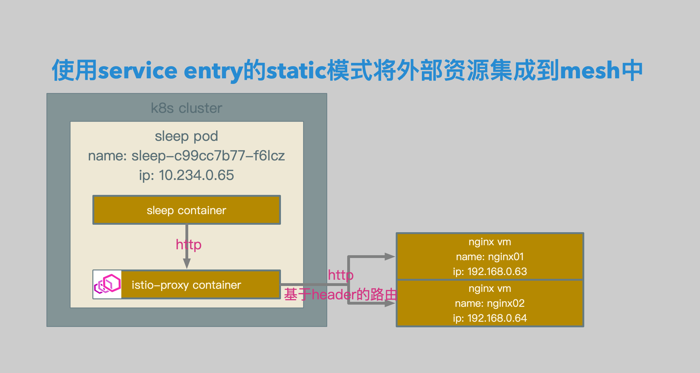
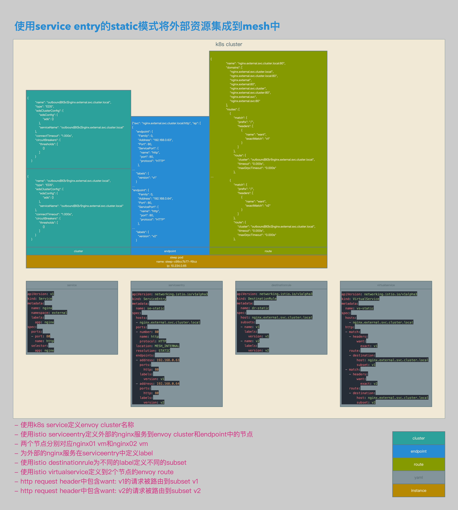

# Istio数据面配置解析03：使用Service Entry的static模式将Http请求路由至外部


[TOC]


## 概述

本文介绍了在Isito中使用Service Entry的场景：Mesh内部服务通过stattic模式的Service Entry访问外部的Http服务。

Http类型的路由均在Envoy route中进行。

本文也对Http类型的路由在Envoy中的配置进行一些解析。


## 相关拓扑



- sleep pod中的sleep container发送相关http请求。
- 请求被sleep pod中的istio-proxy container截获，并根据路由规则转发至相关外部服务。




- 使用k8s service定义envoy cluster名称。
- 使用istio serviceentry定义外部的nginx服务到envoy cluster和endpoint中的节点。
- 两个节点分别对应nginx01 vm和nginx02 vm。
- 为外部的nginx服务在serviceentry中定义label。
- 使用istio destinationrule为不同的label定义不同的subset。
- 使用istio virtualservice定义到2个节点的envoy route。
- http request header中包含want: v1的请求被路由到subset v1。
- http request header中包含want: v2的请求被路由到subset v2。


## 相关配置

###  Service，ServiceEntry和DestinationRule

```yaml
apiVersion: v1
kind: Service
metadata:
  name: nginx
  namespace: external
  labels:
    app: nginx
spec:
  ports:
  - port: 80
    name: http
  selector:
    app: nginx
```

- service相关配置。
- 定义服务nginx.external.svc.cluster.local，此服务为一个虚服务，目的是为了pod在访问这个地址时可以被kube-dns解析。


```yaml
apiVersion: networking.istio.io/v1alpha3
kind: ServiceEntry
metadata:
  name: se-static
spec:
  hosts:
  - nginx.external.svc.cluster.local
  ports:
  - number: 80
    name: http
    protocol: HTTP
  location: MESH_INTERNAL
  resolution: STATIC
  endpoints:
  - address: 192.168.0.63
    ports:
      http: 80
    labels:
      version: v1
  - address: 192.168.0.64
    ports:
      http: 80
    labels:
      version: v2
```

- serviceentry相关配置。
- 在serviceentry中定义cluster的fqdn为nginx.external.svc.cluster.local。
- 为serviceentry添加2个endpoint，分别为192.168.0.63的80端口，和192.168.0.64的80端口。
- 192.168.0.63的label定义为version: v1。
- 192.168.0.64的label定义为version: v2。


```yaml
apiVersion: networking.istio.io/v1alpha3
kind: DestinationRule
metadata:
  name: dr-static
spec:
  host: nginx.external.svc.cluster.local
  subsets:
  - name: v1
    labels:
      version: v1
  - name: v2
    labels:
      version: v2
```

- destinationrule相关配置。
- 为cluster nginx.external.svc.cluster.local定义subset。
- 将label为version: v1的endpoint定义为subset v1。
- 将label为version: v2的endpoint定义为subset v2。


```json
{
        "name": "outbound|80|v1|nginx.external.svc.cluster.local",
        "type": "EDS",
        "edsClusterConfig": {
            "edsConfig": {
                "ads": {}
            },
            "serviceName": "outbound|80|v1|nginx.external.svc.cluster.local"
        },
        "connectTimeout": "1.000s",
        "circuitBreakers": {
            "thresholds": [
                {}
            ]
        }
    }


{
        "name": "outbound|80|v2|nginx.external.svc.cluster.local",
        "type": "EDS",
        "edsClusterConfig": {
            "edsConfig": {
                "ads": {}
            },
            "serviceName": "outbound|80|v2|nginx.external.svc.cluster.local"
        },
        "connectTimeout": "1.000s",
        "circuitBreakers": {
            "thresholds": [
                {}
            ]
        }
    }
```

- envoy cluster相关配置。
- 在serviceentry和destinationrule定义完成后，envoy会生成2个subset相关的cluster，分别为outbound|80|v1|nginx.external.svc.cluster.local和outbound|80|v2|nginx.external.svc.cluster.local。


```json
{"svc": "nginx.external.svc.cluster.local:http", "ep": [
{
    "endpoint": {
      "Family": 0,
      "Address": "192.168.0.63",
      "Port": 80,
      "ServicePort": {
        "name": "http",
        "port": 80,
        "protocol": "HTTP"
      },
…
    "labels": {
      "version": "v1"
    }
…
"endpoint": {
      "Family": 0,
      "Address": "192.168.0.64",
      "Port": 80,
      "ServicePort": {
        "name": "http",
        "port": 80,
        "protocol": "HTTP"
      },
…
    "labels": {
      "version": "v2"
    }
```

- envoy endpoint相关配置。
- 这2个cluster会与envoy endpoint相关联。


### VirtualService

```yaml
apiVersion: networking.istio.io/v1alpha3
kind: VirtualService
metadata:
  name: vs-static
spec:
  hosts:
    - nginx.external.svc.cluster.local
  http:
  - match:
    - headers:
        want:
          exact: v1
    route:
    - destination:
        host: nginx.external.svc.cluster.local
        subset: v1
  - match:
    - headers:
        want:
          exact: v2
    route:
    - destination:
        host: nginx.external.svc.cluster.local
        subset: v2
```

- virtualservice相关配置。
- envoy在接收到http请求后，按照http request header的信息，对请求进行路由。
- header为want: v1的请求，被转发至nginx.external.svc.cluster.local的v1版本。
- header为want: v2的请求，被转发至nginx.external.svc.cluster.local的v2版本。


```json
{
                "name": "nginx.external.svc.cluster.local:80",
                "domains": [
                    "nginx.external.svc.cluster.local",
                    "nginx.external.svc.cluster.local:80",
                    "nginx.external",
                    "nginx.external:80",
                    "nginx.external.svc.cluster",
                    "nginx.external.svc.cluster:80",
                    "nginx.external.svc",
                    "nginx.external.svc:80"
                ],
                "routes": [
                    {
                        "match": {
                            "prefix": "/",
                            "headers": [
                                {
                                    "name": "want",
                                    "exactMatch": "v1"
                                }
                            ]
                        },
                        "route": {
                            "cluster": "outbound|80|v1|nginx.external.svc.cluster.local",
                            "timeout": "0.000s",
                            "maxGrpcTimeout": "0.000s"
                        },
…
                    {
                        "match": {
                            "prefix": "/",
                            "headers": [
                                {
                                    "name": "want",
                                    "exactMatch": "v2"
                                }
                            ]
                        },
                        "route": {
                            "cluster": "outbound|80|v2|nginx.external.svc.cluster.local",
                            "timeout": "0.000s",
                            "maxGrpcTimeout": "0.000s"
                        },
```

- envoy route相关配置。
- 因为virtualservice类型为http，所以路由会在route中进行。
- envoy route会将headers为want: v1的请求全部转发至outbound|80|v1|nginx.external.svc.cluster.local这个cluster。
- envoy route会将headers为want: v2的请求全部转发至outbound|80|v2|nginx.external.svc.cluster.local这个cluster。


## 测试结果

```bash
/ # curl http://nginx.external.svc.cluster.local -Hwant:v1
<!DOCTYPE html>
<html>
<head>
<title>Welcome to nginx!</title>
<style>
    body {
        width: 35em;
        margin: 0 auto;
        font-family: Tahoma, Verdana, Arial, sans-serif;
    }
</style>
</head>
<body>
<h1>Welcome to nginx!</h1>
<h1>first!</h1>
<p>If you see this page, the nginx web server is successfully installed and
working. Further configuration is required.</p>

<p>For online documentation and support please refer to
<a href="http://nginx.org/">nginx.org</a>.<br/>
Commercial support is available at
<a href="http://nginx.com/">nginx.com</a>.</p>

<p><em>Thank you for using nginx.</em></p>
</body>
</html>
/ #

/ # curl http://nginx.external.svc.cluster.local -Hwant:v2
<!DOCTYPE html>
<html>
<head>
<title>Welcome to nginx!</title>
<style>
    body {
        width: 35em;
        margin: 0 auto;
        font-family: Tahoma, Verdana, Arial, sans-serif;
    }
</style>
</head>
<body>
<h1>Welcome to nginx!</h1>
<h1>second!</h1>
<p>If you see this page, the nginx web server is successfully installed and
working. Further configuration is required.</p>

<p>For online documentation and support please refer to
<a href="http://nginx.org/">nginx.org</a>.<br/>
Commercial support is available at
<a href="http://nginx.com/">nginx.com</a>.</p>

<p><em>Thank you for using nginx.</em></p>
</body>
</html>
/ #
```

- 测试结果。
- 到nginx.external.svc.cluster.local的header为want: v1请求被正确转发至nginx01。
- 到nginx.external.svc.cluster.local的header为want: v2请求被正确转发至nginx02。