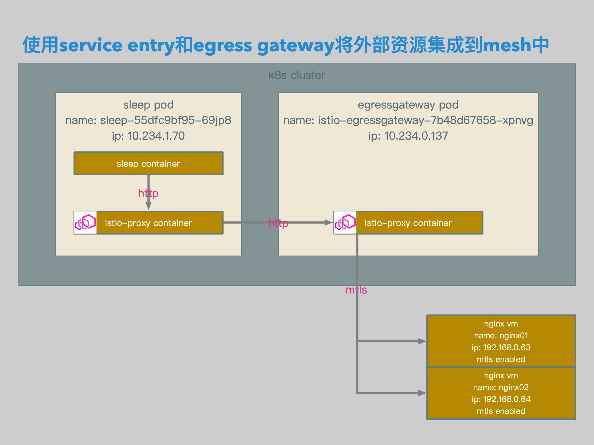

# Isitio数据面配置解析04：使用Service Entry通过Egress Gateway将Http请求路由至外部


[TOC]


## 概述

本文介绍了在Isito中直接将Http请求转发至外部的场景：Mesh内部服务通过Service Entry和Egress Gateway访问外部的mTLS服务。

本文也对mTLS在Envoy中的配置进行一些解析。


## 相关拓扑



- sleep pod中的sleep container发送相关请求。
- 请求被sleep pod中的istio-proxy container截获，并根据路由规则转发至egressgateway pod。
- egressgateway中的istio-proxy container根据目标规则中的相关设置加载mtls配置，并根据路由规则将请求转发至相关外部服务。


- 使用istio gateway定义egress gateway的envoy listener，使envoy listener监听80端口。
- 在定义监听后，mesh中会生成egressgateway的80端口相关endpoint和cluster。
- 使用istio virtualservice定义从从pod发出的访问相关uri的的envoy route。
- 所有相关uri的请求全部会被路由到egress gateway。
- 使用k8s service定义外部服务到envoy cluster的映射名称。
- 使用istio serviceentry定义外部服务到envoy cluster和endpoint中的节点，以及每个节点的label。
- 使用istio destinationrule定义外部服务在envoy cluster和endpoint中的subset，以及mtls使用的相关证书。
- 使用istio virtualservice定义从egress gateway到外部服务的路由。


## 准备

### Client Sleep

```yaml
apiVersion: extensions/v1beta1
kind: Deployment
metadata:
  name: sleep
spec:
  replicas: 1
  template:
    metadata:
      labels:
        app: sleep
    spec:
      containers:
      - name: sleep
        image: 192.168.0.61/istio-example/alpine-curl
        command: ["/bin/sleep","7200"]
        imagePullPolicy: IfNotPresent
```

- 准备用于client端的sleep。


### 证书和密钥

```bash
openssl req \
-newkey rsa:4096 -nodes -sha256 -keyout server.key \
-out server.csr

echo subjectAltName = IP:192.168.0.63, IP:192.168.0.64, DNS:nginx.external.svc.cluster.local > server.cnf

openssl x509 \
-req -days 3655 -in server.csr -CA ca.crt -CAkey ca.key \
-CAcreateserial -extfile server.cnf -out server.crt

openssl req \
-newkey rsa:4096 -nodes -sha256 -keyout client.key \
-out client.csr

openssl x509 \
-req -days 3655 -in client.csr -CA ca.crt -CAkey ca.key \
-CAcreateserial -out client.crt

kubectl create -n istio-system secret tls istio-egressgateway-certs --key ./client.key --cert ./client.crt
kubectl create -n istio-system secret generic istio-egressgateway-ca-certs --from-file ./ca.crt

helm template install/kubernetes/helm/istio/ --name istio-egressgateway --namespace istio-system -x charts/gateways/templates/deployment.yaml --set gateways.istio-ingressgateway.enabled=false \
> ./samples/sleep/egress/gateway/helm-egressgateway.yaml
```

- 准备用于server端的证书和密钥。
- 准备用于client端的证书和密钥。


### Nginx配置

```bash
server {
    listen 443 ssl;
    server_name localhost;

    location / {
        root /usr/share/nginx/html/v1;
        index index.html index.htm;
    }

    ssl_certificate /etc/nginx/certs/server.crt;
    ssl_certificate_key /etc/nginx/certs/server.key;
    ssl_client_certificate /etc/nginx/certs/ca.crt;
    ssl_verify_client on;
    ssl_verify_depth 10;

    error_page 500 502 503 504 /50x.html;
    location = /50x.html {
        root /usr/share/nginx/html;
    }
}

server {
    listen 443 ssl;
    server_name localhost;

    location / {
        root /usr/share/nginx/html/v2;
        index index.html index.htm;
    }

    ssl_certificate /etc/nginx/certs/server.crt;
    ssl_certificate_key /etc/nginx/certs/server.key;
    ssl_client_certificate /etc/nginx/certs/ca.crt;
    ssl_verify_client on;
    ssl_verify_depth 10;

    error_page 500 502 503 504 /50x.html;
    location = /50x.html {
        root /usr/share/nginx/html;
    }
}
```

- 为外部nginx启用mtls。


## 相关配置

### Service

```yaml
apiVersion: v1
kind: Service
metadata:
  name: nginx
  namespace: external
  labels:
    app: nginx
spec:
  ports:
  - port: 80
    name: http
  selector:
    app: nginx
```

- service相关配置。


### Mesh层面VirtualService

```yaml
apiVersion: networking.istio.io/v1alpha3
kind: VirtualService
metadata:
  name: vs-mesh
spec:
  hosts:
  - nginx.external.svc.cluster.local
  http:
  - match:
    - port: 80
    route:
    - destination:
        host: istio-egressgateway.istio-system.svc.cluster.local
        port:
          number: 80
```

- mesh层面virtualservice相关配置。
- virtualservice的路由类型为http。
- 将所有到nginx.external.svc.cluster.local的80端口的请求全部转发至istio-egressgateway.istio-system.svc.cluster.local，也就是istio的egress gateway。


```json
{
        "name": "0.0.0.0_80",
        "address": {
            "socketAddress": {
                "address": "0.0.0.0",
                "portValue": 80
            }
        },
…
                            "rds": {
                                "config_source": {
                                    "ads": {}
                                },
                                "route_config_name": "80"
                            },
```

- envoy listener相关配置。
- envoy listener调用的相关路由配置为80。


```json
{
                "name": "nginx.external.svc.cluster.local:80",
                "domains": [
                    "nginx.external.svc.cluster.local",
                    "nginx.external.svc.cluster.local:80",
                    "nginx.external",
                    "nginx.external:80",
                    "nginx.external.svc.cluster",
                    "nginx.external.svc.cluster:80",
                    "nginx.external.svc",
                    "nginx.external.svc:80",
                    "10.233.36.124",
                    "10.233.36.124:80"
                ],
                "routes": [
                    {
                        "match": {
                            "prefix": "/"
                        },
                        "route": {
                            "cluster": "outbound|80||istio-egressgateway.istio-system.svc.cluster.local",
                            "timeout": "0.000s",
                            "maxGrpcTimeout": "0.000s"
                        },
```

- envoy route相关配置。
- 名称为80的路由，会将所有到nginx.external.svc.cluster.local的80端口的请求，转发至outbound|80||istio-egressgateway.istio-system.svc.cluster.local这个cluster。


### Gateway和Gateway层面VirtualService

```yaml
apiVersion: networking.istio.io/v1alpha3
kind: Gateway
metadata:
  name: gateway
spec:
  selector:
    istio: egressgateway
  servers:
  - port:
      number: 80
      name: http
      protocol: HTTP
    hosts:
    - nginx.external.svc.cluster.local
```

- gateway相关配置。
- 为egress gateway设置监听。
- 打开egress gateway的80端口进行监听，端口类型为http。


```yaml
apiVersion: networking.istio.io/v1alpha3
kind: VirtualService
metadata:
  name: vs-nginx-ext-egress
spec:
  hosts:
    - nginx.external.svc.cluster.local
  gateways:
  - gateway
  http:
  - match:
    - port: 80
      headers:
        want:
          exact: v1
    route:
    - destination:
        host: nginx.external.svc.cluster.local
        port: 
          number: 443
        subset: v1
  - match:
    - port: 80
      headers:
        want:
          exact: v2
    route:
    - destination:
        host: nginx.external.svc.cluster.local
        port: 
          number: 443
        subset: v2
```

- egress gateway层面virtualservice相关配置。
- egress gateway在接收到mesh内部的请求后，对请求进行路由。
- http header为want:v1的请求，被转发至nginx.external.svc.cluster.local的v1版本的443端口。
- http header为want:v2的请求，被转发至nginx.external.svc.cluster.local的v2版本的443端口。


```json
{
        "name": "0.0.0.0_80",
        "address": {
            "socketAddress": {
                "address": "0.0.0.0",
                "portValue": 80
            }
        },
…
                            "rds": {
                                "config_source": {
                                    "ads": {}
                                },
                                "route_config_name": "http.80"
                            },
```

- egress gateway envoy listener相关配置。
- egress gateway envoy listener调用的相关路由配置为http.80。


```json
{
        "name": "http.80",
        "virtualHosts": [
            {
                "name": "nginx.external.svc.cluster.local:80",
                "domains": [
                    "nginx.external.svc.cluster.local",
                    "nginx.external.svc.cluster.local:80"
                ],
                "routes": [
                    {
                        "match": {
                            "prefix": "/",
                            "headers": [
                                {
                                    "name": "want",
                                    "exactMatch": "v1"
                                }
                            ]
                        },
                        "route": {
                            "cluster": "outbound|443|v1|nginx.external.svc.cluster.local",
                            "timeout": "0.000s",
                            "maxGrpcTimeout": "0.000s"
                        },
…
                    {
                        "match": {
                            "prefix": "/",
                            "headers": [
                                {
                                    "name": "want",
                                    "exactMatch": "v2"
                                }
                            ]
                        },
                        "route": {
                            "cluster": "outbound|443|v2|nginx.external.svc.cluster.local",
                            "timeout": "0.000s",
                            "maxGrpcTimeout": "0.000s"
                        },
```

- http header为want:v1的请求，被转发至outbound|443|v1|nginx.external.svc.cluster.local。
- http header为want:v2的请求，被转发至outbound|443|v2|nginx.external.svc.cluster.local。


###  ServiceEntry和DestinationRule

```yaml
apiVersion: networking.istio.io/v1alpha3
kind: ServiceEntry
metadata:
  name: se
spec:
  hosts:
  - nginx.external.svc.cluster.local
  ports:
  - number: 443
    name: http-tls
    protocol: HTTP
  location: MESH_INTERNAL
  resolution: STATIC
  endpoints:
  - address: 192.168.0.63
    ports:
      http-tls: 443
    labels:
      version: v1
  - address: 192.168.0.64
    ports:
      http-tls: 443
    labels:
      version: v2
```

- serviceentry相关配置。
- 在serviceentry中定义cluster的fqdn为nginx.external.svc.cluster.local。
- 为serviceentry添加2个endpoint，分别为192.168.0.63的443端口，和192.168.0.64的443端口。
- 192.168.0.63的label定义为version: v1。
- 192.168.0.64的label定义为version: v2。


```yaml
apiVersion: networking.istio.io/v1alpha3
kind: DestinationRule
metadata:
  name: dr
spec:
  host: nginx.external.svc.cluster.local
  trafficPolicy:
    portLevelSettings:
    - port: 
        number: 443
      tls:
        mode: MUTUAL
        clientCertificate: /etc/istio/egressgateway-certs/tls.crt
        privateKey: /etc/istio/egressgateway-certs/tls.key
        caCertificates: /etc/istio/egressgateway-ca-certs/ca.crt
  subsets:
  - name: v1
    labels:
      version: v1
  - name: v2
    labels:
      version: v2
```

- destinationrule相关配置。
- 将label为version: v1的endpoint定义为subset v1。
- 将label为version: v2的endpoint定义为subset v2。
- 定义mtls相关配置。


```json

        "name": "outbound|443|v1|nginx.external.svc.cluster.local",
        "type": "EDS",
        "edsClusterConfig": {
            "edsConfig": {
                "ads": {}
            },
            "serviceName": "outbound|443|v1|nginx.external.svc.cluster.local"
        },
        "connectTimeout": "1.000s",
        "circuitBreakers": {
            "thresholds": [
                {}
            ]
        },
        "tlsContext": {
            "commonTlsContext": {
                "tlsCertificates": [
                    {
                        "certificateChain": {
                            "filename": "/etc/istio/egressgateway-certs/tls.crt"
                        },
                        "privateKey": {
                            "filename": "/etc/istio/egressgateway-certs/tls.key"
                        }
                    }
                ],
                "validationContext": {
                    "trustedCa": {
                        "filename": "/etc/istio/egressgateway-ca-certs/ca.crt"
                    }
                }
            }
        }
    }


{
        "name": "outbound|443|v2|nginx.external.svc.cluster.local",
        "type": "EDS",
        "edsClusterConfig": {
            "edsConfig": {
                "ads": {}
            },
            "serviceName": "outbound|443|v2|nginx.external.svc.cluster.local"
        },
        "connectTimeout": "1.000s",
        "circuitBreakers": {
            "thresholds": [
                {}
            ]
        },
        "tlsContext": {
            "commonTlsContext": {
                "tlsCertificates": [
                    {
                        "certificateChain": {
                            "filename": "/etc/istio/egressgateway-certs/tls.crt"
                        },
                        "privateKey": {
                            "filename": "/etc/istio/egressgateway-certs/tls.key"
                        }
                    }
                ],
                "validationContext": {
                    "trustedCa": {
                        "filename": "/etc/istio/egressgateway-ca-certs/ca.crt"
                    }
                }
            }
        }
    }
```

- envoy cluster相关配置。
- 在serviceentry和destinationrule定义完成后，envoy会生成2个subset相关的cluster，分别为outbound|443|v1|nginx.external.svc.cluster.local和outbound|443|v2|nginx.external.svc.cluster.local。
- 这2个subset相关cluster都会挂载相应的mtls证书。


```json
{
        "name": "outbound|443|v1|nginx.external.svc.cluster.local",
        "addedViaApi": true,
        "hostStatuses": [
            {
                "address": {
                    "socketAddress": {
                        "address": "192.168.0.63",
                        "portValue": 443
                    }
                },

{
        "name": "outbound|443|v2|nginx.external.svc.cluster.local",
        "addedViaApi": true,
        "hostStatuses": [
            {
                "address": {
                    "socketAddress": {
                        "address": "192.168.0.64",
                        "portValue": 443
                    }
                },
```

- envoy endpoint相关配置。
- 这2个cluster会与envoy endpoint相关联。
- outbound|443|v1|nginx.external.svc.cluster.local的entpoint为192.168.0.63。
- outbound|443|v2|nginx.external.svc.cluster.local的entpoint为192.168.0.64。


## 测试结果

```bash
/ # curl http://nginx.external.svc.cluster.local -Hwant:v1
<!DOCTYPE html>
<html>
<head>
<title>Welcome to nginx!</title>
<style>
    body {
        width: 35em;
        margin: 0 auto;
        font-family: Tahoma, Verdana, Arial, sans-serif;
    }
</style>
</head>
<body>
<h1>Welcome to nginx!</h1>
<h1>v1!</h1>
<p>If you see this page, the nginx web server is successfully installed and
working. Further configuration is required.</p>

<p>For online documentation and support please refer to
<a href="http://nginx.org/">nginx.org</a>.<br/>
Commercial support is available at
<a href="http://nginx.com/">nginx.com</a>.</p>

<p><em>Thank you for using nginx.</em></p>
</body>
</html>
/ #

/ # curl http://nginx.external.svc.cluster.local -Hwant:v2
<!DOCTYPE html>
<html>
<head>
<title>Welcome to nginx!</title>
<style>
    body {
        width: 35em;
        margin: 0 auto;
        font-family: Tahoma, Verdana, Arial, sans-serif;
    }
</style>
</head>
<body>
<h1>Welcome to nginx!</h1>
<h1>v2!</h1>
<p>If you see this page, the nginx web server is successfully installed and
working. Further configuration is required.</p>

<p>For online documentation and support please refer to
<a href="http://nginx.org/">nginx.org</a>.<br/>
Commercial support is available at
<a href="http://nginx.com/">nginx.com</a>.</p>

<p><em>Thank you for using nginx.</em></p>
</body>
</html>
/ #
```

- 测试结果。
- http header为want:v1的请求被正确转发至nginx01。
- http header为want:v2的请求被正确转发至nginx02。