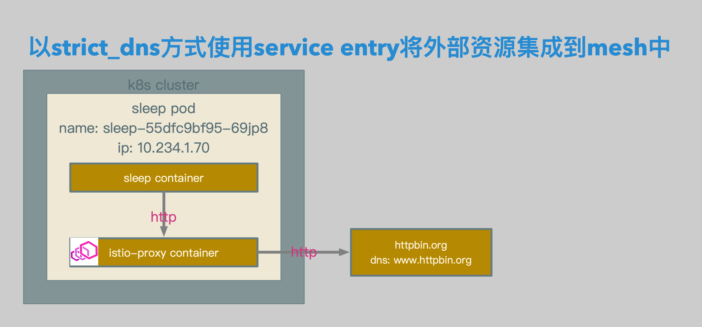
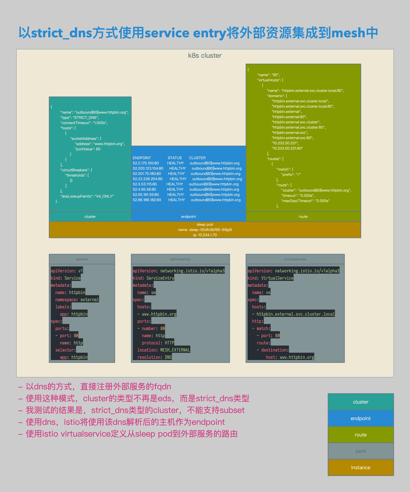

# Isitio数据面配置解析05：使用Service Entry的strict_dns模式将Http请求路由至外部


[TOC]


## 概述

本文介绍了在Isito中使用strict_dns的方式将Http请求转发至外部的场景：在使用strict_dns模式时，Istio会尝试通过DNS解析该主机相关的IP地址，并将解析出的IP地址作为该主机相关Cluster的Endpoint。


## 相关拓扑



- sleep pod中的sleep container发送相关请求。
- 请求被sleep pod中的istio-proxy container截获，并根据路由规则转发至外部服务。




- 以dns的方式，直接注册外部服务的fqdn。
- 使用这种模式，cluster的类型不再是eds，而是strict_dns类型。
- 我测试的结果是，strict_dns类型的cluster，不能支持subset。
- 使用dns，istio将使用该dns解析后的主机作为endpoint。
- 使用istio virtualservice定义从sleep pod到外部服务的路由。


## 准备

### Client Sleep

```yaml
apiVersion: extensions/v1beta1
kind: Deployment
metadata:
  name: sleep
spec:
  replicas: 1
  template:
    metadata:
      labels:
        app: sleep
    spec:
      containers:
      - name: sleep
        image: 192.168.0.61/istio-example/alpine-curl
        command: ["/bin/sleep","7200"]
        imagePullPolicy: IfNotPresent
```

- 准备用于client端的sleep。


## 相关配置

### Service

```yaml
apiVersion: v1
kind: Service
metadata:
  name: httpbin
  namespace: external
  labels:
    app: httpbin
spec:
  ports:
  - port: 80
    name: http
  selector:
    app: httpbin
```

- service相关配置。


### ServiceEntry

```yaml
apiVersion: networking.istio.io/v1alpha3
kind: ServiceEntry
metadata:
  name: se
spec:
  hosts:
  - www.httpbin.org
  ports:
  - number: 80
    name: http
    protocol: HTTP
  location: MESH_EXTERNAL
  resolution: DNS
```

- serviceentry相关配置。
- 在serviceentry中定义cluster的fqdn为www.httpbin.org。
- resolution为dns。


```json
{
        "name": "outbound|80||www.httpbin.org",
        "type": "STRICT_DNS",
        "connectTimeout": "1.000s",
        "hosts": [
            {
                "socketAddress": {
                    "address": "www.httpbin.org",
                    "portValue": 80
                }
            }
        ],
        "circuitBreakers": {
            "thresholds": [
                {}
            ]
        },
        "dnsLookupFamily": "V4_ONLY"
    }
```

- envoy cluster相关配置。
- 在serviceentry定义完成后，envoy会生成相关的cluster，为outbound|80||www.httpbin.org。


```json
ENDPOINT              STATUS      CLUSTER
52.2.175.150:80       HEALTHY     outbound|80||www.httpbin.org
52.200.123.104:80     HEALTHY     outbound|80||www.httpbin.org
52.201.75.180:80      HEALTHY     outbound|80||www.httpbin.org
52.22.236.254:80      HEALTHY     outbound|80||www.httpbin.org
52.3.53.115:80        HEALTHY     outbound|80||www.httpbin.org
52.4.95.48:80         HEALTHY     outbound|80||www.httpbin.org
52.55.191.55:80       HEALTHY     outbound|80||www.httpbin.org
52.86.186.182:80      HEALTHY     outbound|80||www.httpbin.org
```

- envoy endpoint相关配置。
- istio会尝试通过DNS解析该主机相关的ip地址，并将解析出的ip地址作为该主机相关cluster的endpoint。。


### VirtualService

```yaml
apiVersion: networking.istio.io/v1alpha3
kind: VirtualService
metadata:
  name: vs
spec:
  hosts:
  - httpbin.external.svc.cluster.local
  http:
  - match:
    - port: 80
    route:
    - destination:
        host: www.httpbin.org
```

- virtualservice相关配置。
- envoy在接收到主机为httpbin.external.svc.cluster.local的http请求后，会将该请求转发至www.httpbin.org。


```json
{
        "name": "80",
        "virtualHosts": [
            {
                "name": "httpbin.external.svc.cluster.local:80",
                "domains": [
                    "httpbin.external.svc.cluster.local",
                    "httpbin.external.svc.cluster.local:80",
                    "httpbin.external",
                    "httpbin.external:80",
                    "httpbin.external.svc.cluster",
                    "httpbin.external.svc.cluster:80",
                    "httpbin.external.svc",
                    "httpbin.external.svc:80",
                    "10.233.50.221",
                    "10.233.50.221:80"
                ],
                "routes": [
                    {
                        "match": {
                            "prefix": "/"
                        },
                        "route": {
                            "cluster": "outbound|80||www.httpbin.org",
                            "timeout": "0.000s",
                            "maxGrpcTimeout": "0.000s"
                        },
```

- envoy route相关配置。
- 到httpbin.external.svc.cluster.local的80端口的http请求，被转发至outbound|80||www.httpbin.org。


## 测试结果

```bash
/ # curl http://httpbin.external.svc.cluster.local/status/418 -HHost:www.httpbin.org -v
*   Trying 10.233.50.221...
* TCP_NODELAY set
* Connected to httpbin.external.svc.cluster.local (10.233.50.221) port 80 (#0)
> GET /status/418 HTTP/1.1
> Host:www.httpbin.org
> User-Agent: curl/7.61.0
> Accept: */*
>
< HTTP/1.1 418 Unknown
< server: envoy
< date: Sat, 09 Feb 2019 16:34:53 GMT
< x-more-info: http://tools.ietf.org/html/rfc2324
< access-control-allow-origin: *
< access-control-allow-credentials: true
< content-length: 135
< via: 1.1 vegur
< x-envoy-upstream-service-time: 752
<

    -=[ teapot ]=-

       _...._
     .'  _ _ `.
    | ."` ^ `". _,
    \_;`"---"`|//
      |       ;/
      \_     _/
        `"""`
* Connection #0 to host httpbin.external.svc.cluster.local left intact
/ #
```

- 测试结果。
- 到http://httpbin.external.svc.cluster.local/status/418的请求，被正确转发至www.httpbin.org。