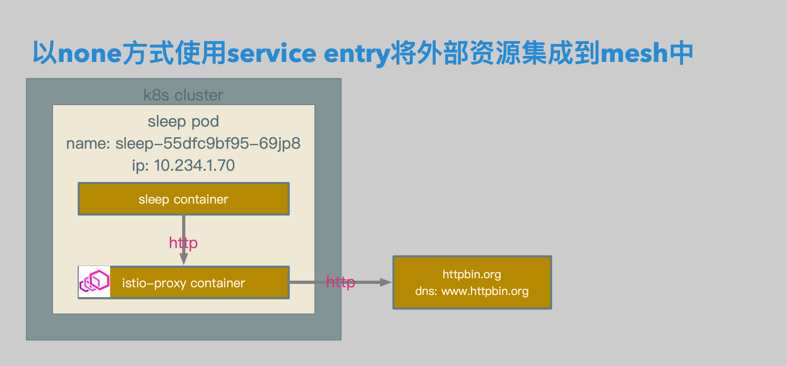
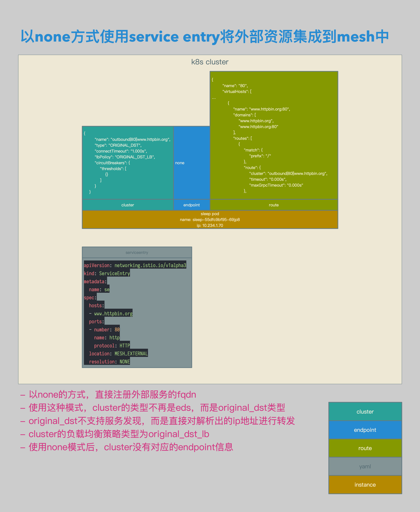

# Istio数据面配置解析06：使用Service Entry的none模式将Http请求路由至外部


[TOC]


## 概述

本文介绍了在Istio中使用none的方式将Http请求转发至外部的场景：在使用none模式时，该主机相关Cluster没有对应的Endpoint信息。


## 相关拓扑



- sleep pod中的sleep container发送相关请求。
- 请求被sleep pod中的istio-proxy container截获，并根据路由规则转发至外部服务。




- 以none的方式，直接注册外部服务的fqdn。
- 使用这种模式，cluster的类型不再是eds，而是original_dst类型。
- original_dst不支持服务发现，而是直接对解析出的ip地址进行转发。
- cluster的负载均衡策略类型为original_dst_lb。
- 使用none模式后，cluster没有对应的endpoint信息。


## 准备

### Client Sleep

```yaml
apiVersion: extensions/v1beta1
kind: Deployment
metadata:
  name: sleep
spec:
  replicas: 1
  template:
    metadata:
      labels:
        app: sleep
    spec:
      containers:
      - name: sleep
        image: 192.168.0.61/istio-example/alpine-curl
        command: ["/bin/sleep","7200"]
        imagePullPolicy: IfNotPresent
```

- 准备用于client端的sleep。


## 相关配置

### ServiceEntry

```yaml
apiVersion: networking.istio.io/v1alpha3
kind: ServiceEntry
metadata:
  name: se
spec:
  hosts:
  - www.httpbin.org
  ports:
  - number: 80
    name: http
    protocol: HTTP
  location: MESH_EXTERNAL
  resolution: NONE
```

- serviceentry相关配置。
- 在serviceentry中定义cluster的fqdn为www.httpbin.org。
- resolution为none。


```json
{
        "name": "outbound|80||www.httpbin.org",
        "type": "ORIGINAL_DST",
        "connectTimeout": "1.000s",
        "lbPolicy": "ORIGINAL_DST_LB",
        "circuitBreakers": {
            "thresholds": [
                {}
            ]
        }
    }
```

- envoy cluster相关配置。
- 在serviceentry定义完成后，envoy会生成相关的cluster，为outbound|80||www.httpbin.org。
- cluster type为original_dst。
- cluster lbpolicy为original_dst_lb。
- 使用none模式后，cluster没有对应的endpoint信息。


```json
{
        "name": "80",
        "virtualHosts": [
…
            {
                "name": "www.httpbin.org:80",
                "domains": [
                    "www.httpbin.org",
                    "www.httpbin.org:80"
                ],
                "routes": [
                    {
                        "match": {
                            "prefix": "/"
                        },
                        "route": {
                            "cluster": "outbound|80||www.httpbin.org",
                            "timeout": "0.000s",
                            "maxGrpcTimeout": "0.000s"
                        },
```

- envoy route相关配置。
- 到www.httpbin.org的80端口的http请求，被转发至outbound|80||www.httpbin.org。


## 测试结果

```bash
/ # curl http://www.httpbin.org/status/418 -v
*   Trying 54.165.51.142...
* TCP_NODELAY set
* Connected to www.httpbin.org (54.165.51.142) port 80 (#0)
> GET /status/418 HTTP/1.1
> Host: www.httpbin.org
> User-Agent: curl/7.61.0
> Accept: */*
>
< HTTP/1.1 418 Unknown
< server: envoy
< date: Sun, 10 Feb 2019 15:59:29 GMT
< x-more-info: http://tools.ietf.org/html/rfc2324
< access-control-allow-origin: *
< access-control-allow-credentials: true
< content-length: 135
< via: 1.1 vegur
< x-envoy-upstream-service-time: 899
<

    -=[ teapot ]=-

       _...._
     .'  _ _ `.
    | ."` ^ `". _,
    \_;`"---"`|//
      |       ;/
      \_     _/
        `"""`
* Connection #0 to host www.httpbin.org left intact
/ #
```

- 测试结果。
- 到http://www.httpbin.org/status/418的请求，被正确转发至www.httpbin.org。