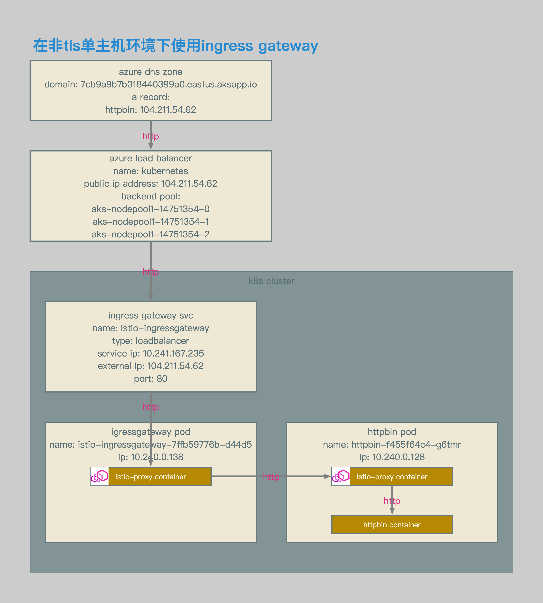
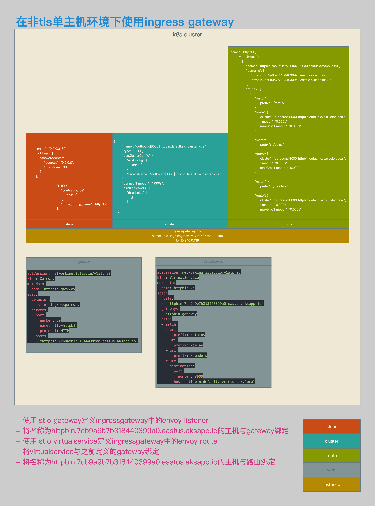

# Istio数据面配置解析07：使用Ingress Gateway对单主机非TLS请求进行路由


[TOC]


## 概述

本文介绍了在Istio中接收请求的场景：使用Ingress Gateway对单主机非TLS请求进行路由。


## 相关拓扑



- 使用azure aks环境。
- ingress gateway的service类型为loadbalancer。
- ingress gateway的service enternal ip为104.211.54.62。
- 通过该external ip对应的域名，访问ingress gateway svc。




- 增加gateway定义。
- gateway定义中的selector会将该设置与相应的gateway pod绑定。
- gateway定义中的servers会在相应的pod中生成listener实例，该拓扑中的监听端口为80。
- 需要将80端口注册到该gateway pod对应的服务中（默认已注册）。
- gateway定义中的hosts表示listener会向哪些特定的虚拟主机转发流量，在该示例中为httpbin.7cb9a9b7b318440399a0.eastus.aksapp.io。
- 增加virtualservice定义。
- virtualservice定义中的hosts与gateway中的hosts相对应，表示该服务可以注册到gateway的监听中，这个host写会更新到gateway pod路由表的虚拟主机条目中。
- virtualservice定义中的gateways将virtualservice与gateway关联起来。
- virtualservice定义中的http定义了路由规则，路由规则会写入到相应gateway pod的路由表中。


## 相关配置

###  Gateway和VirtualService

```yaml
apiVersion: networking.istio.io/v1alpha3
kind: Gateway
metadata:
  name: httpbin-gateway
spec:
  selector:
    istio: ingressgateway
  servers:
  - port:
      number: 80
      name: http-httpbin
      protocol: HTTP
    hosts:
    - "httpbin.7cb9a9b7b318440399a0.eastus.aksapp.io"
```

- gateway相关配置。
- 该定义与包含istio: ingressgateway label的ingress gateway pod绑定。
- 新建80端口监听。
- 监听主机为httpbin.7cb9a9b7b318440399a0.eastus.aksapp.io的请求。


```yaml
apiVersion: networking.istio.io/v1alpha3
kind: VirtualService
metadata:
  name: httpbin-vs
spec:
  hosts:
  - "httpbin.7cb9a9b7b318440399a0.eastus.aksapp.io"
  gateways:
  - httpbin-gateway
  http:
  - match:
    - uri:
        prefix: /status
    - uri:
        prefix: /delay
    - uri:
        prefix: /headers
    route:
    - destination:
        port:
          number: 8000
        host: httpbin.default.svc.cluster.local
```

- virtualservice相关配置。
- 将该配置应用到名称为httpbin-gateway的实例中。
- 定义路由规则和相关转发目的地。


```json
{
        "name": "0.0.0.0_80",
        "address": {
            "socketAddress": {
                "address": "0.0.0.0",
                "portValue": 80
            }
        },
…
                            "rds": {
                                "config_source": {
                                    "ads": {}
                                },
                                "route_config_name": "http.80"
                            },
```

- envoy listener相关配置。
- 在gateway和virtualservice定义完成后，envoy会生成80端口的监听，相关路由为http.80。


```json
{
        "name": "outbound|8000||httpbin.default.svc.cluster.local",
        "type": "EDS",
        "edsClusterConfig": {
            "edsConfig": {
                "ads": {}
            },
            "serviceName": "outbound|8000||httpbin.default.svc.cluster.local"
        },
        "connectTimeout": "1.000s",
        "circuitBreakers": {
            "thresholds": [
                {}
            ]
        }
    }
```

- envoy cluster相关配置。
- ingressgateway中会生成httpbin相关cluster。


```json
"name": "http.80",
        "virtualHosts": [
            {
                "name": "httpbin.7cb9a9b7b318440399a0.eastus.aksapp.io:80",
                "domains": [
                    "httpbin.7cb9a9b7b318440399a0.eastus.aksapp.io",
                    "httpbin.7cb9a9b7b318440399a0.eastus.aksapp.io:80"
                ],
                "routes": [
                    {
                        "match": {
                            "prefix": "/status"
                        },
                        "route": {
                            "cluster": "outbound|8000||httpbin.default.svc.cluster.local",
                            "timeout": "0.000s",
                            "maxGrpcTimeout": "0.000s"
                        },
…
                        "match": {
                            "prefix": "/delay"
                        },
                        "route": {
                            "cluster": "outbound|8000||httpbin.default.svc.cluster.local",
                            "timeout": "0.000s",
                            "maxGrpcTimeout": "0.000s"
                        },
…
                        "match": {
                            "prefix": "/headers"
                        },
                        "route": {
                            "cluster": "outbound|8000||httpbin.default.svc.cluster.local",
                            "timeout": "0.000s",
                            "maxGrpcTimeout": "0.000s"
                        },
```

- envoy route相关配置。
- 到httpbin.7cb9a9b7b318440399a0.eastus.aksapp.io的80端口的相关http请求，会被转发至outbound|8000||httpbin.default.svc.cluster.local。


## 测试结果

```bash
[~/K8s/istio/istio-azure-1.0.2/samples/httpbin]$ http http://httpbin.7cb9a9b7b318440399a0.eastus.aksapp.io/status/418
HTTP/1.1 418 Unknown
access-control-allow-credentials: true
access-control-allow-origin: *
content-length: 135
date: Sat, 03 Nov 2018 16:20:59 GMT
server: envoy
x-envoy-upstream-service-time: 4
x-more-info: http://tools.ietf.org/html/rfc2324

    -=[ teapot ]=-

       _...._
     .'  _ _ `.
    | ."` ^ `". _,
    \_;`"---"`|//
      |       ;/
      \_     _/
        `"""`

[~/K8s/istio/istio-azure-1.0.2/samples/httpbin]$
```

- 测试结果。
- 通过主机httpbin.7cb9a9b7b318440399a0.eastus.aksapp.io，可以正常访问httpbin pod。