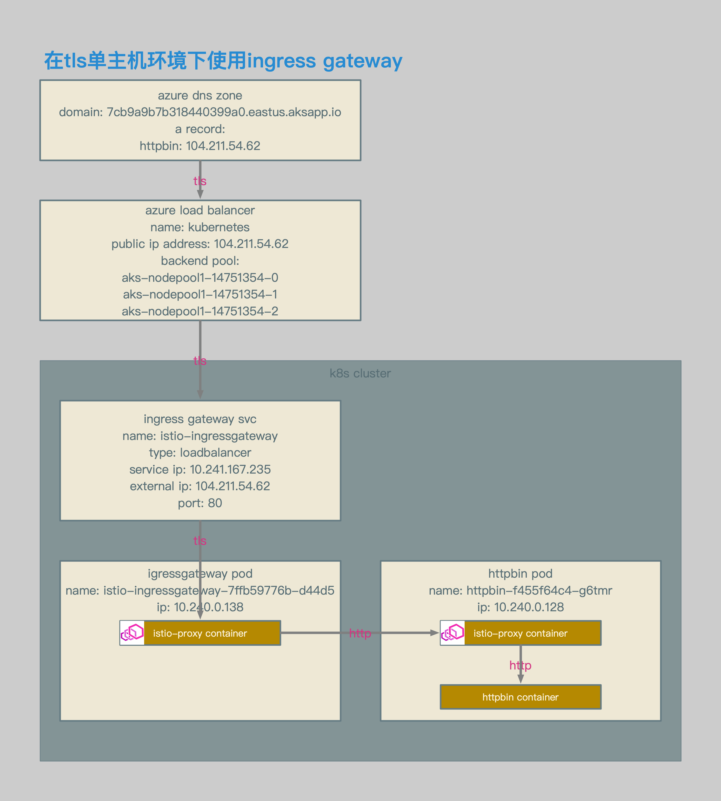
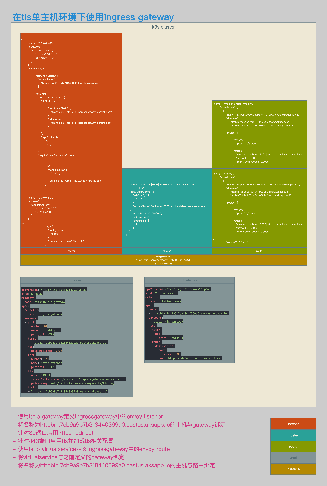

# Istio数据面配置解析08：使用Ingress Gateway对单主机TLS请求进行路由


[TOC]


## 概述

本文介绍了在Istio中接收请求的场景：使用Ingress Gateway对单主机TLS请求进行路由。


## 相关拓扑



- 使用azure aks环境。
- ingress gateway的service类型为loadbalancer。
- ingress gateway的service enternal ip为104.211.54.62。
- 通过该external ip对应的域名，访问ingress gateway svc。




- 使用istio gateway定义ingressgateway中的envoy listener。
- 将名称为httpbin.7cb9a9b7b318440399a0.eastus.aksapp.io的主机与gateway绑定。
- 针对80端口启用https redirect。
- 针对443端口启用tls并加载tls相关配置。
- 使用istio virtualservice定义ingressgateway中的envoy route。
- 将virtualservice与之前定义的gateway绑定。
- 将名称为httpbin.7cb9a9b7b318440399a0.eastus.aksapp.io的主机与路由绑定。


## 相关配置

###  Gateway和VirtualService

```bash
openssl req \
-newkey rsa:4096 -nodes -sha256 -keyout ca.key \
-x509 -days 3655 -out ca.crt

openssl req \
-newkey rsa:4096 -nodes -sha256 -keyout httpbin-tls.key \
-out httpbin-tls.csr

echo subjectAltName = DNS:httpbin.7cb9a9b7b318440399a0.eastus.aksapp.io > extfile-httpbin-tls.cnf

openssl x509 \
-req -days 3655 -in httpbin-tls.csr -CA ca.crt -CAkey ca.key \
-CAcreateserial -extfile extfile-httpbin-tls.cnf -out httpbin-tls.crt

kubectl create -n istio-system secret tls istio-ingressgateway-certs --key ./httpbin-tls.key --cert ./httpbin-tls.crt
```

- 自签名证书相关配置。
- k8s secret相关配置。


```yaml
apiVersion: networking.istio.io/v1alpha3
kind: Gateway
metadata:
  name: httpbin-tls-gateway
spec:
  selector:
    istio: ingressgateway
  servers:
  - port:
      number: 80
      name: http-httpbin
      protocol: HTTP
    hosts:
    - "httpbin.7cb9a9b7b318440399a0.eastus.aksapp.io"
    tls:
      httpsRedirect: true
  - port:
      number: 443
      name: https-httpbin
      protocol: HTTPS
    tls:
      mode: SIMPLE
      serverCertificate: /etc/istio/ingressgateway-certs/tls.crt
      privateKey: /etc/istio/ingressgateway-certs/tls.key
    hosts:
    - "httpbin.7cb9a9b7b318440399a0.eastus.aksapp.io"
```

- gateway相关配置。
- 新建监听端口包括80和443。
- 在80中启用httpsredirect。
- 在443中启用simple tls。
- 指定443的key和cert。


```yaml
apiVersion: networking.istio.io/v1alpha3
kind: VirtualService
metadata:
  name: httpbin-tls-vs
spec:
  hosts:
  - "httpbin.7cb9a9b7b318440399a0.eastus.aksapp.io"
  gateways:
  - httpbin-tls-gateway
  http:
  - match:
    - uri:
        prefix: /status
    route:
    - destination:
        port:
          number: 8000
        host: httpbin.default.svc.cluster.local
```

- virtualservice相关配置。
- 配置相关路由。


```json
{
        "name": "outbound|8000||httpbin.default.svc.cluster.local",
        "type": "EDS",
        "edsClusterConfig": {
            "edsConfig": {
                "ads": {}
            },
            "serviceName": "outbound|8000||httpbin.default.svc.cluster.local"
        },
        "connectTimeout": "1.000s",
        "circuitBreakers": {
            "thresholds": [
                {}
            ]
        }
    }
```

- envoy cluster相关配置。
- ingressgateway中会生成httpbin相关cluster。


```json
{
        "name": "0.0.0.0_80",
        "address": {
            "socketAddress": {
                "address": "0.0.0.0",
                "portValue": 80
            }
        },
…
                            "rds": {
                                "config_source": {
                                    "ads": {}
                                },
                                "route_config_name": "http.80"
                            },
```

- 80端口的envoy listener相关配置。
- 在gateway和virtualservice定义完成后，envoy会生成80端口的监听，相关路由为http.80。


```json
"name": "http.80",
        "virtualHosts": [
            {
                "name": "httpbin.7cb9a9b7b318440399a0.eastus.aksapp.io:80",
                "domains": [
                    "httpbin.7cb9a9b7b318440399a0.eastus.aksapp.io",
                    "httpbin.7cb9a9b7b318440399a0.eastus.aksapp.io:80"
                ],
                "routes": [
                    {
                        "match": {
                            "prefix": "/status"
                        },
                        "route": {
                            "cluster": "outbound|8000||httpbin.default.svc.cluster.local",
                            "timeout": "0.000s",
                            "maxGrpcTimeout": "0.000s"
                        },
…
                "requireTls": "ALL"
```

- envoy route相关配置。
- 到httpbin.7cb9a9b7b318440399a0.eastus.aksapp.io的80端口的相关http请求，会被转发至outbound|8000||httpbin.default.svc.cluster.local。
- **因为设置了httpsRedirect，requireTls会被设置为ALL。**


```json
{
        "name": "0.0.0.0_443",
        "address": {
            "socketAddress": {
                "address": "0.0.0.0",
                "portValue": 443
            }
        },
        "filterChains": [
            {
                "filterChainMatch": {
                    "serverNames": [
                        "httpbin.7cb9a9b7b318440399a0.eastus.aksapp.io"
                    ]
                },
                "tlsContext": {
                    "commonTlsContext": {
                        "tlsCertificates": [
                            {
                                "certificateChain": {
                                    "filename": "/etc/istio/ingressgateway-certs/tls.crt"
                                },
                                "privateKey": {
                                    "filename": "/etc/istio/ingressgateway-certs/tls.key"
                                }
                            }
                        ],
                        "alpnProtocols": [
                            "h2",
                            "http/1.1"
                        ]
                    },
                    "requireClientCertificate": false
                },
…
                            "rds": {
                                "config_source": {
                                    "ads": {}
                                },
                                "route_config_name": "https.443.https-httpbin"
                            },
```

- 443端口的envoy listener相关配置。
- 在gateway和virtualservice定义完成后，envoy会生成443端口的监听，相关路由为https.443.https-httpbin。
- **在listener中会加载tls相关证书和密钥。**
- **tls流量在listener中被卸载。**


```json
"name": "https.443.https-httpbin",
        "virtualHosts": [
            {
                "name": "httpbin.7cb9a9b7b318440399a0.eastus.aksapp.io:443",
                "domains": [
                    "httpbin.7cb9a9b7b318440399a0.eastus.aksapp.io",
                    "httpbin.7cb9a9b7b318440399a0.eastus.aksapp.io:443"
                ],
                "routes": [
                    {
                        "match": {
                            "prefix": "/status"
                        },
                        "route": {
                            "cluster": "outbound|8000||httpbin.default.svc.cluster.local",
                            "timeout": "0.000s",
                            "maxGrpcTimeout": "0.000s"
                        },
```

- envoy route相关配置。
- 到httpbin.7cb9a9b7b318440399a0.eastus.aksapp.io的443端口的相关http请求，会被转发至outbound|8000||httpbin.default.svc.cluster.local。


## 测试结果

```bash
[~/K8s/istio/istio-azure-1.0.2/samples/httpbin]$ http http://httpbin.7cb9a9b7b318440399a0.eastus.aksapp.io/status/418 --verify no --follow -v
GET /status/418 HTTP/1.1
Accept: */*
Accept-Encoding: gzip, deflate
Connection: keep-alive
Host: httpbin.7cb9a9b7b318440399a0.eastus.aksapp.io
User-Agent: HTTPie/0.9.9

HTTP/1.1 301 Moved Permanently
content-length: 0
date: Sat, 03 Nov 2018 19:25:25 GMT
location: https://httpbin.7cb9a9b7b318440399a0.eastus.aksapp.io/status/418
server: envoy

GET /status/418 HTTP/1.1
Accept: */*
Accept-Encoding: gzip, deflate
Connection: keep-alive
Host: httpbin.7cb9a9b7b318440399a0.eastus.aksapp.io
User-Agent: HTTPie/0.9.9

HTTP/1.1 418 Unknown
access-control-allow-credentials: true
access-control-allow-origin: *
content-length: 135
date: Sat, 03 Nov 2018 19:25:26 GMT
server: envoy
x-envoy-upstream-service-time: 6
x-more-info: http://tools.ietf.org/html/rfc2324

    -=[ teapot ]=-

       _...._
     .'  _ _ `.
    | ."` ^ `". _,
    \_;`"---"`|//
      |       ;/
      \_     _/
        `"""`

[~/K8s/istio/istio-azure-1.0.2/samples/httpbin]$
```

- httpsredirect测试结果。
- 通过http方式访问httpbin.7cb9a9b7b318440399a0.eastus.aksapp.io，可以正常访问httpbin pod。


```bash
[~/K8s/istio/istio-azure-1.0.2/samples/httpbin]$ http https://httpbin.7cb9a9b7b318440399a0.eastus.aksapp.io/status/418 --verify no -v
GET /status/418 HTTP/1.1
Accept: */*
Accept-Encoding: gzip, deflate
Connection: keep-alive
Host: httpbin.7cb9a9b7b318440399a0.eastus.aksapp.io
User-Agent: HTTPie/0.9.9

HTTP/1.1 418 Unknown
access-control-allow-credentials: true
access-control-allow-origin: *
content-length: 135
date: Sat, 03 Nov 2018 19:26:21 GMT
server: envoy
x-envoy-upstream-service-time: 5
x-more-info: http://tools.ietf.org/html/rfc2324

    -=[ teapot ]=-

       _...._
     .'  _ _ `.
    | ."` ^ `". _,
    \_;`"---"`|//
      |       ;/
      \_     _/
        `"""`

[~/K8s/istio/istio-azure-1.0.2/samples/httpbin]$
```

- https测试结果。
- 通过https方式访问httpbin.7cb9a9b7b318440399a0.eastus.aksapp.io，可以正常访问httpbin pod。