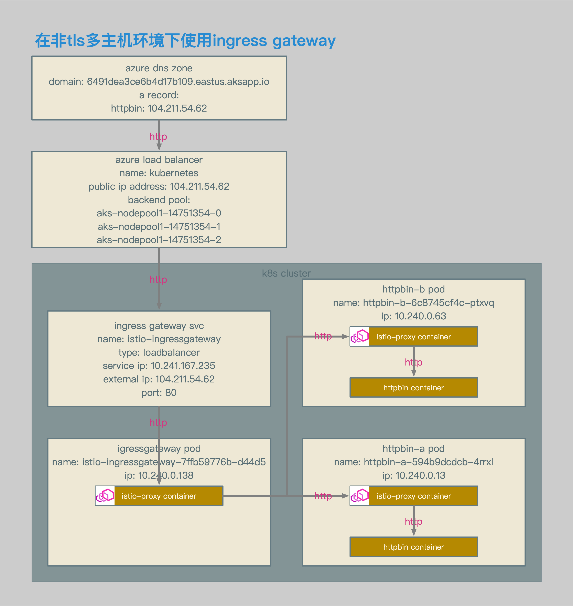
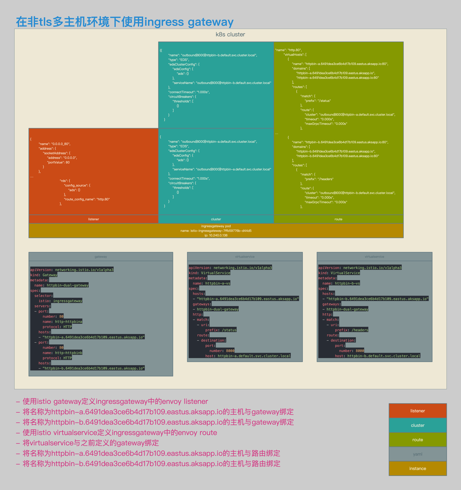

# Istio数据面配置解析10：使用Ingress Gateway对多主机非TLS请求进行路由


[TOC]


## 概述

本文介绍了在Istio中接收请求的场景：使用Ingress Gateway对多主机非TLS请求进行路由。


## 相关拓扑



- 使用azure aks环境。
- ingress gateway的service类型为loadbalancer。
- ingress gateway的service enternal ip为104.211.54.62。
- 通过该external ip对应的域名，访问ingress gateway svc。




- 为2个主机配置统一的gateway定义。
- 为2个主机分别配置virtualservice定义。
- 主机httpbin-a.6491dea3ce6b4d17b109.eastus.aksapp.io被路由至pod httpbin-a的/status uri。
- 主机httpbin-b.6491dea3ce6b4d17b109.eastus.aksapp.io被路由至pod httpbin-b的/headers uri。
- 在gateway的listnener中生成统一的监听0.0.0.0_80。
- 在gateway的route中分别生成针对httpbin-a和httpbin-b的虚拟主机。


## 相关配置

###  Gateway和VirtualService

```yaml
apiVersion: networking.istio.io/v1alpha3
kind: Gateway
metadata:
  name: httpbin-dual-gateway
spec:
  selector:
    istio: ingressgateway
  servers:
  - port:
      number: 80
      name: http-httpbin
      protocol: HTTP
    hosts:
    - "httpbin-a.6491dea3ce6b4d17b109.eastus.aksapp.io"
    - "httpbin-b.6491dea3ce6b4d17b109.eastus.aksapp.io"

apiVersion: networking.istio.io/v1alpha3
kind: Gateway
metadata:
  name: httpbin-dual-gateway
spec:
  selector:
    istio: ingressgateway
  servers:
  - port:
      number: 80
      name: http-httpbina
      protocol: HTTP
    hosts:
    - "httpbin-a.6491dea3ce6b4d17b109.eastus.aksapp.io"
  - port:
      number: 80
      name: http-httpbinb
      protocol: HTTP
    hosts:
    - "httpbin-b.6491dea3ce6b4d17b109.eastus.aksapp.io"
```

- gateway相关配置。
- 这2个gateway的配置，生成的envoy配置是一致的。
- 新建监听端口80。
- 分别针对两个主机httpbin-a和httpbin-b进行监听。


```yaml
apiVersion: networking.istio.io/v1alpha3
kind: VirtualService
metadata:
  name: httpbin-a-vs
spec:
  hosts:
  - "httpbin-a.6491dea3ce6b4d17b109.eastus.aksapp.io"
  gateways:
  - httpbin-dual-gateway
  http:
  - match:
    - uri:
        prefix: /status
    route:
    - destination:
        port:
          number: 8000
        host: httpbin-a.default.svc.cluster.local

apiVersion: networking.istio.io/v1alpha3
kind: VirtualService
metadata:
  name: httpbin-b-vs
spec:
  hosts:
  - "httpbin-b.6491dea3ce6b4d17b109.eastus.aksapp.io"
  gateways:
  - httpbin-dual-gateway
  http:
  - match:
    - uri:
        prefix: /headers
    route:
    - destination:
        port:
          number: 8000
        host: httpbin-b.default.svc.cluster.local
```

- httpbin-a和httpbin-b的virtualservice相关配置。
- httpbin-a.6491dea3ce6b4d17b109.eastus.aksapp.io的/status请求被路由至httpbin-a。
- httpbin-b.6491dea3ce6b4d17b109.eastus.aksapp.io的/headers请求被路由至httpbin-b。


```json
{
        "name": "0.0.0.0_80",
        "address": {
            "socketAddress": {
                "address": "0.0.0.0",
                "portValue": 80
            }
        },
…
                            "rds": {
                                "config_source": {
                                    "ads": {}
                                },
                                "route_config_name": "http.80"
                            },
```

- 80端口的envoy listener相关配置。
- 在gateway和virtualservice定义完成后，envoy会生成80端口的监听，相关路由为https.80。


```json
{{
        "name": "outbound|8000||httpbin-b.default.svc.cluster.local",
        "type": "EDS",
        "edsClusterConfig": {
            "edsConfig": {
                "ads": {}
            },
            "serviceName": "outbound|8000||httpbin-b.default.svc.cluster.local"
        },
        "connectTimeout": "1.000s",
        "circuitBreakers": {
            "thresholds": [
                {}
            ]
        }
    }

{
        "name": "outbound|8000||httpbin-a.default.svc.cluster.local",
        "type": "EDS",
        "edsClusterConfig": {
            "edsConfig": {
                "ads": {}
            },
            "serviceName": "outbound|8000||httpbin-a.default.svc.cluster.local"
        },
        "connectTimeout": "1.000s",
        "circuitBreakers": {
            "thresholds": [
                {}
            ]
        }
    }
```

- envoy cluster相关配置。
- ingressgateway中会生成httpbin-a和httpbin-b相关cluster。


```json
"name": "http.80",
        "virtualHosts": [
            {
                "name": "httpbin-a.6491dea3ce6b4d17b109.eastus.aksapp.io:80",
                "domains": [
                    "httpbin-a.6491dea3ce6b4d17b109.eastus.aksapp.io",
                    "httpbin-a.6491dea3ce6b4d17b109.eastus.aksapp.io:80"
                ],
                "routes": [
                    {
                        "match": {
                            "prefix": "/status"
                        },
                        "route": {
                            "cluster": "outbound|8000||httpbin-a.default.svc.cluster.local",
                            "timeout": "0.000s",
                            "maxGrpcTimeout": "0.000s"
                        },
…
            {
                "name": "httpbin-b.6491dea3ce6b4d17b109.eastus.aksapp.io:80",
                "domains": [
                    "httpbin-b.6491dea3ce6b4d17b109.eastus.aksapp.io",
                    "httpbin-b.6491dea3ce6b4d17b109.eastus.aksapp.io:80"
                ],
                "routes": [
                    {
                        "match": {
                            "prefix": "/headers"
                        },
                        "route": {
                            "cluster": "outbound|8000||httpbin-b.default.svc.cluster.local",
                            "timeout": "0.000s",
                            "maxGrpcTimeout": "0.000s"
                        },
```

- envoy route相关配置。
- 到httpbin-a.6491dea3ce6b4d17b109.eastus.aksapp.io的80端口的相关http请求，会被转发至outbound|8000||httpbin-a.default.svc.cluster.local。
- 到httpbin-b.6491dea3ce6b4d17b109.eastus.aksapp.io的80端口的相关http请求，会被转发至outbound|8000||httpbin-b.default.svc.cluster.local。


## 测试结果

```bash
[~/K8s/istio/istio-azure-1.0.2/samples/httpbin/ssl]$ http http://httpbin-a.6491dea3ce6b4d17b109.eastus.aksapp.io/status/418
HTTP/1.1 418 Unknown
access-control-allow-credentials: true
access-control-allow-origin: *
content-length: 135
date: Sun, 04 Nov 2018 16:27:07 GMT
server: envoy
x-envoy-upstream-service-time: 10
x-more-info: http://tools.ietf.org/html/rfc2324

    -=[ teapot ]=-

       _...._
     .'  _ _ `.
    | ."` ^ `". _,
    \_;`"---"`|//
      |       ;/
      \_     _/
        `"""`

[~/K8s/istio/istio-azure-1.0.2/samples/httpbin/ssl]$ http http://httpbin-b.6491dea3ce6b4d17b109.eastus.aksapp.io/headers
HTTP/1.1 200 OK
access-control-allow-credentials: true
access-control-allow-origin: *
content-length: 412
content-type: application/json
date: Sun, 04 Nov 2018 16:27:25 GMT
server: envoy
x-envoy-upstream-service-time: 7

{
    "headers": {
        "Accept": "*/*",
        "Accept-Encoding": "gzip, deflate",
        "Content-Length": "0",
        "Host": "httpbin-b.6491dea3ce6b4d17b109.eastus.aksapp.io",
        "User-Agent": "HTTPie/0.9.9",
        "X-B3-Sampled": "1",
        "X-B3-Spanid": "9b6889437bfe02c8",
        "X-B3-Traceid": "9b6889437bfe02c8",
        "X-Envoy-Internal": "true",
        "X-Request-Id": "e43ae114-52dd-9ee4-930b-dbb0405c6fef"
    }
}

[~/K8s/istio/istio-azure-1.0.2/samples/httpbin/ssl]$
```

- 测试结果。
- 请求httpbin-a.6491dea3ce6b4d17b109.eastus.aksapp.io/status/418和httpbin-b.6491dea3ce6b4d17b109.eastus.aksapp.io/headers均可以被正确路由。

