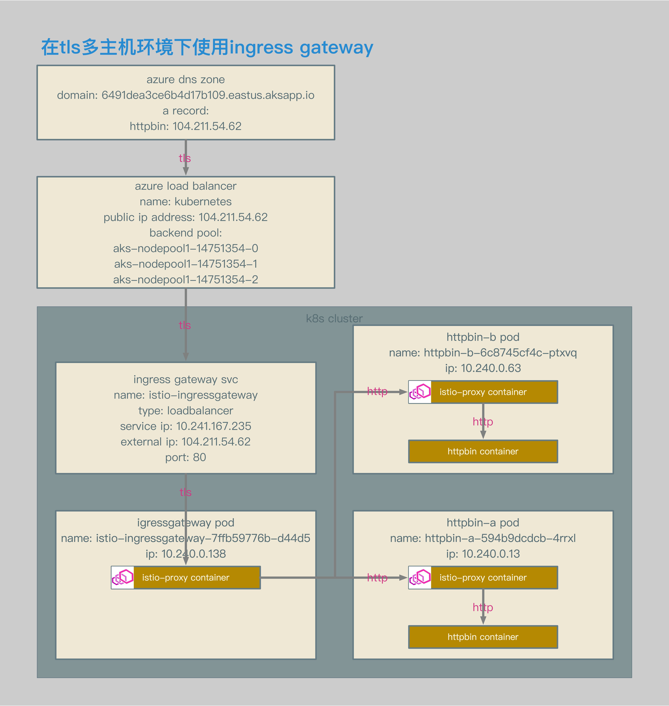

# Istio数据面配置解析11：使用Ingress Gateway对多主机TLS请求进行路由


[TOC]


## 概述

本文介绍了在Istio中接收请求的场景：使用Ingress Gateway对多主机TLS请求进行路由。


## 相关拓扑



- 使用azure aks环境。
- ingress gateway的service类型为loadbalancer。
- ingress gateway的service enternal ip为104.211.54.62。
- 通过该external ip对应的域名，访问ingress gateway svc。


- 为2个主机分别配置gateway中的server定义。
- 为2个主机的server定义中增加证书的定义，每个server使用不同的证书。
- 为2个主机分别配置virtualservice定义。
- 在gateway的listnener中生成统一的监听0.0.0.0_443。
- 因为gateway中配置的2个server中有不相同的配置，所以在监听0.0.0.0_443中，会生成2个server，分别为httpbin-a.6491dea3ce6b4d17b109.eastus.aksapp.io和httpbin-b.6491dea3ce6b4d17b109.eastus.aksapp.io。
- 因为监听中生成2个server，所以在路由中会生成2条不同的路由相对应，在gateway的路由中生成分别的虚拟主机https.443.https-httpbina和https.443.https-httpbinb。
- 监听0.0.0.0_443所属的server httpbin-a.6491dea3ce6b4d17b109.eastus.aksapp.io被关联至路由https.443.https-httpbina，server httpbin-b.6491dea3ce6b4d17b109.eastus.aksapp.io被关联至路由https.443.https-httpbinb。
- 主机httpbin-a被路由至pod httpbin-a的/status uri。
- 主机httpbin-b被路由至pod httpbin-b的/headers uri。


## 相关配置

### Gateway和VirtualService

```bash
openssl req \
-newkey rsa:4096 -nodes -sha256 -keyout ca.key \
-x509 -days 3655 -out ca.crt

openssl req \
-newkey rsa:4096 -nodes -sha256 -keyout httpbin-a-tls.key \
-out httpbin-a-tls.csr

echo subjectAltName = DNS:httpbin-a.6491dea3ce6b4d17b109.eastus.aksapp.io > extfile-httpbin-a-tls.cnf

openssl x509 \
-req -days 3655 -in httpbin-a-tls.csr -CA ca.crt -CAkey ca.key \
-CAcreateserial -extfile extfile-httpbin-a-tls.cnf -out httpbin-a-tls.crt

openssl req \
-newkey rsa:4096 -nodes -sha256 -keyout httpbin-b-tls.key \
-out httpbin-b-tls.csr

echo subjectAltName = DNS:httpbin-b.6491dea3ce6b4d17b109.eastus.aksapp.io > extfile-httpbin-b-tls.cnf

openssl x509 \
-req -days 3655 -in httpbin-b-tls.csr -CA ca.crt -CAkey ca.key \
-CAcreateserial -extfile extfile-httpbin-b-tls.cnf -out httpbin-b-tls.crt

kubectl create -n istio-system secret tls istio-ingressgateway-httpbin-a-certs --key ./httpbin-a-tls.key --cert ./httpbin-a-tls.crt
kubectl create -n istio-system secret tls istio-ingressgateway-httpbin-b-certs --key ./httpbin-b-tls.key --cert ./httpbin-b-tls.crt
```

- 自签名证书相关配置。
- k8s secret相关配置。


```bash
helm template install/kubernetes/helm/istio/ --name istio-ingressgateway --namespace istio-system -x charts/gateways/templates/deployment.yaml --set gateways.istio-egressgateway.enabled=false \
--set gateways.istio-ingressgateway.secretVolumes[0].name=ingressgateway-ca-certs \
--set gateways.istio-ingressgateway.secretVolumes[0].secretName=istio-ingressgateway-ca-certs \
--set gateways.istio-ingressgateway.secretVolumes[0].mountPath=/etc/istio/ingressgateway-ca-certs \
--set gateways.istio-ingressgateway.secretVolumes[1].name=ingressgateway-httpbin-a-certs \
--set gateways.istio-ingressgateway.secretVolumes[1].secretName=istio-ingressgateway-httpbin-a-certs \
--set gateways.istio-ingressgateway.secretVolumes[1].mountPath=/etc/istio/ingressgateway-httpbin-a-certs \
--set gateways.istio-ingressgateway.secretVolumes[2].name=ingressgateway-httpbin-b-certs \
--set gateways.istio-ingressgateway.secretVolumes[2].secretName=istio-ingressgateway-httpbin-b-certs \
--set gateways.istio-ingressgateway.secretVolumes[2].mountPath=/etc/istio/ingressgateway-httpbin-b-certs > \
./helm-ingressgateway-httpbin-dual-tls.yaml

...
          volumeMounts:
          - name: istio-certs
            mountPath: /etc/certs
            readOnly: true
          - name: ingressgateway-ca-certs
            mountPath: "/etc/istio/ingressgateway-ca-certs"
            readOnly: true
          - name: ingressgateway-httpbin-a-certs
            mountPath: "/etc/istio/ingressgateway-httpbin-a-certs"
            readOnly: true
          - name: ingressgateway-httpbin-b-certs
            mountPath: "/etc/istio/ingressgateway-httpbin-b-certs"
            readOnly: true
      volumes:
      - name: istio-certs
        secret:
          secretName: istio.istio-ingressgateway-service-account
          optional: true
      - name: ingressgateway-ca-certs
        secret:
          secretName: "istio-ingressgateway-ca-certs"
          optional: true
      - name: ingressgateway-httpbin-a-certs
        secret:
          secretName: "istio-ingressgateway-httpbin-a-certs"
          optional: true
      - name: ingressgateway-httpbin-b-certs
        secret:
          secretName: "istio-ingressgateway-httpbin-b-certs"
          optional: true
...
```

- 修改了ingress gateway deployment的配置，可以支持多个证书。
- 分别包含域名为httpbin-a和httpbin-b的证书。


```yaml
apiVersion: networking.istio.io/v1alpha3
kind: Gateway
metadata:
  name: httpbin-dual-tls-gateway
spec:
  selector:
    istio: ingressgateway
  servers:
  - port:
      number: 443
      name: https-httpbina
      protocol: HTTPS
    tls:
      mode: SIMPLE
      serverCertificate: /etc/istio/ingressgateway-httpbin-a-certs/tls.crt
      privateKey: /etc/istio/ingressgateway-httpbin-a-certs/tls.key
    hosts:
    - "httpbin-a.6491dea3ce6b4d17b109.eastus.aksapp.io"
  - port:
      number: 443
      name: https-httpbinb
      protocol: HTTPS
    tls:
      mode: SIMPLE
      serverCertificate: /etc/istio/ingressgateway-httpbin-b-certs/tls.crt
      privateKey: /etc/istio/ingressgateway-httpbin-b-certs/tls.key
    hosts:
    - "httpbin-b.6491dea3ce6b4d17b109.eastus.aksapp.io"
```

- gateway相关配置。
- 分别定义2个server，每个server配置不同的证书。


```yaml
apiVersion: networking.istio.io/v1alpha3
kind: VirtualService
metadata:
  name: httpbin-a-vs
spec:
  hosts:
  - "httpbin-a.6491dea3ce6b4d17b109.eastus.aksapp.io"
  gateways:
  - httpbin-dual-tls-gateway
  http:
  - match:
    - uri:
        prefix: /status
    route:
    - destination:
        port:
          number: 8000
        host: httpbin-a.default.svc.cluster.local

apiVersion: networking.istio.io/v1alpha3
kind: VirtualService
metadata:
  name: httpbin-b-vs
spec:
  hosts:
  - "httpbin-b.6491dea3ce6b4d17b109.eastus.aksapp.io"
  gateways:
  - httpbin-dual-tls-gateway
  http:
  - match:
    - uri:
        prefix: /headers
    route:
    - destination:
        port:
          number: 8000
        host: httpbin-b.default.svc.cluster.local
```

- httpbin-a和httpbin-b的virtualservice相关配置。
- httpbin-a.6491dea3ce6b4d17b109.eastus.aksapp.io的/status请求被路由至httpbin-a。
- httpbin-b.6491dea3ce6b4d17b109.eastus.aksapp.io的/headers请求被路由至httpbin-b。


```json
{
        "name": "0.0.0.0_443",
        "address": {
            "socketAddress": {
                "address": "0.0.0.0",
                "portValue": 443
            }
        },
        "filterChains": [
            {
                "filterChainMatch": {
                    "serverNames": [
                        "httpbin-a.6491dea3ce6b4d17b109.eastus.aksapp.io"
                    ]
                },
                "tlsContext": {
                    "commonTlsContext": {
                        "tlsCertificates": [
                            {
                                "certificateChain": {
                                    "filename": "/etc/istio/ingressgateway-httpbin-a-certs/tls.crt"
                                },
                                "privateKey": {
                                    "filename": "/etc/istio/ingressgateway-httpbin-a-certs/tls.key"
                                }
                            }
                        ],
…
                            "rds": {
                                "config_source": {
                                    "ads": {}
                                },
                                "route_config_name": "https.443.https-httpbina"
                            },
…
                "filterChainMatch": {
                    "serverNames": [
                        "httpbin-b.6491dea3ce6b4d17b109.eastus.aksapp.io"
                    ]
                },
                "tlsContext": {
                    "commonTlsContext": {
                        "tlsCertificates": [
                            {
                                "certificateChain": {
                                    "filename": "/etc/istio/ingressgateway-httpbin-b-certs/tls.crt"
                                },
                                "privateKey": {
                                    "filename": "/etc/istio/ingressgateway-httpbin-b-certs/tls.key"
                                }
                            }
                        ],
…
                            "rds": {
                                "config_source": {
                                    "ads": {}
                                },
                                "route_config_name": "https.443.https-httpbinb"
                            },
```

- 443端口的envoy listener相关配置。
- 到httpbin-a.6491dea3ce6b4d17b109.eastus.aksapp.io的路由相关配置为https.443.https-httpbina。
- 到httpbin-b.6491dea3ce6b4d17b109.eastus.aksapp.io的路由相关配置为https.443.https-httpbinb。
- 在监听中加载证书相关配置。


```json
{{
        "name": "outbound|8000||httpbin-b.default.svc.cluster.local",
        "type": "EDS",
        "edsClusterConfig": {
            "edsConfig": {
                "ads": {}
            },
            "serviceName": "outbound|8000||httpbin-b.default.svc.cluster.local"
        },
        "connectTimeout": "1.000s",
        "circuitBreakers": {
            "thresholds": [
                {}
            ]
        }
    }

{
        "name": "outbound|8000||httpbin-a.default.svc.cluster.local",
        "type": "EDS",
        "edsClusterConfig": {
            "edsConfig": {
                "ads": {}
            },
            "serviceName": "outbound|8000||httpbin-a.default.svc.cluster.local"
        },
        "connectTimeout": "1.000s",
        "circuitBreakers": {
            "thresholds": [
                {}
            ]
        }
    }
```

- envoy cluster相关配置。
- ingressgateway中会生成httpbin-a和httpbin-b相关cluster。


```json
"name": "https.443.https-httpbinb",
        "virtualHosts": [
            {
                "name": "httpbin-b.6491dea3ce6b4d17b109.eastus.aksapp.io:443",
                "domains": [
                    "httpbin-b.6491dea3ce6b4d17b109.eastus.aksapp.io",
                    "httpbin-b.6491dea3ce6b4d17b109.eastus.aksapp.io:443"
                ],
                "routes": [
                    {
                        "match": {
                            "prefix": "/headers"
                        },
                        "route": {
                            "cluster": "outbound|8000||httpbin-b.default.svc.cluster.local",
                            "timeout": "0.000s",
                            "maxGrpcTimeout": "0.000s"
                        },

"name": "https.443.https-httpbina",
        "virtualHosts": [
            {
                "name": "httpbin-a.6491dea3ce6b4d17b109.eastus.aksapp.io:443",
                "domains": [
                    "httpbin-a.6491dea3ce6b4d17b109.eastus.aksapp.io",
                    "httpbin-a.6491dea3ce6b4d17b109.eastus.aksapp.io:443"
                ],
                "routes": [
                    {
                        "match": {
                            "prefix": "/status"
                        },
                        "route": {
                            "cluster": "outbound|8000||httpbin-a.default.svc.cluster.local",
                            "timeout": "0.000s",
                            "maxGrpcTimeout": "0.000s"
                        },
```

- envoy route相关配置。
- 到httpbin-a.6491dea3ce6b4d17b109.eastus.aksapp.io的443端口的相关https请求，会被转发至outbound|8000||httpbin-a.default.svc.cluster.local。
- 到httpbin-b.6491dea3ce6b4d17b109.eastus.aksapp.io的443端口的相关https请求，会被转发至outbound|8000||httpbin-b.default.svc.cluster.local。


## 测试结果

```bash
[~/K8s/istio/istio-azure-1.0.2/samples/httpbin/ssl]$ http https://httpbin-a.6491dea3ce6b4d17b109.eastus.aksapp.io/status/418 --verify no
HTTP/1.1 418 Unknown
access-control-allow-credentials: true
access-control-allow-origin: *
content-length: 135
date: Sun, 04 Nov 2018 17:36:30 GMT
server: envoy
x-envoy-upstream-service-time: 6
x-more-info: http://tools.ietf.org/html/rfc2324

    -=[ teapot ]=-

       _...._
     .'  _ _ `.
    | ."` ^ `". _,
    \_;`"---"`|//
      |       ;/
      \_     _/
        `"""`

[~/K8s/istio/istio-azure-1.0.2/samples/httpbin/ssl]$ http https://httpbin-b.6491dea3ce6b4d17b109.eastus.aksapp.io/headers --verify no
HTTP/1.1 200 OK
access-control-allow-credentials: true
access-control-allow-origin: *
content-length: 412
content-type: application/json
date: Sun, 04 Nov 2018 17:36:33 GMT
server: envoy
x-envoy-upstream-service-time: 8

{
    "headers": {
        "Accept": "*/*",
        "Accept-Encoding": "gzip, deflate",
        "Content-Length": "0",
        "Host": "httpbin-b.6491dea3ce6b4d17b109.eastus.aksapp.io",
        "User-Agent": "HTTPie/0.9.9",
        "X-B3-Sampled": "1",
        "X-B3-Spanid": "27a46e99214fe1e1",
        "X-B3-Traceid": "27a46e99214fe1e1",
        "X-Envoy-Internal": "true",
        "X-Request-Id": "6c1ace56-7f57-9b0d-bb3d-2eb57519c4a2"
    }
}

[~/K8s/istio/istio-azure-1.0.2/samples/httpbin/ssl]$
```

- 测试结果。
- 请求httpbin-a.6491dea3ce6b4d17b109.eastus.aksapp.io/status/418和httpbin-b.6491dea3ce6b4d17b109.eastus.aksapp.io/headers均可以被正确路由。

