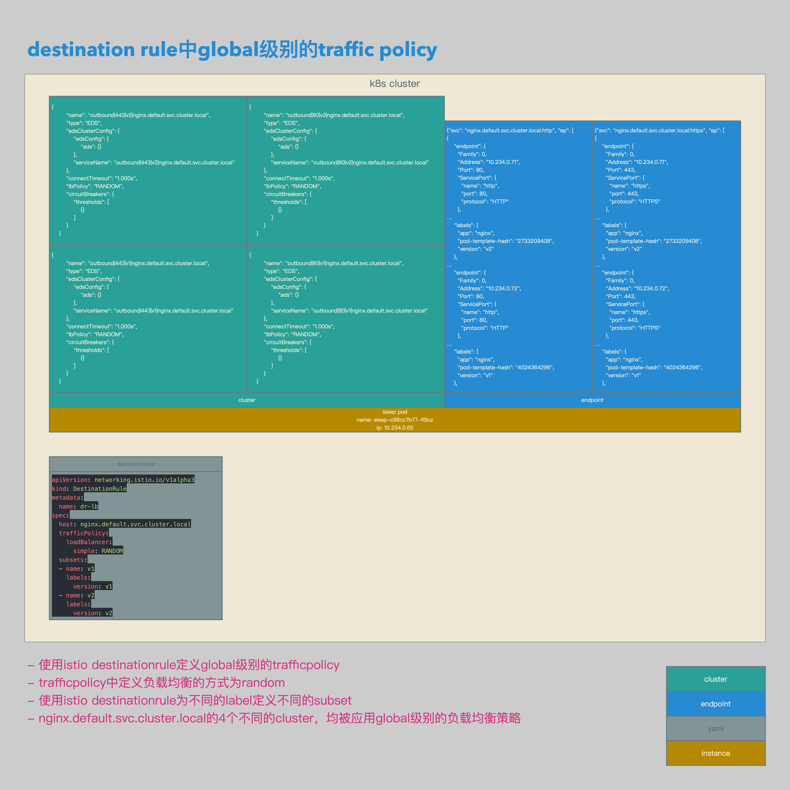
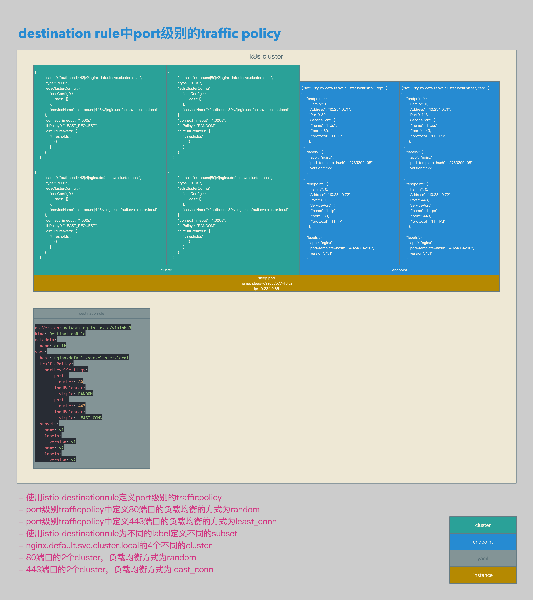
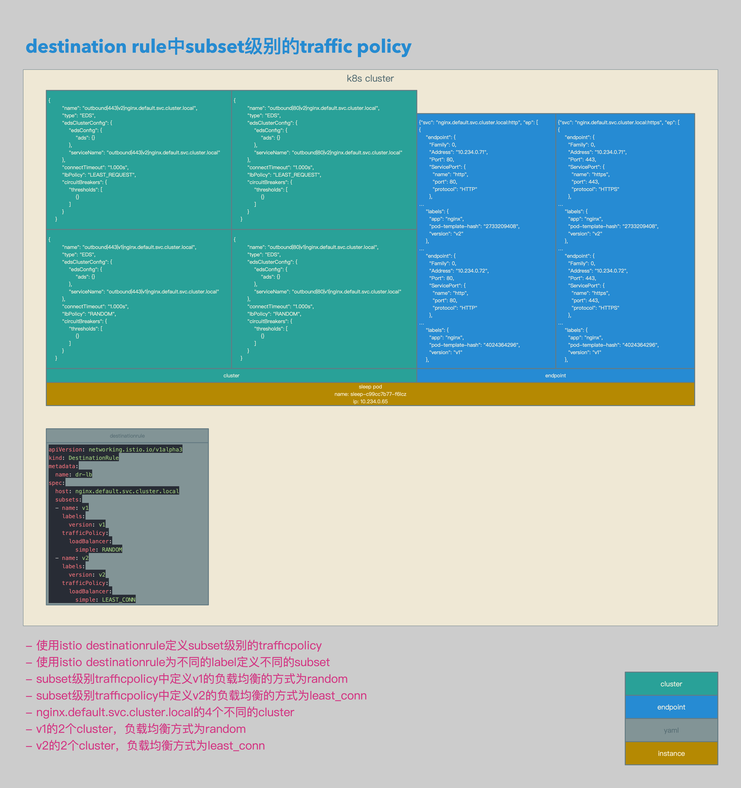

# Istio数据面配置解析12：在Destination Rule中配置3个级别的Traffic Policy


[TOC]


## 概述

本文介绍了在Isito中DestinationRule中trafficPolicy的3个级别：

1. Global级别。
2. Port级别。
3. Subset级别。

这3个级别的trafficPolicy的优先级如下：

1. Global级别的优先级最低。
2. Port级别的trafficPolicy会覆盖Global级别的设置。
3. Subset级别的trafficPolicy会覆盖Global和Port级别的设置。


```yaml
apiVersion: extensions/v1beta1
kind: Deployment
metadata:
  name: nginx-v1
spec:
  replicas: 1
  template:
    metadata:
      labels:
        app: nginx
        version: v1
    spec:
      containers:
      - name: nginx
        image: 192.168.0.61/istio-example/nginx
        ports:
        - containerPort: 443
        - containerPort: 80
        volumeMounts:
        - mountPath: /etc/nginx/conf.d/
          readOnly: true
          name: conf
        - mountPath: /etc/nginx/html/
          readOnly: true
          name: index
        - mountPath: /etc/nginx/certs
          readOnly: true
          name: certs
      volumes:
      - name: conf
        configMap:
          name: cm-nginx-v1
          items:
            - key: default.conf
              path: default.conf
      - name: index
        configMap:
          name: cm-nginx-v1
          items:
            - key: index.html
              path: index.html
      - name: certs
        secret:
          secretName: sec-nginx-v1
---
apiVersion: v1
kind: ConfigMap
metadata:
  name: cm-nginx-v1
data:
  default.conf: |
    server {
      listen       443 ssl;
      server_name  loalhost;

      location / {
        root   /etc/nginx/html/;
        index  index.html index.htm;
      }

      ssl_certificate      /etc/nginx/certs/tls.crt;
      ssl_certificate_key  /etc/nginx/certs/tls.key;
      ssl_verify_depth     2;

      error_page   500 502 503 504  /50x.html;
      location = /50x.html {
        root   /usr/share/nginx/html;
      }
    }

    server {
      listen       80;
      server_name  loalhost;

      location / {
        root   /etc/nginx/html/;
        index  index.html index.htm;
      }

      error_page   500 502 503 504  /50x.html;
      location = /50x.html {
        root   /usr/share/nginx/html;
      }
    }
  index.html: |
    <!DOCTYPE html>
    <html>
    <head>
    <title>Welcome to nginx!</title>
    <style>
      body {
        width: 35em;
        margin: 0 auto;
        font-family: Tahoma, Verdana, Arial, sans-serif;
      }
    </style>
    </head>
    <body>
    <h1>Welcome to nginx!</h1>
    <h1>nginx01</h1>
    <p>If you see this page, the nginx web server is successfully installed and working. Further configuration is required.</p>
    <p>For online documentation and support please refer to
    <a href="http://nginx.org/">nginx.org</a>.<br/>
    Commercial support is available at
    <a href="http://nginx.com/">nginx.com</a>.</p>
    <p><em>Thank you for using nginx.</em></p>
    </body>
    </html>
---
apiVersion: extensions/v1beta1
kind: Deployment
metadata:
  name: nginx-v2
spec:
  replicas: 1
  template:
    metadata:
      labels:
        app: nginx
        version: v2
    spec:
      containers:
      - name: nginx
        image: 192.168.0.61/istio-example/nginx
        ports:
        - containerPort: 443
        - containerPort: 80
        volumeMounts:
        - mountPath: /etc/nginx/conf.d/
          readOnly: true
          name: conf
        - mountPath: /etc/nginx/html/
          readOnly: true
          name: index
        - mountPath: /etc/nginx/certs
          readOnly: true
          name: certs
      volumes:
      - name: conf
        configMap:
          name: cm-nginx-v2
          items:
            - key: default.conf
              path: default.conf
      - name: index
        configMap:
          name: cm-nginx-v2
          items:
            - key: index.html
              path: index.html
      - name: certs
        secret:
          secretName: sec-nginx-v2
---
apiVersion: v1
kind: ConfigMap
metadata:
  name: cm-nginx-v2
data:
  default.conf: |
    server {
      listen       443 ssl;
      server_name  loalhost;

      location / {
        root   /etc/nginx/html/;
        index  index.html index.htm;
      }

      ssl_certificate      /etc/nginx/certs/tls.crt;
      ssl_certificate_key  /etc/nginx/certs/tls.key;
      ssl_verify_depth     2;

      error_page   500 502 503 504  /50x.html;
      location = /50x.html {
        root   /usr/share/nginx/html;
      }
    }

    server {
      listen       80;
      server_name  loalhost;

      location / {
        root   /etc/nginx/html/;
        index  index.html index.htm;
      }

      error_page   500 502 503 504  /50x.html;
      location = /50x.html {
        root   /usr/share/nginx/html;
      }
    }
  index.html: |
    <!DOCTYPE html>
    <html>
    <head>
    <title>Welcome to nginx!</title>
    <style>
      body {
        width: 35em;
        margin: 0 auto;
        font-family: Tahoma, Verdana, Arial, sans-serif;
      }
    </style>
    </head>
    <body>
    <h1>Welcome to nginx!</h1>
    <h1>nginx02</h1>
    <p>If you see this page, the nginx web server is successfully installed and working. Further configuration is required.</p>
    <p>For online documentation and support please refer to
    <a href="http://nginx.org/">nginx.org</a>.<br/>
    Commercial support is available at
    <a href="http://nginx.com/">nginx.com</a>.</p>
    <p><em>Thank you for using nginx.</em></p>
    </body>
    </html>
---
apiVersion: v1
kind: Service
metadata:
  name: nginx
spec:
  type: ClusterIP
  ports:
  - port: 443
    name: https
  - port: 80
    name: http
  selector:
    app: nginx
```

- 本文涉及到的cluster的配置文件。
- nginx-v1 deployment，标签为version: v1，打开80端口和443端口。
- nginx-v2 deployment，标签为version: v2，打开80端口和443端口。
- nginx service，打开80端口和443端口。


```json
{"svc": "nginx.default.svc.cluster.local:http", "ep": [
{
    "endpoint": {
      "Family": 0,
      "Address": "10.234.0.71",
      "Port": 80,
      "ServicePort": {
        "name": "http",
        "port": 80,
        "protocol": "HTTP"
      },
…
    "labels": {
      "app": "nginx",
      "pod-template-hash": "2733209408",
      "version": "v2"
    },
…
    "endpoint": {
      "Family": 0,
      "Address": "10.234.0.72",
      "Port": 80,
      "ServicePort": {
        "name": "http",
        "port": 80,
        "protocol": "HTTP"
      },
…
    "labels": {
      "app": "nginx",
      "pod-template-hash": "4024364296",
      "version": "v1"
    },
```

- istio pilot根据deployment和service生成相关的endpoint。


## Global级别

### 相关拓扑



- 使用istio destinationrule定义global级别的trafficpolicy。
- trafficpolicy中定义负载均衡的方式为random。
- 使用istio destinationrule为不同的label定义不同的subset。
- nginx.default.svc.cluster.local的4个不同的cluster，均被应用global级别的负载均衡策略。


### 相关配置

```yaml
apiVersion: networking.istio.io/v1alpha3
kind: DestinationRule
metadata:
  name: dr-lb
spec:
  host: nginx.default.svc.cluster.local
  trafficPolicy:
    loadBalancer:
      simple: RANDOM
  subsets:
  - name: v1
    labels:
      version: v1
  - name: v2
    labels:
      version: v2
```

- global级别destinationrule相关配置。
- 配置global级别的destinationrule的trafficpolicy的loadbalancer策略为random。


```json
{
        "name": "outbound|80|v1|nginx.default.svc.cluster.local",
        "type": "EDS",
        "edsClusterConfig": {
            "edsConfig": {
                "ads": {}
            },
            "serviceName": "outbound|80|v1|nginx.default.svc.cluster.local"
        },
        "connectTimeout": "1.000s",
        "lbPolicy": "RANDOM",
        "circuitBreakers": {
            "thresholds": [
                {}
            ]
        }
    }

{
        "name": "outbound|80|v2|nginx.default.svc.cluster.local",
        "type": "EDS",
        "edsClusterConfig": {
            "edsConfig": {
                "ads": {}
            },
            "serviceName": "outbound|80|v2|nginx.default.svc.cluster.local"
        },
        "connectTimeout": "1.000s",
        "lbPolicy": "RANDOM",
        "circuitBreakers": {
            "thresholds": [
                {}
            ]
        }
    }

{
        "name": "outbound|443|v1|nginx.default.svc.cluster.local",
        "type": "EDS",
        "edsClusterConfig": {
            "edsConfig": {
                "ads": {}
            },
            "serviceName": "outbound|443|v1|nginx.default.svc.cluster.local"
        },
        "connectTimeout": "1.000s",
        "lbPolicy": "RANDOM",
        "circuitBreakers": {
            "thresholds": [
                {}
            ]
        }
    }

{
        "name": "outbound|443|v2|nginx.default.svc.cluster.local",
        "type": "EDS",
        "edsClusterConfig": {
            "edsConfig": {
                "ads": {}
            },
            "serviceName": "outbound|443|v2|nginx.default.svc.cluster.local"
        },
        "connectTimeout": "1.000s",
        "lbPolicy": "RANDOM",
        "circuitBreakers": {
            "thresholds": [
                {}
            ]
        }
    }
```

- istio pilot根据相关destinationrule生成4个cluster，分别为：
- outbound|80|v1|nginx.default.svc.cluster.local。
- outbound|80|v2|nginx.default.svc.cluster.local。
- outbound|443|v1|nginx.default.svc.cluster.local。
- outbound|443|v2|nginx.default.svc.cluster.local。
- 因为使用了global级别的trafficpolicy，所以这4个cluster的lbpolicy均为random。


## Port级别

### 相关拓扑



- 使用istio destinationrule定义port级别的trafficpolicy。
- port级别trafficpolicy中定义80端口的负载均衡的方式为random。
- port级别trafficpolicy中定义443端口的负载均衡的方式为least_conn。
- 使用istio destinationrule为不同的label定义不同的subset。
- nginx.default.svc.cluster.local的4个不同的cluster。
- 80端口的2个cluster，负载均衡方式为random。
- 443端口的2个cluster，负载均衡方式为least_conn。


### 相关配置

```yaml
apiVersion: networking.istio.io/v1alpha3
kind: DestinationRule
metadata:
  name: dr-lb
spec:
  host: nginx.default.svc.cluster.local
  trafficPolicy:
    portLevelSettings:
      - port: 
          number: 80
        loadBalancer:
          simple: RANDOM
      - port: 
          number: 443
        loadBalancer:
          simple: LEAST_CONN
  subsets:
  - name: v1
    labels:
      version: v1
  - name: v2
    labels:
      version: v2
```

- port级别destinationrule相关配置。
- 配置port级别的destinationrule的80端口的trafficpolicy的loadbalancer策略为random。
- 配置port级别的destinationrule的443端口的trafficpolicy的loadbalancer策略为least_conn。


```json
{
        "name": "outbound|80|v1|nginx.default.svc.cluster.local",
        "type": "EDS",
        "edsClusterConfig": {
            "edsConfig": {
                "ads": {}
            },
            "serviceName": "outbound|80|v1|nginx.default.svc.cluster.local"
        },
        "connectTimeout": "1.000s",
        "lbPolicy": "RANDOM",
        "circuitBreakers": {
            "thresholds": [
                {}
            ]
        }
    }

{
        "name": "outbound|80|v2|nginx.default.svc.cluster.local",
        "type": "EDS",
        "edsClusterConfig": {
            "edsConfig": {
                "ads": {}
            },
            "serviceName": "outbound|80|v2|nginx.default.svc.cluster.local"
        },
        "connectTimeout": "1.000s",
        "lbPolicy": "RANDOM",
        "circuitBreakers": {
            "thresholds": [
                {}
            ]
        }
    }

{
        "name": "outbound|443|v1|nginx.default.svc.cluster.local",
        "type": "EDS",
        "edsClusterConfig": {
            "edsConfig": {
                "ads": {}
            },
            "serviceName": "outbound|443|v1|nginx.default.svc.cluster.local"
        },
        "connectTimeout": "1.000s",
        "lbPolicy": "LEAST_REQUEST",
        "circuitBreakers": {
            "thresholds": [
                {}
            ]
        }
    }

{
        "name": "outbound|443|v2|nginx.default.svc.cluster.local",
        "type": "EDS",
        "edsClusterConfig": {
            "edsConfig": {
                "ads": {}
            },
            "serviceName": "outbound|443|v2|nginx.default.svc.cluster.local"
        },
        "connectTimeout": "1.000s",
        "lbPolicy": "LEAST_REQUEST",
        "circuitBreakers": {
            "thresholds": [
                {}
            ]
        }
    }
```

- istio pilot根据相关destinationrule生成4个cluster，分别为：
- outbound|80|v1|nginx.default.svc.cluster.local。
- outbound|80|v2|nginx.default.svc.cluster.local。
- outbound|443|v1|nginx.default.svc.cluster.local。
- outbound|443|v2|nginx.default.svc.cluster.local。
- 因为使用了port级别的trafficpolicy，所以outbound|80|v1|nginx.default.svc.cluster.local和outbound|80|v2|nginx.default.svc.cluster.local的lbpolicy为random。
- 因为使用了port级别的trafficpolicy，所以outbound|443|v1|nginx.default.svc.cluster.local和outbound|443|v2|nginx.default.svc.cluster.local的lbpolicy为least_request。


## Subset级别

### 相关拓扑



- 使用istio destinationrule定义subset级别的trafficpolicy
- 使用istio destinationrule为不同的label定义不同的subset
- subset级别trafficpolicy中定义v1的负载均衡的方式为random
- subset级别trafficpolicy中定义v2的负载均衡的方式为least_conn
- nginx.default.svc.cluster.local的4个不同的cluster
- v1的2个cluster，负载均衡方式为random
- v2的2个cluster，负载均衡方式为least_conn


### 相关配置

```yaml
apiVersion: networking.istio.io/v1alpha3
kind: DestinationRule
metadata:
  name: dr-lb
spec:
  host: nginx.default.svc.cluster.local
  subsets:
  - name: v1
    labels:
      version: v1
    trafficPolicy:
      loadBalancer:
        simple: RANDOM
  - name: v2
    labels:
      version: v2
    trafficPolicy:
      loadBalancer:
        simple: LEAST_CONN
```

- subset级别destinationrule相关配置。
- 配置subset级别的destinationrule的v1的trafficpolicy的loadbalancer策略为random。
- 配置subset级别的destinationrule的v2的trafficpolicy的loadbalancer策略为least_conn。


```json
{
        "name": "outbound|80|v1|nginx.default.svc.cluster.local",
        "type": "EDS",
        "edsClusterConfig": {
            "edsConfig": {
                "ads": {}
            },
            "serviceName": "outbound|80|v1|nginx.default.svc.cluster.local"
        },
        "connectTimeout": "1.000s",
        "lbPolicy": "RANDOM",
        "circuitBreakers": {
            "thresholds": [
                {}
            ]
        }
    }

{
        "name": "outbound|80|v2|nginx.default.svc.cluster.local",
        "type": "EDS",
        "edsClusterConfig": {
            "edsConfig": {
                "ads": {}
            },
            "serviceName": "outbound|80|v2|nginx.default.svc.cluster.local"
        },
        "connectTimeout": "1.000s",
        "lbPolicy": "LEAST_REQUEST",
        "circuitBreakers": {
            "thresholds": [
                {}
            ]
        }
    }

{
        "name": "outbound|443|v1|nginx.default.svc.cluster.local",
        "type": "EDS",
        "edsClusterConfig": {
            "edsConfig": {
                "ads": {}
            },
            "serviceName": "outbound|443|v1|nginx.default.svc.cluster.local"
        },
        "connectTimeout": "1.000s",
        "lbPolicy": "RANDOM",
        "circuitBreakers": {
            "thresholds": [
                {}
            ]
        }
    }

{
        "name": "outbound|443|v2|nginx.default.svc.cluster.local",
        "type": "EDS",
        "edsClusterConfig": {
            "edsConfig": {
                "ads": {}
            },
            "serviceName": "outbound|443|v2|nginx.default.svc.cluster.local"
        },
        "connectTimeout": "1.000s",
        "lbPolicy": "LEAST_REQUEST",
        "circuitBreakers": {
            "thresholds": [
                {}
            ]
        }
    }
```

- istio pilot根据相关destinationrule生成4个cluster，分别为：
- outbound|80|v1|nginx.default.svc.cluster.local。
- outbound|80|v2|nginx.default.svc.cluster.local。
- outbound|443|v1|nginx.default.svc.cluster.local。
- outbound|443|v2|nginx.default.svc.cluster.local。
- 因为使用了subset级别的trafficpolicy，所以outbound|80|v1|nginx.default.svc.cluster.local和outbound|443|v1|nginx.default.svc.cluster.local的lbpolicy为random。
- 因为使用了subset级别的trafficpolicy，所以outbound|80|v2|nginx.default.svc.cluster.local和outbound|443|v2|nginx.default.svc.cluster.local的lbpolicy为least_request。