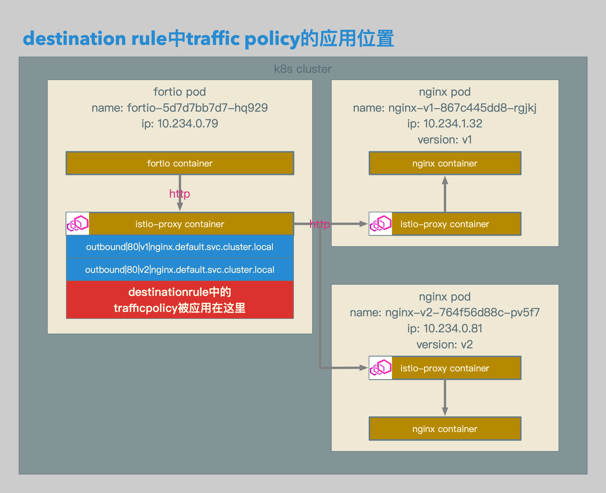
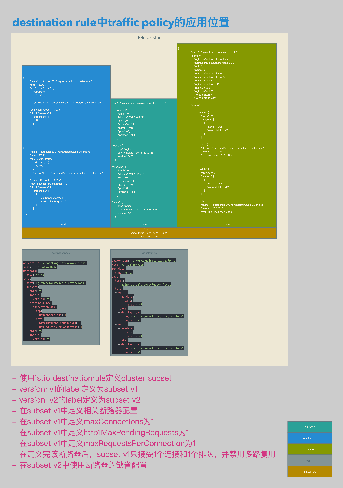

# Istio数据面配置解析13：Destination Rule中的Traffic Policy会被应用到哪里


[TOC]


## 概述

本文介绍了在Istio中DestinationRule中trafficPolicy的应用位置：

1. trafficPolicy应用在client端的outbound cluster中。
2. **在请求从client端的Envoy proxy发出时，会应用相关的trafficPolicy。**
3. 也就是说，trafficPolicy定制的策略，是针对每个client端的每个cluster的限制，并不是destination主机全局的限制。
4. 举例说明，如果在一个DestinationRule中为某个主机设置http的最大连接数为1，那么这个最大连接数是针对每个client到这个destination主机的最大连接数，而不是所有client到这个destination主机的最大连接数为1。
5. 而trafficPolicy在client端影响的范围，见：[Istio数据面配置解析12：在Destination Rule中配置4个级别的Traffic Policy](https://github.com/shenxg13/istio-no-best-practice/blob/master/12-destinationrule-4-level-trafficpolicy.md)。
6. 因为DestinationRule只能指定destination主机，无法指定client端的范围，所以，针对某个destination主机的trafficPolicy，会同步到所有的client端，也就是整个mesh层面。


```yaml
apiVersion: extensions/v1beta1
kind: Deployment
metadata:
  name: nginx-v1
spec:
  replicas: 1
  template:
    metadata:
      labels:
        app: nginx
        version: v1
    spec:
      containers:
      - name: nginx
        image: 192.168.0.61/istio-example/nginx
        ports:
        - containerPort: 80
        volumeMounts:
        - mountPath: /etc/nginx/conf.d/
          readOnly: true
          name: conf
        - mountPath: /etc/nginx/html/
          readOnly: true
          name: index
      volumes:
      - name: conf
        configMap:
          name: cm-nginx-v1
          items:
            - key: default.conf
              path: default.conf
      - name: index
        configMap:
          name: cm-nginx-v1
          items:
            - key: index.html
              path: index.html
---
apiVersion: v1
kind: ConfigMap
metadata:
  name: cm-nginx-v1
data:
  default.conf: |
    server {
      listen       80;
      server_name  loalhost;

      location / {
        root   /etc/nginx/html/;
        index  index.html index.htm;
      }

      error_page   500 502 503 504  /50x.html;
      location = /50x.html {
        root   /usr/share/nginx/html;
      }
    }
  index.html: |
    <!DOCTYPE html>
    <html>
    <head>
    <title>Welcome to nginx!</title>
    <style>
      body {
        width: 35em;
        margin: 0 auto;
        font-family: Tahoma, Verdana, Arial, sans-serif;
      }
    </style>
    </head>
    <body>
    <h1>Welcome to nginx!</h1>
    <h1>nginx01</h1>
    <p>If you see this page, the nginx web server is successfully installed and working. Further configuration is required.</p>
    <p>For online documentation and support please refer to
    <a href="http://nginx.org/">nginx.org</a>.<br/>
    Commercial support is available at
    <a href="http://nginx.com/">nginx.com</a>.</p>
    <p><em>Thank you for using nginx.</em></p>
    </body>
    </html>
---
apiVersion: extensions/v1beta1
kind: Deployment
metadata:
  name: nginx-v2
spec:
  replicas: 1
  template:
    metadata:
      labels:
        app: nginx
        version: v2
    spec:
      containers:
      - name: nginx
        image: 192.168.0.61/istio-example/nginx
        ports:
        - containerPort: 80
        volumeMounts:
        - mountPath: /etc/nginx/conf.d/
          readOnly: true
          name: conf
        - mountPath: /etc/nginx/html/
          readOnly: true
          name: index
      volumes:
      - name: conf
        configMap:
          name: cm-nginx-v2
          items:
            - key: default.conf
              path: default.conf
      - name: index
        configMap:
          name: cm-nginx-v2
          items:
            - key: index.html
              path: index.html
---
apiVersion: v1
kind: ConfigMap
metadata:
  name: cm-nginx-v2
data:
  default.conf: |
    server {
      listen       80;
      server_name  loalhost;

      location / {
        root   /etc/nginx/html/;
        index  index.html index.htm;
      }

      error_page   500 502 503 504  /50x.html;
      location = /50x.html {
        root   /usr/share/nginx/html;
      }
    }
  index.html: |
    <!DOCTYPE html>
    <html>
    <head>
    <title>Welcome to nginx!</title>
    <style>
      body {
        width: 35em;
        margin: 0 auto;
        font-family: Tahoma, Verdana, Arial, sans-serif;
      }
    </style>
    </head>
    <body>
    <h1>Welcome to nginx!</h1>
    <h1>nginx02</h1>
    <p>If you see this page, the nginx web server is successfully installed and working. Further configuration is required.</p>
    <p>For online documentation and support please refer to
    <a href="http://nginx.org/">nginx.org</a>.<br/>
    Commercial support is available at
    <a href="http://nginx.com/">nginx.com</a>.</p>
    <p><em>Thank you for using nginx.</em></p>
    </body>
    </html>
---
apiVersion: v1
kind: Service
metadata:
  name: nginx
spec:
  type: ClusterIP
  ports:
  - port: 80
    name: http
  selector:
    app: nginx
```

- 本文涉及到的cluster的配置文件。
- nginx-v1 deployment，标签为version: v1，打开80端口。
- nginx-v2 deployment，标签为version: v2，打开80端口。
- nginx service，打开80端口。


```json
{"svc": "nginx.default.svc.cluster.local:http", "ep": [
{
    "endpoint": {
      "Family": 0,
      "Address": "10.234.0.81",
      "Port": 80,
      "ServicePort": {
        "name": "http",
        "port": 80,
        "protocol": "HTTP"
      },
…
"labels": {
      "app": "nginx",
      "pod-template-hash": "3209128447",
      "version": "v2"
    },
…
"endpoint": {
      "Family": 0,
      "Address": "10.234.1.32",
      "Port": 80,
      "ServicePort": {
        "name": "http",
        "port": 80,
        "protocol": "HTTP"
      },
…
"labels": {
      "app": "nginx",
      "pod-template-hash": "4237001884",
      "version": "v1"
    },
```

- istio pilot根据deployment和service生成相关的endpoint。


## 相关拓扑



- 使用istio destinationrule定义到nginx.default.svc.cluster.local这个主机的trafficpolicy。
- 为nginx.default.svc.cluster.local这个主机定义v1和v2这2个subset。
- 在mesh的每个节点上，都会同步到outbound|80|v1|nginx.default.svc.cluster.local和outbound|80|v2|nginx.default.svc.cluster.local这2个cluster。
- 以及这2个cluster相关的trafficpolicy。
- 也包括示例中的fortio pod。
- trafficPolicy应用在fortio pod的envoy proxy sidecar的outbound cluster中。
- **在请求从fortio pod的envoy proxy sidecar发出时，会应用相关的trafficPolicy。**
- **举例说明，如果在destinationrule中为outbound|80|v1|nginx.default.svc.cluster.local设置http的最大连接数为1，那么fortio pod的envoy proxy sidecar在转发从fortio container过来的请求之前，会检查自己到outbound|80|v1|nginx.default.svc.cluster.local已有的连接数的数量，是否已经达到断路器设置的阈值，如果尚未达到，就转发请求；如果已经达到，就对fortio container返回503错误码。**




- 使用istio destinationrule定义cluster subset。
- version: v1的label定义为subset v1。
- version: v2的label定义为subset v2。
- 在subset v1中定义相关断路器配置。
- 在subset v1中定义maxConnections为1。
- 在subset v1中定义http1MaxPendingRequests为1。
- 在subset v1中定义maxRequestsPerConnection为1。
- 在定义完该断路器后，subset v1只接受1个连接和1个排队，并禁用多路复用。
- 在subset v2中使用断路器的缺省配置。


## 相关配置

### DestinationRule

```yaml
apiVersion: networking.istio.io/v1alpha3
kind: DestinationRule
metadata:
  name: dr-cb
spec:
  host: nginx.default.svc.cluster.local
  subsets:
  - name: v1
    labels:
      version: v1
    trafficPolicy:
      connectionPool:
        tcp:
          maxConnections: 1
        http:
          http1MaxPendingRequests: 1
          maxRequestsPerConnection: 1
  - name: v2
    labels:
      version: v2
```

- destinationrule相关配置。
- 配置针对主机nginx.default.svc.cluster.local的destinationrule。
- 为主机nginx.default.svc.cluster.local定义v1和v2这2个subset。
- 在subset v1上设置断路器相关参数。
- 在subset v1上设置maxConnections，设置http的最大连接数为1。
- 在subset v1上设置http1MaxPendingRequests，设置http的最大排队数为1。
- 在subset v1上设置maxRequestsPerConnection:，设置禁用http多路复用。


```json
{
        "name": "outbound|80|v1|nginx.default.svc.cluster.local",
        "type": "EDS",
        "edsClusterConfig": {
            "edsConfig": {
                "ads": {}
            },
            "serviceName": "outbound|80|v1|nginx.default.svc.cluster.local"
        },
        "connectTimeout": "1.000s",
        "maxRequestsPerConnection": 1,
        "circuitBreakers": {
            "thresholds": [
                {
                    "maxConnections": 1,
                    "maxPendingRequests": 1
                }
            ]
        }
    }

{
        "name": "outbound|80|v2|nginx.default.svc.cluster.local",
        "type": "EDS",
        "edsClusterConfig": {
            "edsConfig": {
                "ads": {}
            },
            "serviceName": "outbound|80|v2|nginx.default.svc.cluster.local"
        },
        "connectTimeout": "1.000s",
        "circuitBreakers": {
            "thresholds": [
                {}
            ]
        }
    }
```

- envoy cluster相关配置。
- 根据相关destinationrule，nginx.default.svc.cluster.local主机生成2个cluster，分别为：outbound|80|v1|nginx.default.svc.cluster.local和outbound|80|v2|nginx.default.svc.cluster.local。
- outbound|80|v1|nginx.default.svc.cluster.local的maxRequestsPerConnection为1。
- outbound|80|v1|nginx.default.svc.cluster.local的maxConnections为1。
- outbound|80|v1|nginx.default.svc.cluster.local的maxPendingRequests为1。


### VirtualService

```yaml
apiVersion: networking.istio.io/v1alpha3
kind: VirtualService
metadata:
  name: vs-cb
spec:
  hosts:
    - nginx.default.svc.cluster.local
  http:
  - match:
    - headers:
        want:
          exact: v1
    route:
    - destination:
        host: nginx.default.svc.cluster.local
        subset: v1
  - match:
    - headers:
        want:
          exact: v2
    route:
    - destination:
        host: nginx.default.svc.cluster.local
        subset: v2
```

- virtualservice相关配置。
- envoy proxy sidecar在接收到http请求后，按照http request header的信息，对请求进行路由。
- header为want: v1的请求，被转发至nginx.default.svc.cluster.local的subset v1。
- header为want: v2的请求，被转发至nginx.default.svc.cluster.local的subset v2。


```json
{
                "name": "nginx.default.svc.cluster.local:80",
                "domains": [
                    "nginx.default.svc.cluster.local",
                    "nginx.default.svc.cluster.local:80",
                    "nginx",
                    "nginx:80",
                    "nginx.default.svc.cluster",
                    "nginx.default.svc.cluster:80",
                    "nginx.default.svc",
                    "nginx.default.svc:80",
                    "nginx.default",
                    "nginx.default:80",
                    "10.233.217.163",
                    "10.233.217.163:80"
                ],
                "routes": [
                    {
                        "match": {
                            "prefix": "/",
                            "headers": [
                                {
                                    "name": "want",
                                    "exactMatch": "v1"
                                }
                            ]
                        },
                        "route": {
                            "cluster": "outbound|80|v1|nginx.default.svc.cluster.local",
                            "timeout": "0.000s",
                            "maxGrpcTimeout": "0.000s"
                        },
…
                    {
                        "match": {
                            "prefix": "/",
                            "headers": [
                                {
                                    "name": "want",
                                    "exactMatch": "v2"
                                }
                            ]
                        },
                        "route": {
                            "cluster": "outbound|80|v2|nginx.default.svc.cluster.local",
                            "timeout": "0.000s",
                            "maxGrpcTimeout": "0.000s"
                        },
```

- envoy route相关配置。
- 因为virtualservice类型为http，所以路由会在route中进行。
- envoy route会将headers为want: v1的请求全部转发至outbound|80|v1|nginx.default.svc.cluster.local这个cluster。
- envoy route会将headers为want: v2的请求全部转发至outbound|80|v2|nginx.default.svc.cluster.local这个cluster。


## 测试结果

```bash
[~]$ kubectl exec -it fortio-5d7d7bb7d7-hq929 -c fortio /usr/local/bin/fortio -- load -c 3 -qps 0 -n 30 -loglevel Warning -H want:v1 http://nginx
08:51:17 I logger.go:97> Log level is now 3 Warning (was 2 Info)
Fortio 1.0.1 running at 0 queries per second, 2->2 procs, for 30 calls: http://nginx
Starting at max qps with 3 thread(s) [gomax 2] for exactly 30 calls (10 per thread + 0)
08:51:17 W http_client.go:604> Parsed non ok code 503 (HTTP/1.1 503)
08:51:17 W http_client.go:604> Parsed non ok code 503 (HTTP/1.1 503)
08:51:17 W http_client.go:604> Parsed non ok code 503 (HTTP/1.1 503)
08:51:17 W http_client.go:604> Parsed non ok code 503 (HTTP/1.1 503)
08:51:17 W http_client.go:604> Parsed non ok code 503 (HTTP/1.1 503)
08:51:17 W http_client.go:604> Parsed non ok code 503 (HTTP/1.1 503)
08:51:17 W http_client.go:604> Parsed non ok code 503 (HTTP/1.1 503)
08:51:17 W http_client.go:604> Parsed non ok code 503 (HTTP/1.1 503)
08:51:17 W http_client.go:604> Parsed non ok code 503 (HTTP/1.1 503)
08:51:17 W http_client.go:604> Parsed non ok code 503 (HTTP/1.1 503)
08:51:17 W http_client.go:604> Parsed non ok code 503 (HTTP/1.1 503)
08:51:17 W http_client.go:604> Parsed non ok code 503 (HTTP/1.1 503)
08:51:17 W http_client.go:604> Parsed non ok code 503 (HTTP/1.1 503)
08:51:17 W http_client.go:604> Parsed non ok code 503 (HTTP/1.1 503)
08:51:17 W http_client.go:604> Parsed non ok code 503 (HTTP/1.1 503)
08:51:17 W http_client.go:604> Parsed non ok code 503 (HTTP/1.1 503)
08:51:17 W http_client.go:604> Parsed non ok code 503 (HTTP/1.1 503)
08:51:17 W http_client.go:604> Parsed non ok code 503 (HTTP/1.1 503)
08:51:17 W http_client.go:604> Parsed non ok code 503 (HTTP/1.1 503)
08:51:17 W http_client.go:604> Parsed non ok code 503 (HTTP/1.1 503)
Ended after 65.646115ms : 30 calls. qps=457
Aggregated Function Time : count 30 avg 0.0057884333 +/- 0.005672 min 0.000746096 max 0.01765204 sum 0.173653
# range, mid point, percentile, count
>= 0.000746096 <= 0.001 , 0.000873048 , 6.67, 2
> 0.001 <= 0.002 , 0.0015 , 33.33, 8
> 0.002 <= 0.003 , 0.0025 , 53.33, 6
> 0.003 <= 0.004 , 0.0035 , 66.67, 4
> 0.005 <= 0.006 , 0.0055 , 70.00, 1
> 0.009 <= 0.01 , 0.0095 , 76.67, 2
> 0.012 <= 0.014 , 0.013 , 83.33, 2
> 0.014 <= 0.016 , 0.015 , 90.00, 2
> 0.016 <= 0.017652 , 0.016826 , 100.00, 3
# target 50% 0.00283333
# target 75% 0.00975
# target 90% 0.016
# target 99% 0.0174868
# target 99.9% 0.0176355
Sockets used: 22 (for perfect keepalive, would be 3)
Code 200 : 10 (33.3 %)
Code 503 : 20 (66.7 %)
Response Header Sizes : count 30 avg 80.466667 +/- 113.8 min 0 max 242 sum 2414
Response Body/Total Sizes : count 30 avg 428.8 +/- 299.5 min 217 max 853 sum 12864
All done 30 calls (plus 0 warmup) 5.788 ms avg, 457.0 qps
[~]$
```

- 使用fortio模拟并发访问subset v1。
- 模拟3个并发，共发送30个请求。
- 因为对subset v1启用了断路器的策略，有10个请求返回了200，20个请求返回了503。


```bash
[~]$ kubectl exec -it fortio-5d7d7bb7d7-hq929 -c istio-proxy curl -- http://localhost:15000/stats | grep cluster | grep nginx | grep pending_overflow | grep v1
cluster.outbound|80|v1|nginx.default.svc.cluster.local.upstream_rq_pending_overflow: 138
[~]$
```

- 查看fortio pod的istio-proxy container的stats数据，对cluster.outbound|80|v1|nginx.default.svc.cluster.local的upstream的访问，有138个pending oveflow，也就是由envoy proxy断路器直接返回了503的错误码。
- **这是由fortio pod的istio-prxoy直接返回的503错误，所以可见，trafficpolicy策略应用在了client端的envoy proxy sidecar上。**


```bash
[~]$ kubectl exec -it fortio-5d7d7bb7d7-hq929 -c fortio /usr/local/bin/fortio -- load -c 3 -qps 0 -n 30 -loglevel Warning -H want:v2 http://nginx
10:38:29 I logger.go:97> Log level is now 3 Warning (was 2 Info)
Fortio 1.0.1 running at 0 queries per second, 2->2 procs, for 30 calls: http://nginx
Starting at max qps with 3 thread(s) [gomax 2] for exactly 30 calls (10 per thread + 0)
Ended after 77.214232ms : 30 calls. qps=388.53
Aggregated Function Time : count 30 avg 0.0076466441 +/- 0.00534 min 0.003017221 max 0.022757133 sum 0.229399322
# range, mid point, percentile, count
>= 0.00301722 <= 0.004 , 0.00350861 , 13.33, 4
> 0.004 <= 0.005 , 0.0045 , 40.00, 8
> 0.005 <= 0.006 , 0.0055 , 53.33, 4
> 0.006 <= 0.007 , 0.0065 , 60.00, 2
> 0.007 <= 0.008 , 0.0075 , 70.00, 3
> 0.008 <= 0.009 , 0.0085 , 76.67, 2
> 0.009 <= 0.01 , 0.0095 , 86.67, 3
> 0.01 <= 0.011 , 0.0105 , 90.00, 1
> 0.02 <= 0.0227571 , 0.0213786 , 100.00, 3
# target 50% 0.00575
# target 75% 0.00875
# target 90% 0.011
# target 99% 0.0224814
# target 99.9% 0.0227296
Sockets used: 3 (for perfect keepalive, would be 3)
Code 200 : 30 (100.0 %)
Response Header Sizes : count 30 avg 241.1 +/- 0.3 min 241 max 242 sum 7233
Response Body/Total Sizes : count 30 avg 852.1 +/- 0.3 min 852 max 853 sum 25563
All done 30 calls (plus 0 warmup) 7.647 ms avg, 388.5 qps
[~]$
```

- 使用fortio模拟并发访问subset v2。
- 模拟3个并发，共发送30个请求。
- 因为对subset v2没有启用断路器的策略，所以30个请求全部返回200。


```
[~]$ kubectl exec -it fortio-5d7d7bb7d7-hq929 -c istio-proxy curl -- http://localhost:15000/stats | grep cluster | grep nginx | grep pending_overflow | grep v2
cluster.outbound|80|v2|nginx.default.svc.cluster.local.upstream_rq_pending_overflow: 0
[~]$
```

- 查看fortio pod的istio-proxy container的stats数据，对cluster.outbound|80|v2|nginx.default.svc.cluster.local的upstream的访问，pending oveflow为0。

