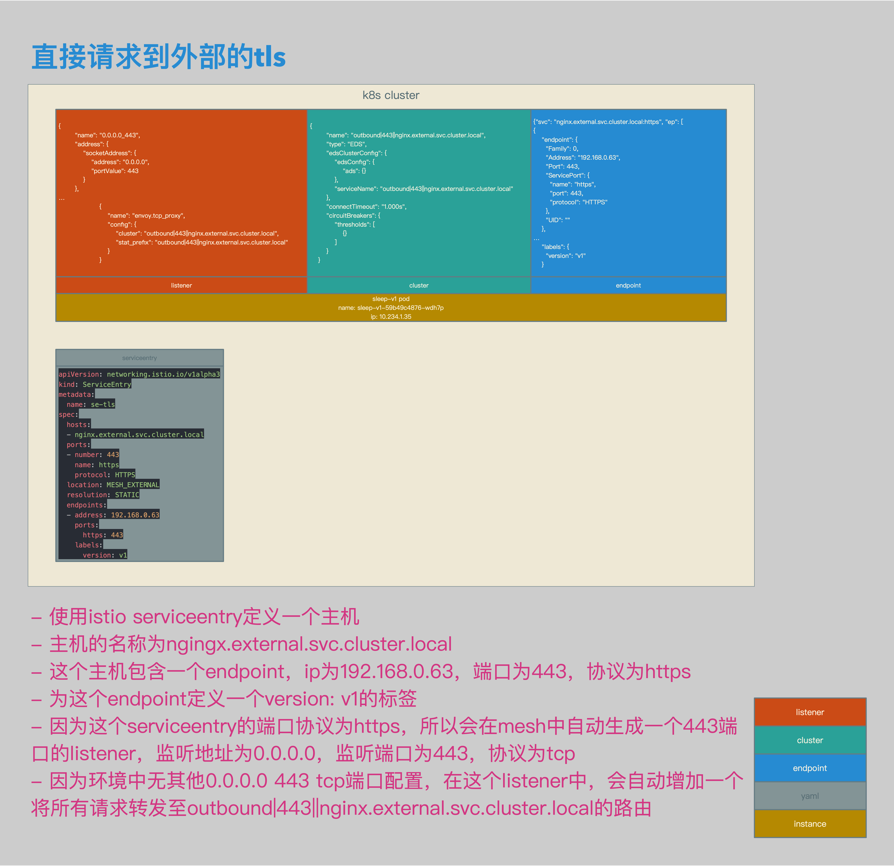
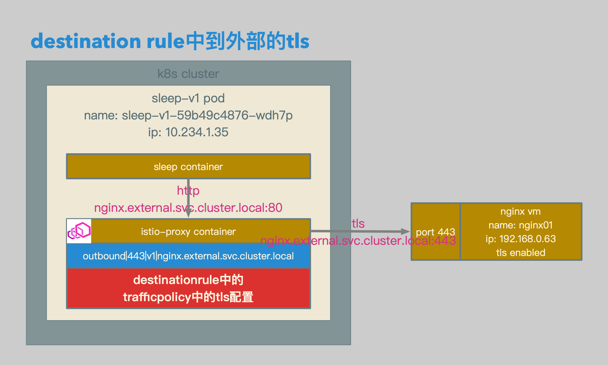
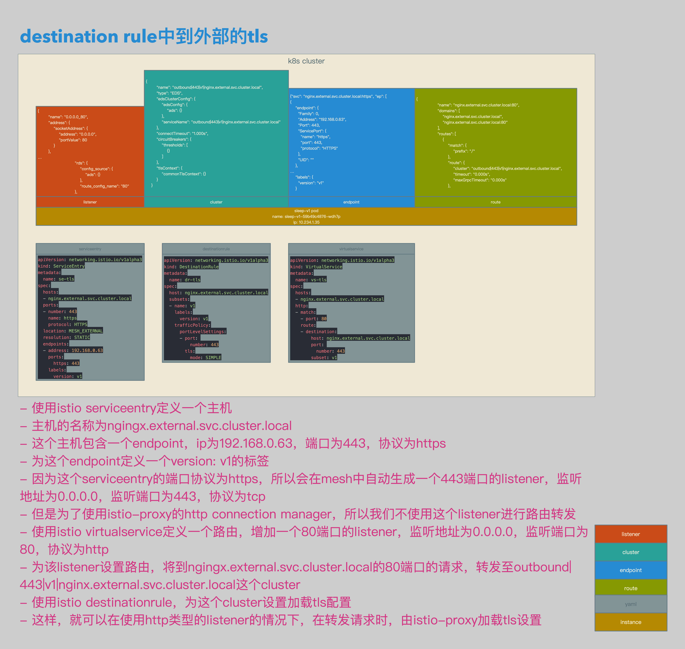

# Istio数据面配置解析14：在Destination Rule中配置到外部的TLS


[TOC]


## 概述

本文介绍了在Isito的DestinationRule中配置到外部的TLS：

1. 可以从client container直接发送tls请求到client Envoy proxy。
2. client Envoy proxy直接转发该tls请求至目标主机。
3. 如果是这个过程，则不需要对目标主机配置任何的DestinationRule。
4. **但是采用这种方式，路由将直接在Envoy tcp proxy中进行，无法使用Envoy http connection manager的高级路由功能。**
5. 所以建议，从client container到client Envoy proxy的请求为http请求。
6. 配置DestinationRule的目标主机启用TLS。
7. 在client Envoy proxy上，为到目标端主机的请求加载TLS配置。
8. **采用这种方式，从client container到client Envoy proxy的请求，可以使用Envoy http connection manager的高级路由功能。**


## 相关拓扑


- 从sleep container直接发送tls请求，https://nginx.external.svc.cluster.local ，到istio-proxy container。
- istio-proxy直接转发该tls请求，https://nginx.external.svc.cluster.local ，至nginx vm。
- 不需要对目标主机配置任何的destinationrule。
- 采用这种方式，路由将直接在istio-proxy的tcp proxy中进行，无法使用istio-proxy的http connection manager的高级路由功能。




- 使用istio serviceentry定义一个主机。
- 主机的名称为ngingx.external.svc.cluster.local。
- 这个主机包含一个endpoint，ip为192.168.0.63，端口为443，协议为https。
- 为这个endpoint定义一个version: v1的标签。
- 因为这个serviceentry的端口协议为https，所以会在mesh中自动生成一个443端口的listener，监听地址为0.0.0.0，监听端口为443，协议为tcp。
- 因为环境中无其他0.0.0.0 443 tcp端口配置，在这个listener中，会自动增加一个将所有请求转发至outbound|443||nginx.external.svc.cluster.local的路由。




- 从sleep container到istio-proxy container的请求为http请求，http://nginx.external.svc.cluster.local 。
- 配置destinationrule的目标主机，outbound|443|v1|nginx.external.svc.cluster.local，启用TLS。
- 在istio-proxy上，为到目标端主机的请求加载TLS配置。
- 采用这种方式，从sleep container到istio-proxy container的请求，可以使用istio-proxy的http connection manager的高级路由功能。




- 使用istio serviceentry定义一个主机。
- 主机的名称为ngingx.external.svc.cluster.local。
- 这个主机包含一个endpoint，ip为192.168.0.63，端口为443，协议为https。
- 为这个endpoint定义一个version: v1的标签。
- 因为这个serviceentry的端口协议为https，所以会在mesh中自动生成一个443端口的listener，监听地址为0.0.0.0，监听端口为443，协议为tcp。
- 但是为了使用istio-proxy的http connection manager，所以我们不使用这个listener进行路由转发。
- 使用istio virtualservice定义一个路由，增加一个80端口的listener，监听地址为0.0.0.0，监听端口为80，协议为http。
- 为该listener设置路由，将到ngingx.external.svc.cluster.local的80端口的请求，转发至outbound|443|v1|nginx.external.svc.cluster.local这个cluster。
- 使用istio destinationrule，为这个cluster设置加载tls配置。
- 这样，就可以在使用http类型的listener的情况下，在转发请求时，由istio-proxy加载tls设置。


## 准备

### External Nginx Server Certs

```bash
openssl req \
-newkey rsa:4096 -nodes -sha256 -keyout v1.nginx.key \
-out v1.nginx.csr

echo subjectAltName = DNS:nginx.external.svc.cluster.local, DNS:api.v1.nginx.external > v1.nginx.cnf

openssl x509 \
-req -days 3655 -in v1.nginx.csr -CA ca.crt -CAkey ca.key \
-CAcreateserial -extfile v1.nginx.cnf -out v1.nginx.crt
```

- 准备外部nginx服务器的证书和密钥：v1.nginx.crt和v1.nginx.key。


### External Nginx Server Conf

```bash
server {
    listen 443 ssl;
    server_name localhost;

    location / {
        root /usr/share/nginx/html/v1;
        index index.html index.htm;
    }

    ssl_certificate /etc/nginx/certs/v1.nginx.crt;
    ssl_certificate_key /etc/nginx/certs/v1.nginx.key;
    ssl_verify_depth 10;

    error_page 500 502 503 504 /50x.html;
    location = /50x.html {
        root /usr/share/nginx/html;
    }
}
```

- 准备外部nginx服务器的配置文件。
- 为外部nginx服务器启用tls。


## 相关配置

### ServiceEntry

```yaml
apiVersion: networking.istio.io/v1alpha3
kind: ServiceEntry
metadata:
  name: se-tls
spec:
  hosts:
  - nginx.external.svc.cluster.local
  ports:
  - number: 443
    name: https
    protocol: HTTPS
  location: MESH_EXTERNAL
  resolution: STATIC
  endpoints:
  - address: 192.168.0.63
    ports:
      https: 443
    labels:
      version: v1
```

- serviceentry相关配置。
- 主机的名称为ngingx.external.svc.cluster.local。
- 这个主机包含一个endpoint，ip为192.168.0.63，端口为443，协议为https。
- 为这个endpoint定义一个version: v1的标签。


```json
{"svc": "nginx.external.svc.cluster.local:https", "ep": [
{
    "endpoint": {
      "Family": 0,
      "Address": "192.168.0.63",
      "Port": 443,
      "ServicePort": {
        "name": "https",
        "port": 443,
        "protocol": "HTTPS"
      },
      "UID": ""
    },
…
    "labels": {
      "version": "v1"
    }
```

- envoy endpoint相关配置。
- 会生成serviceentry相关的endpoint。


### DestinationRule

```yaml
apiVersion: networking.istio.io/v1alpha3
kind: DestinationRule
metadata:
  name: dr-tls
spec:
  host: nginx.external.svc.cluster.local
  subsets:
  - name: v1
    labels:
      version: v1
    trafficPolicy:
      portLevelSettings:
      - port: 
          number: 443
        tls:
          mode: SIMPLE
```

- destinationrule相关配置。
- 配置针对主机nginx.external.svc.cluster.local的destinationrule。
- 为主机nginx.default.svc.cluster.local定义subset v1。
- 在subset v1的443端口上启用tls，mode为simple。


```json
{
        "name": "outbound|443|v1|nginx.external.svc.cluster.local",
        "type": "EDS",
        "edsClusterConfig": {
            "edsConfig": {
                "ads": {}
            },
            "serviceName": "outbound|443|v1|nginx.external.svc.cluster.local"
        },
        "connectTimeout": "1.000s",
        "circuitBreakers": {
            "thresholds": [
                {}
            ]
        },
        "tlsContext": {
            "commonTlsContext": {}
        }
    }
```

- envoy cluster相关配置。
- 根据相关destinationrule，主机生成cluster：outbound|443|v1|nginx.external.svc.cluster.local。
- 加载tlsContext配置。


### VirtualService

```yaml
apiVersion: networking.istio.io/v1alpha3
kind: VirtualService
metadata:
  name: vs-tls
spec:
  hosts:
  - nginx.external.svc.cluster.local
  http:
  - match:
    - port: 80
    route:
    - destination:
        host: nginx.external.svc.cluster.local
        port: 
          number: 443
        subset: v1
```

- virtualservice相关配置。
- istio-proxy sidecar在接收到到nginx.external.svc.cluster.local的80端口的http请求后，会将请求转发至nginx.default.svc.cluster.local的subset v1的443端口，也就是outbound|443|v1|nginx.external.svc.cluster.local。
- 而outbound|443|v1|nginx.external.svc.cluster.local配置了tls加载，所以http请求，会被转换成tls请求。


```json
{
                "name": "nginx.external.svc.cluster.local:80",
                "domains": [
                    "nginx.external.svc.cluster.local",
                    "nginx.external.svc.cluster.local:80"
                ],
                "routes": [
                    {
                        "match": {
                            "prefix": "/"
                        },
                        "route": {
                            "cluster": "outbound|443|v1|nginx.external.svc.cluster.local",
                            "timeout": "0.000s",
                            "maxGrpcTimeout": "0.000s"
                        },
```

- envoy route相关配置。
- 因为virtualservice类型为http，所以路由会在route中进行。
- envoy route会将到nginx.external.svc.cluster.local的80端口请求全部转发至outbound|443|v1|nginx.external.svc.cluster.local这个cluster。


## 测试结果

```bash
/ # curl https://nginx.external.svc.cluster.local --resolve nginx.external.svc.cluster.local:443:1.1.1.1 -k
<!DOCTYPE html>
<html>
<head>
<title>Welcome to nginx!</title>
<style>
    body {
        width: 35em;
        margin: 0 auto;
        font-family: Tahoma, Verdana, Arial, sans-serif;
    }
</style>
</head>
<body>
<h1>Welcome to nginx!</h1>
<h1>v1!</h1>
<p>If you see this page, the nginx web server is successfully installed and
working. Further configuration is required.</p>

<p>For online documentation and support please refer to
<a href="http://nginx.org/">nginx.org</a>.<br/>
Commercial support is available at
<a href="http://nginx.com/">nginx.com</a>.</p>

<p><em>Thank you for using nginx.</em></p>
</body>
</html>
/ #
```

- 使用https://nginx.external.svc.cluster.local ，可以正确访问外部nginx服务。
- 这种访问访问通过tcp进行路由，并在sleep container上加载tls设置。


```bash
/ # curl http://nginx.external.svc.cluster.local --resolve nginx.external.svc.cluster.local:80:1.1.1.1
<!DOCTYPE html>
<html>
<head>
<title>Welcome to nginx!</title>
<style>
    body {
        width: 35em;
        margin: 0 auto;
        font-family: Tahoma, Verdana, Arial, sans-serif;
    }
</style>
</head>
<body>
<h1>Welcome to nginx!</h1>
<h1>v1!</h1>
<p>If you see this page, the nginx web server is successfully installed and
working. Further configuration is required.</p>

<p>For online documentation and support please refer to
<a href="http://nginx.org/">nginx.org</a>.<br/>
Commercial support is available at
<a href="http://nginx.com/">nginx.com</a>.</p>

<p><em>Thank you for using nginx.</em></p>
</body>
</html>
/ #
```

- 使用http://nginx.external.svc.cluster.local ，可以正确访问外部nginx服务。
- 这种访问访问通过http进行路由，并在istio-proxy上加载tls设置。
