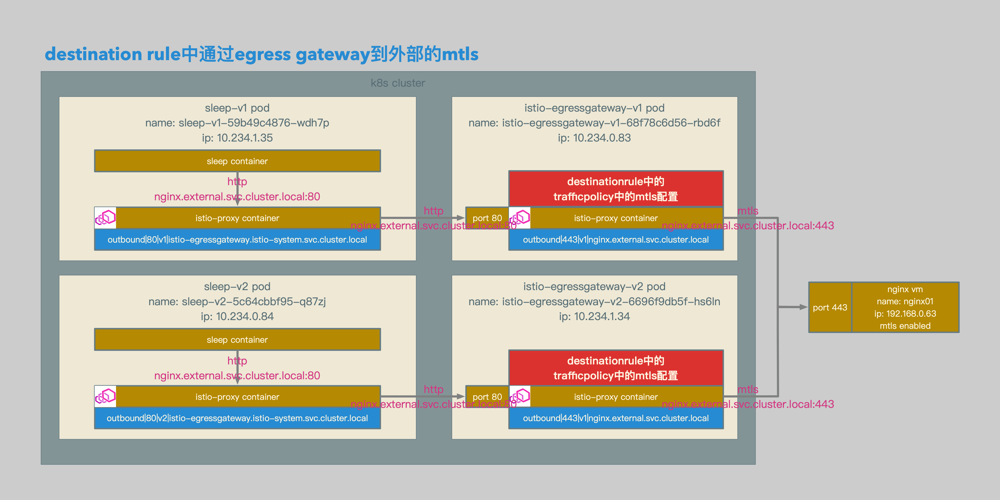

# Istio数据面配置解析15：在Destination Rule中通过Egress Gateway配置到外部的mTLS


[TOC]


## 概述

本文介绍了在Isito的DestinationRule中通过Egress Gateway配置到外部的mTLS：

1. 因为DestinationRule的应用位置为client端的Envoy proxy，所以针对某个目标配置DestinationRule的mTLS时，是配置的client端连接到该目标的参数信息，包括client端的Envoy proxy使用的证书，证书相关的密钥，以及根证书信息。
2. Envoy proxy作为client端，发起mTLS连接。
3. 以下是我的判断：
4. Mesh中的Envoy proxy sidecar无法定制证书信息，所以在Mesh内部，无法使用DestinationRule进行mTLS通信，而应该使用ISTIO_MUTUAL进行mTLS通信。
5. 只有在Ingress Gateay或Egress Gateway的Envoy proxy上，才可以定制证书信息，所以，只有在Gateway上，才能应用DestinationRule中的mTLS机制。
6. 但是一般来讲，Ingress Gateway一般是作为server端来卸载mTLS通信的，而Egress Gateway一般是作为client端来加载mTLS通信。
7. 所以我认为，DestinationRule中的mTLS配置，最佳的应用地点是在Egress Gateway上，用于加载mTLS配置，将Mesh内部的Http请求转变为mTLS请求后转发。


## 相关拓扑



- sleep-v1 container发送到nginx.external.svc.cluster.local的http请求至pod中的istio-proxy container。
- sleep-v1的istio-proxy container根据路由策略，将到nginx.external.svc.cluster.local的http请求发送到istio-egressgateway-v1的80端口。
- istio-egressgateway-v1的istio-proxy container根据路由策略，将到nginx.external.svc.cluster.local的http请求转为https请求，并发送到外部nginx服务。
- 在转发https请求之前，istio-egressgateway-v1的istio-proxy container会应用destinationrule，加载相关的mtls配置信息。
- **也就是说，从sleep-v1发送至外部nginx服务的mtls请求，使用的mtls证书，为istio-egressgateway-v1配置的客户端证书。**
- sleep-v2 container发送到nginx.external.svc.cluster.local的http请求至pod中的istio-proxy container。
- sleep-v2的istio-proxy container根据路由策略，将到nginx.external.svc.cluster.local的http请求发送到istio-egressgateway-v2的80端口。
- istio-egressgateway-v2的istio-proxy container根据路由策略，将到nginx.external.svc.cluster.local的http请求转为https请求，并发送到外部nginx服务。
- 在转发https请求之前，istio-egressgateway-v2的istio-proxy container会应用destinationrule，加载相关的mtls配置信息。
- **也就是说，从sleep-v2发送至外部nginx服务的mtls请求，使用的mtls证书，为istio-egressgateway-v2配置的客户端证书。**


- 使用istio serviceentry定义一个主机，主机的名称为nginx.external.svc.cluster.local。
- 该主机包含一个endpoint，endpoint的ip为192.168.0.63，端口为443，协议为https。
- 为这个endpoint定义一个version: v1的标签。
- 因为这个serviceentry的端口协议为https，所以会在mesh中自动生成一个443端口的listener，监听地址为0.0.0.0，监听端口为443，协议为tcp。
- 部署2个egress gateway，分别是isito-egressgateway-v1和istio-egressgateway-v2。
- isito-egressgateway-v1包含标签version: v1，isito-egressgateway-v2包含标签version: v2。
- 使用istio destinationrule定义isito-egressgateway-v1为subset v1，定义isito-egressgateway-v2为subset v2。
- 部署2个client端sleep应用，分别为sleep-v1和sleep-v2。
- sleep-v1包含标签app: sleep和version: v1，sleep-v2包含标签app: sleep和version: v2。
- 使用istio virtualservice定义从sleep-v1的80端口的请求，全部发送至isito-egressgateway-v1的80端口。
- 使用istio virtualservice定义从sleep-v2的80端口的请求，全部发送至isito-egressgateway-v2的80端口。
- 使用istio gateway定义egress gateway的80端口的监听，协议为http。
- 使用istio virtualservice定义从egress gateway到nginx.external.svc.cluster.local的路由，将所有80端口的请求转发到该主机的443端口。
- 使用istio destinationrule定义从egress gatway到nginx.external.svc.cluster.local的转发策略，启用mtls，并加载相应的证书和密钥。
- isito-egressgateway-v1加载的证书为v1.client.crt和v1.client.key。
- isito-egressgateway-v1加载的证书为v2.client.crt和v2.client.key。


## 准备

### Client Sleep Deployments

```yaml
apiVersion: v1
kind: Service
metadata:
  name: sleep
  labels:
    app: sleep
spec:
  ports:
  - port: 80
    name: http
  selector:
    app: sleep
---
apiVersion: extensions/v1beta1
kind: Deployment
metadata:
  name: sleep-v1
spec:
  replicas: 1
  template:
    metadata:
      labels:
        app: sleep
        version: v1
    spec:
      containers:
      - name: sleep
        image: 192.168.0.61/istio-example/alpine-curl
        command: ["/bin/sleep","7200"]
        imagePullPolicy: IfNotPresent
---
apiVersion: extensions/v1beta1
kind: Deployment
metadata:
  name: sleep-v2
spec:
  replicas: 1
  template:
    metadata:
      labels:
        app: sleep
        version: v2
    spec:
      containers:
      - name: sleep
        image: 192.168.0.61/istio-example/alpine-curl
        command: ["/bin/sleep","7200"]
        imagePullPolicy: IfNotPresent
```

- 准备用于client端的sleep pod。
- 包括sleep-v1和sleep-v2。
- sleep-v1加入version: v1标签。
- sleep-v2加入version: v2标签。


### Client Certs

```bash
openssl req \
-newkey rsa:4096 -nodes -sha256 -keyout v1.client.key \
-out v1.client.csr

openssl x509 \
-req -days 3655 -in v1.client.csr -CA ca.crt -CAkey ca.key \
-CAcreateserial -out v1.client.crt

openssl req \
-newkey rsa:4096 -nodes -sha256 -keyout v2.client.key \
-out v2.client.csr

openssl x509 \
-req -days 3655 -in v2.client.csr -CA ca.crt -CAkey ca.key \
-CAcreateserial -out v2.client.crt

kubectl create -n istio-system secret tls istio-egressgateway-v1-certs --key ./v1.client.key --cert ./v1.client.crt
kubectl create -n istio-system secret generic istio-egressgateway-v1-ca-certs --from-file ./ca.crt

kubectl create -n istio-system secret tls istio-egressgateway-v2-certs --key ./v2.client.key --cert ./v2.client.crt
kubectl create -n istio-system secret generic istio-egressgateway-v2-ca-certs --from-file ./ca.crt
```

- 准备用于v1版本client的证书和密钥：v1.client.crt和v1.client.key。
- 准备用于v2版本client的证书和密钥：v2.client.crt和v2.client.key。
- 为v1版本client创建tls secret：istio-egressgateway-v1-certs。
- 为v1版本client创建ca secret：istio-egressgateway-v1-ca-certs。
- 为v2版本client创建tls secret：istio-egressgateway-v2-certs。
- 为v2版本client创建ca secret：istio-egressgateway-v2-ca-certs。


### Egress Gateway Deployments

```yaml
apiVersion: extensions/v1beta1
kind: Deployment
metadata:
  name: istio-egressgateway-v1
  namespace: istio-system
  labels:
    chart: gateways-1.0.2
    release: istio-egressgateway
    heritage: Tiller
    app: istio-egressgateway
    istio: egressgateway
spec:
  replicas: 1
  template:
    metadata:
      labels:
        app: istio-egressgateway
        istio: egressgateway
        version: v1
      annotations:
        sidecar.istio.io/inject: "false"
        scheduler.alpha.kubernetes.io/critical-pod: ""
    spec:
      serviceAccountName: istio-egressgateway-service-account
      containers:
        - name: istio-proxy
          image: "192.168.0.61/istio/proxyv2:1.0.2"
          imagePullPolicy: IfNotPresent
          ports:
            - containerPort: 80
            - containerPort: 443
          args:
          - proxy
          - router
          - -v
          - "2"
          - --discoveryRefreshDelay
          - '1s' #discoveryRefreshDelay
          - --drainDuration
          - '45s' #drainDuration
          - --parentShutdownDuration
          - '1m0s' #parentShutdownDuration
          - --connectTimeout
          - '10s' #connectTimeout
          - --serviceCluster
          - istio-egressgateway
          - --zipkinAddress
          - zipkin:9411
          - --statsdUdpAddress
          - istio-statsd-prom-bridge:9125
          - --proxyAdminPort
          - "15000"
          - --controlPlaneAuthPolicy
          - NONE
          - --discoveryAddress
          - istio-pilot:8080
          resources:
            requests:
              cpu: 10m
            
          env:
          - name: POD_NAME
            valueFrom:
              fieldRef:
                apiVersion: v1
                fieldPath: metadata.name
          - name: POD_NAMESPACE
            valueFrom:
              fieldRef:
                apiVersion: v1
                fieldPath: metadata.namespace
          - name: INSTANCE_IP
            valueFrom:
              fieldRef:
                apiVersion: v1
                fieldPath: status.podIP
          - name: ISTIO_META_POD_NAME
            valueFrom:
              fieldRef:
                fieldPath: metadata.name
          volumeMounts:
          - name: istio-certs
            mountPath: /etc/certs
            readOnly: true
          - name: egressgateway-certs
            mountPath: "/etc/istio/egressgateway-certs"
            readOnly: true
          - name: egressgateway-ca-certs
            mountPath: "/etc/istio/egressgateway-ca-certs"
            readOnly: true
      volumes:
      - name: istio-certs
        secret:
          secretName: istio.istio-egressgateway-service-account
          optional: true
      - name: egressgateway-certs
        secret:
          secretName: "istio-egressgateway-v1-certs"
          optional: true
      - name: egressgateway-ca-certs
        secret:
          secretName: "istio-egressgateway-v1-ca-certs"
          optional: true
      affinity:      
        nodeAffinity:
          requiredDuringSchedulingIgnoredDuringExecution:
            nodeSelectorTerms:
            - matchExpressions:
              - key: beta.kubernetes.io/arch
                operator: In
                values:
                - amd64
                - ppc64le
                - s390x
          preferredDuringSchedulingIgnoredDuringExecution:
          - weight: 2
            preference:
              matchExpressions:
              - key: beta.kubernetes.io/arch
                operator: In
                values:
                - amd64
          - weight: 2
            preference:
              matchExpressions:
              - key: beta.kubernetes.io/arch
                operator: In
                values:
                - ppc64le
          - weight: 2
            preference:
              matchExpressions:
              - key: beta.kubernetes.io/arch
                operator: In
                values:
                - s390x
---
apiVersion: extensions/v1beta1
kind: Deployment
metadata:
  name: istio-egressgateway-v2
  namespace: istio-system
  labels:
    chart: gateways-1.0.2
    release: istio-egressgateway
    heritage: Tiller
    app: istio-egressgateway
    istio: egressgateway
spec:
  replicas: 1
  template:
    metadata:
      labels:
        app: istio-egressgateway
        istio: egressgateway
        version: v2
      annotations:
        sidecar.istio.io/inject: "false"
        scheduler.alpha.kubernetes.io/critical-pod: ""
    spec:
      serviceAccountName: istio-egressgateway-service-account
      containers:
        - name: istio-proxy
          image: "192.168.0.61/istio/proxyv2:1.0.2"
          imagePullPolicy: IfNotPresent
          ports:
            - containerPort: 80
            - containerPort: 443
          args:
          - proxy
          - router
          - -v
          - "2"
          - --discoveryRefreshDelay
          - '1s' #discoveryRefreshDelay
          - --drainDuration
          - '45s' #drainDuration
          - --parentShutdownDuration
          - '1m0s' #parentShutdownDuration
          - --connectTimeout
          - '10s' #connectTimeout
          - --serviceCluster
          - istio-egressgateway
          - --zipkinAddress
          - zipkin:9411
          - --statsdUdpAddress
          - istio-statsd-prom-bridge:9125
          - --proxyAdminPort
          - "15000"
          - --controlPlaneAuthPolicy
          - NONE
          - --discoveryAddress
          - istio-pilot:8080
          resources:
            requests:
              cpu: 10m
            
          env:
          - name: POD_NAME
            valueFrom:
              fieldRef:
                apiVersion: v1
                fieldPath: metadata.name
          - name: POD_NAMESPACE
            valueFrom:
              fieldRef:
                apiVersion: v1
                fieldPath: metadata.namespace
          - name: INSTANCE_IP
            valueFrom:
              fieldRef:
                apiVersion: v1
                fieldPath: status.podIP
          - name: ISTIO_META_POD_NAME
            valueFrom:
              fieldRef:
                fieldPath: metadata.name
          volumeMounts:
          - name: istio-certs
            mountPath: /etc/certs
            readOnly: true
          - name: egressgateway-certs
            mountPath: "/etc/istio/egressgateway-certs"
            readOnly: true
          - name: egressgateway-ca-certs
            mountPath: "/etc/istio/egressgateway-ca-certs"
            readOnly: true
      volumes:
      - name: istio-certs
        secret:
          secretName: istio.istio-egressgateway-service-account
          optional: true
      - name: egressgateway-certs
        secret:
          secretName: "istio-egressgateway-v2-certs"
          optional: true
      - name: egressgateway-ca-certs
        secret:
          secretName: "istio-egressgateway-v2-ca-certs"
          optional: true
      affinity:      
        nodeAffinity:
          requiredDuringSchedulingIgnoredDuringExecution:
            nodeSelectorTerms:
            - matchExpressions:
              - key: beta.kubernetes.io/arch
                operator: In
                values:
                - amd64
                - ppc64le
                - s390x
          preferredDuringSchedulingIgnoredDuringExecution:
          - weight: 2
            preference:
              matchExpressions:
              - key: beta.kubernetes.io/arch
                operator: In
                values:
                - amd64
          - weight: 2
            preference:
              matchExpressions:
              - key: beta.kubernetes.io/arch
                operator: In
                values:
                - ppc64le
          - weight: 2
            preference:
              matchExpressions:
              - key: beta.kubernetes.io/arch
                operator: In
                values:
                - s390x
```

- 准备egressgateway。
- 包括istio-egressgateway-v1和istio-egressgateway-v2.
- istio-egressgateway-v1将用于承接sleep-v1的请求。
- istio-egressgateway-v2将用于承接sleep-v2的请求。
- 为istio-egressgateway-v1挂载tls secret：istio-egressgateway-v1-certs。
- 为istio-egressgateway-v1挂载ca secret：istio-egressgateway-v1-ca-certs。
- 为istio-egressgateway-v2挂载tls secret：istio-egressgateway-v2-certs。
- 为istio-egressgateway-v2挂载ca secret：istio-egressgateway-v2-ca-certs。


### External Nginx Server Certs

```bash
openssl req \
-newkey rsa:4096 -nodes -sha256 -keyout v1.nginx.key \
-out v1.nginx.csr

echo subjectAltName = DNS:nginx.external.svc.cluster.local, DNS:api.v1.nginx.external > v1.nginx.cnf

openssl x509 \
-req -days 3655 -in v1.nginx.csr -CA ca.crt -CAkey ca.key \
-CAcreateserial -extfile v1.nginx.cnf -out v1.nginx.crt
```

- 准备外部nginx服务器的证书和密钥：v1.nginx.crt和v1.nginx.key。


### External Nginx Server Conf

```bash
server {
    listen 443 ssl;
    server_name localhost;

    if ($ssl_client_fingerprint != "50218ec31c55f5d6460772c21a1c25a8d42d1cf8") {
     return 403;
    }

    location / {
        root /usr/share/nginx/html/v1;
        index index.html index.htm;
    }

    ssl_certificate /etc/nginx/certs/v1.nginx.crt;
    ssl_certificate_key /etc/nginx/certs/v1.nginx.key;
    ssl_client_certificate /etc/nginx/certs/ca.crt;
    ssl_verify_client on;
    ssl_verify_depth 10;

    error_page 500 502 503 504 /50x.html;
    location = /50x.html {
        root /usr/share/nginx/html;
    }
}
```

- 准备外部nginx服务器的配置文件。
- 为外部nginx服务器启用mtls。
- 并且外部nginx服务器只接收证书的fingerprint为50218ec31c55f5d6460772c21a1c25a8d42d1cf8的client端的请求，也就是v1版本应用所配置的证书的请求，其他client端的请求均返回403。


## 相关配置

### ServiceEntry

```yaml
apiVersion: networking.istio.io/v1alpha3
kind: ServiceEntry
metadata:
  name: se-mtls
spec:
  hosts:
  - nginx.external.svc.cluster.local
  ports:
  - number: 443
    name: https
    protocol: HTTPS
  location: MESH_EXTERNAL
  resolution: STATIC
  endpoints:
  - address: 192.168.0.63
    ports:
      https: 443
    labels:
      version: v1
```

- serviceentry相关配置。
- 使用istio serviceentry定义一个主机，主机的名称为nginx.external.svc.cluster.local。
- 该主机包含一个endpoint，endpoint的ip为192.168.0.63，端口为443，协议为https。
- 为这个endpoint定义一个version: v1的标签。


```json
{"svc": "nginx.external.svc.cluster.local:http-mtls", "ep": [
{
    "endpoint": {
      "Family": 0,
      "Address": "192.168.0.63",
      "Port": 443,
      "ServicePort": {
        "name": "http-mtls",
        "port": 443,
        "protocol": "HTTP"
      },
      "UID": ""
    },
…
    "labels": {
      "version": "v1"
    }
```

- envoy endpoint相关配置。


### Egress Gateway DestinationRule

```yaml
apiVersion: networking.istio.io/v1alpha3
kind: DestinationRule
metadata:
  name: dr-mtls-egress
spec:
  host: istio-egressgateway.istio-system.svc.cluster.local
  subsets:
  - name: v1
    labels:
      version: v1
  - name: v2
    labels:
      version: v2
```

- destinationrule相关配置。
- 定义isito-egressgateway-v1为subset v1，定义isito-egressgateway-v2为subset v2。


```json
{
        "name": "outbound|80|v1|istio-egressgateway.istio-system.svc.cluster.local",
        "type": "EDS",
        "edsClusterConfig": {
            "edsConfig": {
                "ads": {}
            },
            "serviceName": "outbound|80|v1|istio-egressgateway.istio-system.svc.cluster.local"
        },
        "connectTimeout": "1.000s",
        "circuitBreakers": {
            "thresholds": [
                {}
            ]
        },
        "http2ProtocolOptions": {
            "maxConcurrentStreams": 1073741824
        }
    }

{
        "name": "outbound|80|v2|istio-egressgateway.istio-system.svc.cluster.local",
        "type": "EDS",
        "edsClusterConfig": {
            "edsConfig": {
                "ads": {}
            },
            "serviceName": "outbound|80|v2|istio-egressgateway.istio-system.svc.cluster.local"
        },
        "connectTimeout": "1.000s",
        "circuitBreakers": {
            "thresholds": [
                {}
            ]
        },
        "http2ProtocolOptions": {
            "maxConcurrentStreams": 1073741824
        }
    }
```

- envoy cluster相关配置。
- istio-egressgateway包含2个cluster，分别是：outbound|80|v1|istio-egressgateway.istio-system.svc.cluster.local和outbound|80|v2|istio-egressgateway.istio-system.svc.cluster.local。


### Mesh VirtualService

```yaml
apiVersion: networking.istio.io/v1alpha3
kind: VirtualService
metadata:
  name: vs-mtls-mesh
spec:
  hosts:
  - nginx.external.svc.cluster.local
  http:
  - match:
    - sourceLabels:
        app: sleep
        version: v1
      port: 80
    route:
    - destination:
        host: istio-egressgateway.istio-system.svc.cluster.local
        port:
          number: 80
        subset: v1
  - match:
    - sourceLabels:
        app: sleep
        version: v2
      port: 80
    route:
    - destination:
        host: istio-egressgateway.istio-system.svc.cluster.local
        port:
          number: 80
        subset: v2
```

- virtualservice相关配置。
- 从sleep-v1的80端口的请求，全部发送至isito-egressgateway-v1的80端口。
- 从sleep-v2的80端口的请求，全部发送至isito-egressgateway-v2的80端口。


```json
{
                "name": "nginx.external.svc.cluster.local:80",
                "domains": [
                    "nginx.external.svc.cluster.local",
                    "nginx.external.svc.cluster.local:80",
                    "nginx.external",
                    "nginx.external:80",
                    "nginx.external.svc.cluster",
                    "nginx.external.svc.cluster:80",
                    "nginx.external.svc",
                    "nginx.external.svc:80",
                    "10.233.158.241",
                    "10.233.158.241:80"
                ],
                "routes": [
                    {
                        "match": {
                            "prefix": "/"
                        },
                        "route": {
                            "cluster": "outbound|80|v1|istio-egressgateway.istio-system.svc.cluster.local",
                            "timeout": "0.000s",
                            "maxGrpcTimeout": "0.000s"
                        },

{
                "name": "nginx.external.svc.cluster.local:80",
                "domains": [
                    "nginx.external.svc.cluster.local",
                    "nginx.external.svc.cluster.local:80",
                    "nginx.external",
                    "nginx.external:80",
                    "nginx.external.svc.cluster",
                    "nginx.external.svc.cluster:80",
                    "nginx.external.svc",
                    "nginx.external.svc:80",
                    "10.233.158.241",
                    "10.233.158.241:80"
                ],
                "routes": [
                    {
                        "match": {
                            "prefix": "/"
                        },
                        "route": {
                            "cluster": "outbound|80|v2|istio-egressgateway.istio-system.svc.cluster.local",
                            "timeout": "0.000s",
                            "maxGrpcTimeout": "0.000s"
                        },
```

- envoy route相关配置。
- sleep-v1中，nginx.external.svc.cluster.local:80转发至outbound|80|v1|istio-egressgateway.istio-system.svc.cluster.local。
- sleep-v2中，nginx.external.svc.cluster.local:80转发至outbound|80|v2|istio-egressgateway.istio-system.svc.cluster.local。


### Gateway

```yaml
apiVersion: networking.istio.io/v1alpha3
kind: Gateway
metadata:
  name: eg-mtls
spec:
  selector:
    istio: egressgateway
  servers:
  - port:
      number: 80
      name: http
      protocol: HTTP
    hosts:
    - nginx.external.svc.cluster.local
```

- gateway相关配置。
- 定义egress gateway的80端口的监听，协议为http。


```json
{
        "name": "0.0.0.0_80",
        "address": {
            "socketAddress": {
                "address": "0.0.0.0",
                "portValue": 80
            }
        },
…
                            "rds": {
                                "config_source": {
                                    "ads": {}
                                },
                                "route_config_name": "http.80"
                            },
```

- envoy listener相关配置。


### Egress Gateway VirtualService

```yaml
apiVersion: networking.istio.io/v1alpha3
kind: VirtualService
metadata:
  name: vs-mtls-egress
spec:
  hosts:
  - nginx.external.svc.cluster.local
  gateways:
  - eg-mtls
  http:
  - route:
    - destination:
        host: nginx.external.svc.cluster.local
        port: 
          number: 443
        subset: v1
```

- virtualservice相关配置。
- 定义从egress gateway到nginx.external.svc.cluster.local的路由，将所有80端口的请求转发到该主机的443端口。


```json
{
        "name": "http.80",
        "virtualHosts": [
            {
                "name": "nginx.external.svc.cluster.local:80",
                "domains": [
                    "nginx.external.svc.cluster.local",
                    "nginx.external.svc.cluster.local:80"
                ],
                "routes": [
                    {
                        "match": {
                            "prefix": "/"
                        },
                        "route": {
                            "cluster": "outbound|443|v1|nginx.external.svc.cluster.local",
                            "timeout": "0.000s",
                            "maxGrpcTimeout": "0.000s"
                        },
```

- envoy route相关配置。
- 到nginx.external.svc.cluster.local:80的请求，被转发至outbound|443|v1|nginx.external.svc.cluster.local。


### Nginx DestinationRule

```yaml
apiVersion: networking.istio.io/v1alpha3
kind: DestinationRule
metadata:
  name: dr-mtls-nginx
spec:
  host: nginx.external.svc.cluster.local
  subsets:
  - name: v1
    labels:
      version: v1
    trafficPolicy:
      portLevelSettings:
      - port: 
          number: 443
        tls:
          mode: MUTUAL
          clientCertificate: /etc/istio/egressgateway-certs/tls.crt
          privateKey: /etc/istio/egressgateway-certs/tls.key
          caCertificates: /etc/istio/egressgateway-ca-certs/ca.crt
```

- destiantionrule相关配置。
- 定义从egress gatway到nginx.external.svc.cluster.local的转发策略，启用mtls，并加载相应的证书和密钥。


```json
{
        "name": "outbound|443|v1|nginx.external.svc.cluster.local",
        "type": "EDS",
        "edsClusterConfig": {
            "edsConfig": {
                "ads": {}
            },
            "serviceName": "outbound|443|v1|nginx.external.svc.cluster.local"
        },
        "connectTimeout": "1.000s",
        "circuitBreakers": {
            "thresholds": [
                {}
            ]
        },
        "tlsContext": {
            "commonTlsContext": {
                "tlsCertificates": [
                    {
                        "certificateChain": {
                            "filename": "/etc/istio/egressgateway-certs/tls.crt"
                        },
                        "privateKey": {
                            "filename": "/etc/istio/egressgateway-certs/tls.key"
                        }
                    }
                ],
                "validationContext": {
                    "trustedCa": {
                        "filename": "/etc/istio/egressgateway-ca-certs/ca.crt"
                    }
                }
            }
        }
    }
```

- envoy cluster相关配置。
- cluster名称为outbound|443|v1|nginx.external.svc.cluster.local。
- 定义了certificateChain，privateKey和trustedCa。


## 测试结果

```bash
/ # curl http://nginx.external.svc.cluster.local --resolve nginx.external.svc.cluster.local:80:1.1.1.1
<!DOCTYPE html>
<html>
<head>
<title>Welcome to nginx!</title>
<style>
    body {
        width: 35em;
        margin: 0 auto;
        font-family: Tahoma, Verdana, Arial, sans-serif;
    }
</style>
</head>
<body>
<h1>Welcome to nginx!</h1>
<h1>v1!</h1>
<p>If you see this page, the nginx web server is successfully installed and
working. Further configuration is required.</p>

<p>For online documentation and support please refer to
<a href="http://nginx.org/">nginx.org</a>.<br/>
Commercial support is available at
<a href="http://nginx.com/">nginx.com</a>.</p>

<p><em>Thank you for using nginx.</em></p>
</body>
</html>
/ #
```

- 从sleep-v1发送至外部nginx服务的mtls请求，使用的mtls证书，为istio-egressgateway-v1配置的客户端证书，可以正常访问外部nginx服务。


```bash
/ # curl http://nginx.external.svc.cluster.local --resolve nginx.external.svc.cluster.local:80:1.1.1.1
<html>
<head><title>403 Forbidden</title></head>
<body bgcolor="white">
<center><h1>403 Forbidden</h1></center>
<hr><center>nginx/1.14.1</center>
</body>
</html>
/ #
```

- 从sleep-v2发送至外部nginx服务的mtls请求，使用的mtls证书，为istio-egressgateway-v2配置的客户端证书，证书被外部nginx服务的mtls策略拒绝。

