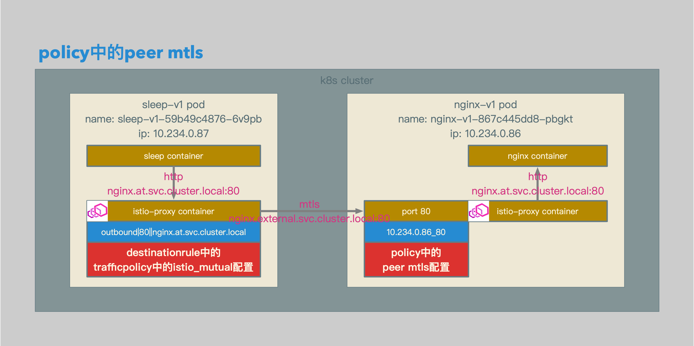
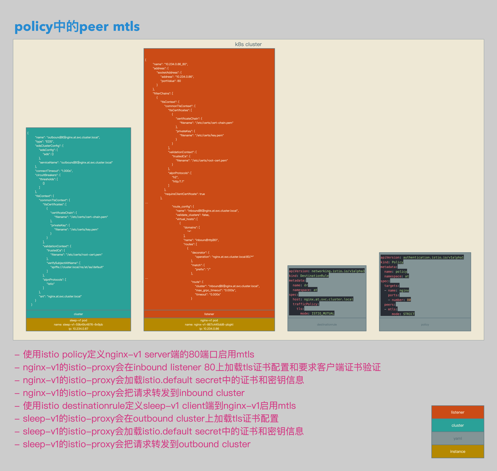

# Istio数据面配置解析16：使用Policy配置Peer mTLS Authentication


[TOC]


## 概述

本文介绍了在Isito中使用Policy配置Peer mTLS Authentication：

1. 为Server端配置Policy，启用mTLS卸载。
2. Server端在应用Policy后，会在inbound listnener中加载相应配置和证书。
3. 为Client端配置DestinationRule，启用mTLS加载。
4. Client端在应用DestinationRule后，会在outbound cluster中加载相应配置和证书。


## 相关拓扑



- sleep container发送到nginx.at.svc.cluster.local的http请求至sleep-v1的istio-proxy container。
- sleep-v1的istio-proxy container加载destinationrule中的mtls设置，将到nginx.external.svc.cluster.local的mtls请求发送到nginx-v1的istio-proxy container的80端口。
- nginx-v1的istio-proxy container根据policy中的mtls设置，验证从sleep-v1发送过来的请求。
- 请求验证成功，nginx-v1的istio-proxy container将请求转发至nginx container。




- 使用istio policy定义nginx-v1 server端的80端口启用mtls。
- nginx-v1的istio-proxy会在inbound listener 80上加载tls证书配置和要求客户端证书验证。
- nginx-v1的istio-proxy会加载istio.default secret中的证书和密钥信息。
- nginx-v1的istio-proxy会把请求转发到inbound cluster。
- 使用istio destinationrule定义sleep-v1 client端到nginx-v1启用mtls。
- sleep-v1的istio-proxy会在outbound cluster上加载tls证书配置。
- sleep-v1的istio-proxy会加载istio.default secret中的证书和密钥信息。
- sleep-v1的istio-proxy会把请求转发到outbound cluster。


## 准备

### Client Sleep

```yaml
apiVersion: extensions/v1beta1
kind: Deployment
metadata:
  name: sleep-v1
spec:
  replicas: 1
  template:
    metadata:
      labels:
        app: sleep
        version: v1
    spec:
      containers:
      - name: sleep
        image: 192.168.0.61/istio-example/alpine-curl
        command: ["/bin/sleep","7200"]
        imagePullPolicy: IfNotPresent
```

- 准备用于client端的sleep-v1。


### Server Nginx

```bash
apiVersion: extensions/v1beta1
kind: Deployment
metadata:
  name: nginx-v1
  namespace: at
spec:
  replicas: 1
  template:
    metadata:
      labels:
        app: nginx
        version: v1
    spec:
      containers:
      - name: nginx
        image: 192.168.0.61/istio-example/nginx
        ports:
        - containerPort: 80
        volumeMounts:
        - mountPath: /etc/nginx/conf.d/
          readOnly: true
          name: conf
        - mountPath: /etc/nginx/html/
          readOnly: true
          name: index
      volumes:
      - name: conf
        configMap:
          name: cm-nginx-v1
          items:
            - key: default.conf
              path: default.conf
      - name: index
        configMap:
          name: cm-nginx-v1
          items:
            - key: index.html
              path: index.html
---
apiVersion: v1
kind: ConfigMap
metadata:
  name: cm-nginx-v1
  namespace: at
data:
  default.conf: |
    server {
      listen       80;
      server_name  loalhost;

      location / {
        root   /etc/nginx/html/;
        index  index.html index.htm;
      }

      error_page   500 502 503 504  /50x.html;
      location = /50x.html {
        root   /usr/share/nginx/html;
      }
    }
  index.html: |
    <!DOCTYPE html>
    <html>
    <head>
    <title>Welcome to nginx!</title>
    <style>
      body {
        width: 35em;
        margin: 0 auto;
        font-family: Tahoma, Verdana, Arial, sans-serif;
      }
    </style>
    </head>
    <body>
    <h1>Welcome to nginx!</h1>
    <h1>v1!</h1>
    <p>If you see this page, the nginx web server is successfully installed and working. Further configuration is required.</p>
    <p>For online documentation and support please refer to
    <a href="http://nginx.org/">nginx.org</a>.<br/>
    Commercial support is available at
    <a href="http://nginx.com/">nginx.com</a>.</p>
    <p><em>Thank you for using nginx.</em></p>
    </body>
    </html>
---
apiVersion: v1
kind: Service
metadata:
  name: nginx
  namespace: at
spec:
  type: ClusterIP
  ports:
  - port: 80
    name: http
  selector:
    app: nginx
```

- 准备用于server端的nginx-v1。


## 相关配置

### Policy

```yaml
apiVersion: authentication.istio.io/v1alpha1
kind: Policy
metadata:
  name: policy
  namespace: at
spec:
  targets:
  - name: nginx
    ports:
    - number: 80
  peers:
  - mtls:
      mode: STRICT
```

- policy相关配置。
- policy的作用域为at ns。
- policy的作用目标为nginx的80端口。
- 针对作用域中的目标启用peer mtls。


```json
{
        "name": "10.234.0.86_80",
        "address": {
            "socketAddress": {
                "address": "10.234.0.86",
                "portValue": 80
            }
        },
        "filterChains": [
            {
                "tlsContext": {
                    "commonTlsContext": {
                        "tlsCertificates": [
                            {
                                "certificateChain": {
                                    "filename": "/etc/certs/cert-chain.pem"
                                },
                                "privateKey": {
                                    "filename": "/etc/certs/key.pem"
                                }
                            }
                        ],
                        "validationContext": {
                            "trustedCa": {
                                "filename": "/etc/certs/root-cert.pem"
                            }
                        },
                        "alpnProtocols": [
                            "h2",
                            "http/1.1"
                        ]
                    },
                    "requireClientCertificate": true
                },
…
                            "route_config": {
                                "name": "inbound|80||nginx.at.svc.cluster.local",
                                "validate_clusters": false,
                                "virtual_hosts": [
                                    {
                                        "domains": [
                                            "*"
                                        ],
                                        "name": "inbound|http|80",
                                        "routes": [
                                            {
                                                "decorator": {
                                                    "operation": "nginx.at.svc.cluster.local:80/*"
                                                },
                                                "match": {
                                                    "prefix": "/"
                                                },
…
                                                "route": {
                                                    "cluster": "inbound|80||nginx.at.svc.cluster.local",
                                                    "max_grpc_timeout": "0.000s",
                                                    "timeout": "0.000s"
                                                }
```

- envoy listener相关配置。
- policy会作用在10.234.0.86_80监听上。
- policy会配置10.234.0.86_80监听的certificateChain，privateKey，trustedCa和requireClientCertificate参数。
- 10.234.0.86_80监听中的证书和密钥信息保存在at ns的istio.default secret中。
- 10.234.0.86_80监听会把nginx.at.svc.cluster.local:80/*请求转发到inbound|80||nginx.at.svc.cluster.local。


### DestinationRule

```yaml
apiVersion: networking.istio.io/v1alpha3
kind: DestinationRule
metadata:
  name: dr
  namespace: at
spec:
  host: nginx.at.svc.cluster.local
  trafficPolicy:
    tls:
      mode: ISTIO_MUTUAL
```

- destinationrule相关配置。
- 针对nginx.at.svc.cluster.local主机，启用ISTIO_MUTUAL。


```json
{
        "name": "outbound|80||nginx.at.svc.cluster.local",
        "type": "EDS",
        "edsClusterConfig": {
            "edsConfig": {
                "ads": {}
            },
            "serviceName": "outbound|80||nginx.at.svc.cluster.local"
        },
        "connectTimeout": "1.000s",
        "circuitBreakers": {
            "thresholds": [
                {}
            ]
        },
        "tlsContext": {
            "commonTlsContext": {
                "tlsCertificates": [
                    {
                        "certificateChain": {
                            "filename": "/etc/certs/cert-chain.pem"
                        },
                        "privateKey": {
                            "filename": "/etc/certs/key.pem"
                        }
                    }
                ],
                "validationContext": {
                    "trustedCa": {
                        "filename": "/etc/certs/root-cert.pem"
                    },
                    "verifySubjectAltName": [
                        "spiffe://cluster.local/ns/at/sa/default"
                    ]
                },
                "alpnProtocols": [
                    "istio"
                ]
            },
            "sni": "nginx.at.svc.cluster.local"
        }
    }
```

- envoy cluster相关配置。
- destinationrule会作用在outbound|80||nginx.at.svc.cluster.local cluster上。
- destinationrule会配置cluster的certificateChain，privateKey，trustedCa和sni参数。
- cluster中的证书和密钥信息保存在default ns的istio.default secret中。


## 测试结果

```bash
/ # curl http://nginx.at
upstream connect error or disconnect/reset before headers/ #
/ #

$ curl http://localhost:15000/stats | grep 10.234.0.86_80.ssl.connection_error
listener.10.234.0.86_80.ssl.connection_error: 8
$
```

- 如果只启用policy，不配置相应的destinationrule，在server端的istio-proxy上，会有相应的连接错误。


```bash
/ # curl http://nginx.at
<!DOCTYPE html>
<html>
<head>
<title>Welcome to nginx!</title>
<style>
  body {
    width: 35em;
    margin: 0 auto;
    font-family: Tahoma, Verdana, Arial, sans-serif;
  }
</style>
</head>
<body>
<h1>Welcome to nginx!</h1>
<h1>v1!</h1>
<p>If you see this page, the nginx web server is successfully installed and working. Further configuration is required.</p>
<p>For online documentation and support please refer to
<a href="http://nginx.org/">nginx.org</a>.<br/>
Commercial support is available at
<a href="http://nginx.com/">nginx.com</a>.</p>
<p><em>Thank you for using nginx.</em></p>
</body>
</html>
/ #
```

- 在配置了相应的destinationrule以后，可以正常访问server。

