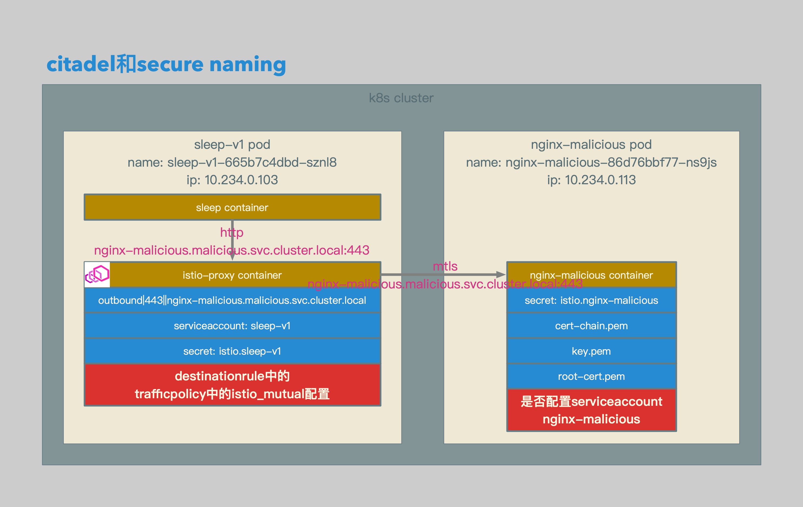
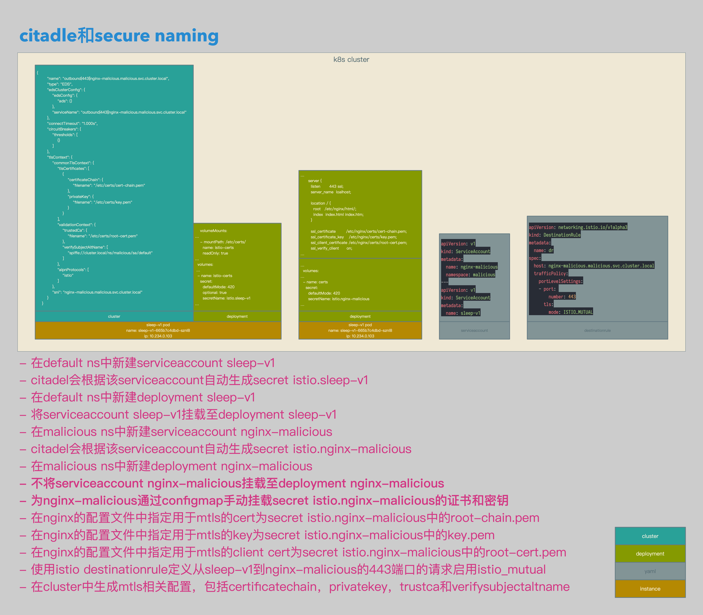
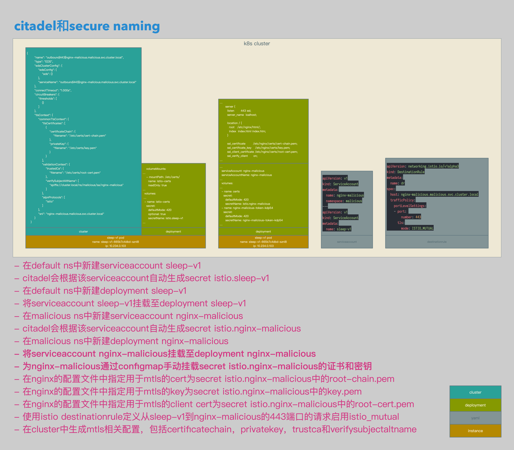

# Istio数据面配置解析17：Citadel和Secure Naming


[TOC]


## 概述

本文介绍了在Isito中使用Citadel的证书和密钥进行mTLS通信，以及Secure Naming的工作机制：

1. 使用Citadel生成证书和密钥。
2. 配置Client端使用Citadel生成的证书和密钥。
3. 配置Server端使用Citadel生成的证书和密钥。
4. 在什么情况下，从Client到Server的通信无法通过Secure Naming的校验。
5. 在什么情况下，从Client到Server的通信可以通过Secure Naming的校验。


## 相关拓扑



- 新建serviceaccount sleep-v1和nginx-malicious。
- 新建deployment sleep-v1和nginx-malicious。
- 将serviceaccount sleep-v1挂载至deployment sleep-v1。
- istio会自动将citadel根据serviceaccount sleep-v1生成的secret istio.sleep-v1挂载至sleep-v1 pod的istio-proxy sidecar中。
- 将citadel根据serviceaccount nginx-malicious生成的secret通过configmap挂载至nginx-malicious的nginx配置中。
- 为到nginx-malicious的443端口的请求启用istio_mutual。
- **观察是否将serviceaccount nginx-malicious挂载至deployment nginx-malicious的不同结果。**


## 准备

```yaml
apiVersion: v1
kind: ServiceAccount
metadata:
  name: nginx-malicious
  namespace: malicious
---
apiVersion: v1
kind: ServiceAccount
metadata:
  name: sleep-v1
```

- serviceaccount相关配置。
- 在default ns中新建serviceaccount sleep-v1。
- 在malicious ns中新建serviceaccount nginx-malicious。


```bash
shenxg13@is5:~|⇒  kubectl get secrets
NAME                         TYPE                                  DATA   AGE
default-token-6xbrm          kubernetes.io/service-account-token   3      63d
istio.default                istio.io/key-and-cert                 3      63d
istio.sleep-v1               istio.io/key-and-cert                 3      5h
sleep-v1-token-p4l5b         kubernetes.io/service-account-token   3      5h
shenxg13@is5:~|⇒

shenxg13@is5:~|⇒  kubectl get secrets -n malicious
NAME                          TYPE                                  DATA   AGE
default-token-9cb8w           kubernetes.io/service-account-token   3      5h
istio.default                 istio.io/key-and-cert                 3      5h
istio.nginx-malicious         istio.io/key-and-cert                 3      5h
nginx-malicious-token-kdp54   kubernetes.io/service-account-token   3      5h
shenxg13@is5:~|⇒
```

- citadel会为serviceaccount sleep-v1自动生成secret istio.sleep-v1。
- citadel会为serviceaccount istio.nginx-malicious自动生成secret istio.nginx-malicious。


```bash
X509v3 Subject Alternative Name: 
                URI:spiffe://cluster.local/ns/malicious/sa/nginx-malicious
```

- 查看istio.nginx-malicious的cert-chain.pem中的san信息如下：
- **URI:spiffe://cluster.local/ns/malicious/sa/nginx-malicious。**


```yaml
apiVersion: extensions/v1beta1
kind: Deployment
metadata:
  name: sleep-v1
spec:
  replicas: 1
  template:
    metadata:
      labels:
        app: sleep
        version: v1
    spec:
      serviceAccountName: sleep-v1
      containers:
      - name: sleep
        image: 192.168.0.61/istio-example/alpine-curl
        command: ["/bin/sleep","7200"]
        imagePullPolicy: IfNotPresent
```

- 准备用于client端的sleep-v1
- 为deployment sleep-v1挂载serviceaccount sleep-v1。


```yaml
    volumeMounts:
…
    - mountPath: /etc/certs/
      name: istio-certs
      readOnly: true
…
  volumes:
 …
  - name: istio-certs
    secret:
      defaultMode: 420
      optional: true
      secretName: istio.sleep-v1
…
```

- sleep-v1的istio-proxy会自动加载secret istio.sleep-v1为volume。
- 并将这个volume挂载到istio-proxy的/etc/certs目录下。


```yaml
apiVersion: v1
kind: Service
metadata:
  name: nginx-malicious
  namespace: malicious
spec:
  type: ClusterIP
  ports:
  - port: 443
    name: https
  selector:
    app: nginx-malicious
---
apiVersion: v1
kind: ConfigMap
metadata:
  name: nginx-malicious
  namespace: malicious
data:
  default.conf: |
    server {
      listen       443 ssl;
      server_name  loalhost;

      location / {
        root   /etc/nginx/html/;
        index  index.html index.htm;
      }

      ssl_certificate        /etc/nginx/certs/cert-chain.pem;
      ssl_certificate_key    /etc/nginx/certs/key.pem;
      ssl_client_certificate /etc/nginx/certs/root-cert.pem;
      ssl_verify_client      on;
      ssl_verify_depth       10;

      error_page   500 502 503 504  /50x.html;
      location = /50x.html {
        root   /usr/share/nginx/html;
      }
    }
  index.html: |
    <!DOCTYPE html>
    <html>
    <head>
    <title>Welcome to nginx!</title>
    <style>
      body {
        width: 35em;
        margin: 0 auto;
        font-family: Tahoma, Verdana, Arial, sans-serif;
      }
    </style>
    </head>
    <body>
    <h1>Welcome to nginx!</h1>
    <h1>Malicious!</h1>
    <p>If you see this page, the nginx web server is successfully installed and working. Further configuration is required.</p>
    <p>For online documentation and support please refer to
    <a href="http://nginx.org/">nginx.org</a>.<br/>
    Commercial support is available at
    <a href="http://nginx.com/">nginx.com</a>.</p>
    <p><em>Thank you for using nginx.</em></p>
    </body>
    </html>
```

- 在malicious ns下新建service nginx-malicious，打开443端口，命名为https。
- 在nginx configmap中配置mtls使用istio.nginx-malicious中自动生成的证书和密钥。


```yaml
apiVersion: networking.istio.io/v1alpha3
kind: DestinationRule
metadata:
  name: dr
spec:
  host: nginx-malicious.malicious.svc.cluster.local
  trafficPolicy:
    portLevelSettings:
    - port: 
        number: 443
      tls:
        mode: ISTIO_MUTUAL
```

- destinationrule相关配置。
- 配置到nginx-malicious.malicious.svc.cluster.local启用istio_mutual。


## 不为Server端挂载ServiceAccount



- 在default ns中新建serviceaccount sleep-v1。
- citadel会根据该serviceaccount自动生成secret istio.sleep-v1。
- 在default ns中新建deployment sleep-v1。
- 将serviceaccount sleep-v1挂载至deployment sleep-v1。
- 在malicious ns中新建serviceaccount nginx-malicious。
- citadel会根据该serviceaccount自动生成secret istio.nginx-malicious。
- 在malicious ns中新建deployment nginx-malicious。
- **不将serviceaccount nginx-malicious挂载至deployment nginx-malicious。**
- **为nginx-malicious通过configmap手动挂载secret istio.nginx-malicious的证书和密钥。**
- 在nginx的配置文件中指定用于mtls的cert为secret istio.nginx-malicious中的root-chain.pem。
- 在nginx的配置文件中指定用于mtls的key为secret istio.nginx-malicious中的key.pem。
- 在nginx的配置文件中指定用于mtls的client cert为secret istio.nginx-malicious中的root-cert.pem。
- 使用istio destinationrule定义从sleep-v1到nginx-malicious的443端口的请求启用istio_mutual。
- 在cluster中生成mtls相关配置，包括certificatechain，privatekey，trustca和verifysubjectaltname。


```yaml
apiVersion: extensions/v1beta1
kind: Deployment
metadata:
  name: nginx-malicious
  namespace: malicious
spec:
  replicas: 1
  template:
    metadata:
      labels:
        app: nginx-malicious
        version: malicious
    spec:
      containers:
      - name: nginx
        image: 192.168.0.61/istio-example/nginx
        ports:
        - containerPort: 80
        - containerPort: 443
        volumeMounts:
        - mountPath: /etc/nginx/conf.d/
          readOnly: true
          name: conf
        - mountPath: /etc/nginx/html/
          readOnly: true
          name: index
        - mountPath: /etc/nginx/certs
          readOnly: true
          name: certs
      volumes:
      - name: conf
        configMap:
          name: nginx-malicious
          items:
            - key: default.conf
              path: default.conf
      - name: index
        configMap:
          name: nginx-malicious
          items:
            - key: index.html
              path: index.html
      - name: certs
        secret:
          secretName: istio.nginx-malicious
```

- 准备用于server端的nginx-malicious。
- **nginx-malicious未挂载serviceaccount nginx-malicious。**
- nginx-malicious挂载istio.nginx-malicious中的证书和密钥。


```yaml
…
  volumes:
…
  - name: certs
    secret:
      defaultMode: 420
      secretName: istio.nginx-malicious
…
```

- nginx-malicious pod中未包含serviceaccount信息。


```json
{
        "name": "outbound|443||nginx-malicious.malicious.svc.cluster.local",
        "type": "EDS",
        "edsClusterConfig": {
            "edsConfig": {
                "ads": {}
            },
            "serviceName": "outbound|443||nginx-malicious.malicious.svc.cluster.local"
        },
        "connectTimeout": "1.000s",
        "circuitBreakers": {
            "thresholds": [
                {}
            ]
        },
        "tlsContext": {
            "commonTlsContext": {
                "tlsCertificates": [
                    {
                        "certificateChain": {
                            "filename": "/etc/certs/cert-chain.pem"
                        },
                        "privateKey": {
                            "filename": "/etc/certs/key.pem"
                        }
                    }
                ],
                "validationContext": {
                    "trustedCa": {
                        "filename": "/etc/certs/root-cert.pem"
                    },
                    "verifySubjectAltName": [
                        "spiffe://cluster.local/ns/malicious/sa/default"
                    ]
                },
                "alpnProtocols": [
                    "istio"
                ]
            },
            "sni": "nginx-malicious.malicious.svc.cluster.local"
        }
    }
```

- server端outbound cluster中的配置如下：
- **verifySubjectAltName中不包含URI:spiffe://cluster.local/ns/malicious/sa/nginx-malicious。**


```bash
/ # curl nginx-malicious.malicious:443 -v
* Rebuilt URL to: nginx-malicious.malicious:443/
*   Trying 10.233.17.189...
* TCP_NODELAY set
* Connected to nginx-malicious.malicious (10.233.17.189) port 443 (#0)
> GET / HTTP/1.1
> Host: nginx-malicious.malicious:443
> User-Agent: curl/7.61.0
> Accept: */*
>
* Recv failure: Connection reset by peer
* stopped the pause stream!
* Closing connection 0
curl: (56) Recv failure: Connection reset by peer
/ #

$ curl http://localhost:15000/stats|grep nginx-malicious|grep fail_verify_san
cluster.outbound|443||nginx-malicious.malicious.svc.cluster.local.ssl.fail_verify_san: 3
$
```

- 触发istio-proxy的ssl.fail_verify_san，无法访问服务。


## 为Server端挂载ServiceAccount



- 在default ns中新建serviceaccount sleep-v1。
- citadel会根据该serviceaccount自动生成secret istio.sleep-v1。
- 在default ns中新建deployment sleep-v1。
- 将serviceaccount sleep-v1挂载至deployment sleep-v1。
- 在malicious ns中新建serviceaccount nginx-malicious。
- citadel会根据该serviceaccount自动生成secret istio.nginx-malicious。
- 在malicious ns中新建deployment nginx-malicious。
- **将serviceaccount nginx-malicious挂载至deployment nginx-malicious。**
- **为nginx-malicious通过configmap手动挂载secret istio.nginx-malicious的证书和密钥。**
- 在nginx的配置文件中指定用于mtls的cert为secret istio.nginx-malicious中的root-chain.pem。
- 在nginx的配置文件中指定用于mtls的key为secret istio.nginx-malicious中的key.pem。
- 在nginx的配置文件中指定用于mtls的client cert为secret istio.nginx-malicious中的root-cert.pem。
- 使用istio destinationrule定义从sleep-v1到nginx-malicious的443端口的请求启用istio_mutual。
- 在cluster中生成mtls相关配置，包括certificatechain，privatekey，trustca和verifysubjectaltname。


```yaml
apiVersion: extensions/v1beta1
kind: Deployment
metadata:
  name: nginx-malicious
  namespace: malicious
spec:
  replicas: 1
  template:
    metadata:
      labels:
        app: nginx-malicious
        version: malicious
    spec:
      serviceAccountName: nginx-malicious
      containers:
      - name: nginx
        image: 192.168.0.61/istio-example/nginx
        ports:
        - containerPort: 80
        - containerPort: 443
        volumeMounts:
        - mountPath: /etc/nginx/conf.d/
          readOnly: true
          name: conf
        - mountPath: /etc/nginx/html/
          readOnly: true
          name: index
        - mountPath: /etc/nginx/certs
          readOnly: true
          name: certs
      volumes:
      - name: conf
        configMap:
          name: nginx-malicious
          items:
            - key: default.conf
              path: default.conf
      - name: index
        configMap:
          name: nginx-malicious
          items:
            - key: index.html
              path: index.html
      - name: certs
        secret:
          secretName: istio.nginx-malicious
```

- 准备用于server端的nginx-malicious。
- **nginx-malicious挂载serviceaccount nginx-malicious。**
- nginx-malicious挂载istio.nginx-malicious中的证书和密钥。


```yaml
…
  serviceAccount: nginx-malicious
  serviceAccountName: nginx-malicious
…
  volumes:
…
  - name: certs
    secret:
      defaultMode: 420
      secretName: istio.nginx-malicious
  - name: nginx-malicious-token-kdp54
    secret:
      defaultMode: 420
      secretName: nginx-malicious-token-kdp54
…
```

- nginx-malicious pod中包含serviceaccount信息。


```json
{
        "name": "outbound|443||nginx-malicious.malicious.svc.cluster.local",
        "type": "EDS",
        "edsClusterConfig": {
            "edsConfig": {
                "ads": {}
            },
            "serviceName": "outbound|443||nginx-malicious.malicious.svc.cluster.local"
        },
        "connectTimeout": "1.000s",
        "circuitBreakers": {
            "thresholds": [
                {}
            ]
        },
        "tlsContext": {
            "commonTlsContext": {
                "tlsCertificates": [
                    {
                        "certificateChain": {
                            "filename": "/etc/certs/cert-chain.pem"
                        },
                        "privateKey": {
                            "filename": "/etc/certs/key.pem"
                        }
                    }
                ],
                "validationContext": {
                    "trustedCa": {
                        "filename": "/etc/certs/root-cert.pem"
                    },
                    "verifySubjectAltName": [
                        "spiffe://cluster.local/ns/malicious/sa/nginx-malicious"
                    ]
                },
                "alpnProtocols": [
                    "istio"
                ]
            },
            "sni": "nginx-malicious.malicious.svc.cluster.local"
        }
    }
```

- server端outbound cluster中的配置如下：
- **verifySubjectAltName中包含URI:spiffe://cluster.local/ns/malicious/sa/nginx-malicious。**


```bash
/ # curl nginx-malicious.malicious:443
<!DOCTYPE html>
<html>
<head>
<title>Welcome to nginx!</title>
<style>
  body {
    width: 35em;
    margin: 0 auto;
    font-family: Tahoma, Verdana, Arial, sans-serif;
  }
</style>
</head>
<body>
<h1>Welcome to nginx!</h1>
<h1>Malicious!</h1>
<p>If you see this page, the nginx web server is successfully installed and working. Further configuration is required.</p>
<p>For online documentation and support please refer to
<a href="http://nginx.org/">nginx.org</a>.<br/>
Commercial support is available at
<a href="http://nginx.com/">nginx.com</a>.</p>
<p><em>Thank you for using nginx.</em></p>
</body>
</html>
/ #
```

- 可以正常访问nginx-malicious服务。