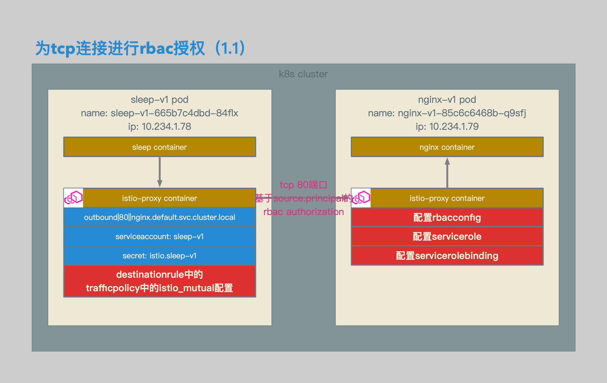
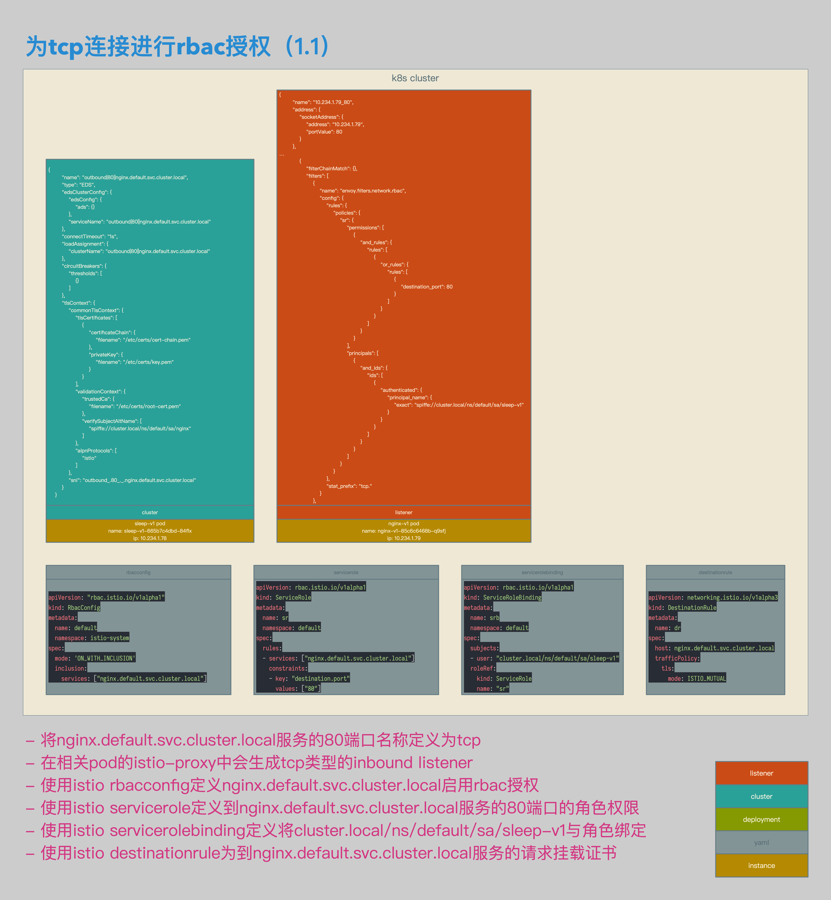

# Istio数据面配置解析18：使用RBAC对Tcp连接进行授权（1.1）


[TOC]


## 概述

本文介绍了在Isito中使用RBAC对Tcp连接进行授权：

1. 1.1版本针对Tcp的RBAC授权的配置会被加到Server端inbound listener的envoy.filters.network.rbac中。
2. 1.1版本支持针对Tcp的RBAC授权。
3. 针对source.principal的授权，需要为Client端挂载证书和密钥。


## 相关拓扑



- 在destinationrule中启用针对server端的istio_mutual的配置。
- 为server端配置rbacconfig，开启rbac授权。
- 为server端配置servicerole，为角色授权。
- 为server端配置servicerolebinding，将角色与被授权对象关联。
- 在本文中，将基于source.principal进行授权，也就是针对client端的证书信息进行授权。




- 将nginx.default.svc.cluster.local服务的80端口名称定义为tcp。
- 在相关pod的istio-proxy中会生成tcp类型的inbound listener。
- 使用istio rbacconfig定义nginx.default.svc.cluster.local启用rbac授权。
- 使用istio servicerole定义到nginx.default.svc.cluster.local服务的80端口的角色权限。
- 使用istio servicerolebinding定义将cluster.local/ns/default/sa/sleep-v1与角色绑定。
- 使用istio destinationrule为到nginx.default.svc.cluster.local服务的请求挂载证书。


## 准备

```yaml
apiVersion: v1
kind: ServiceAccount
metadata:
  name: sleep-v1
---
apiVersion: extensions/v1beta1
kind: Deployment
metadata:
  name: sleep-v1
spec:
  replicas: 1
  template:
    metadata:
      labels:
        app: sleep
        version: v1
    spec:
      serviceAccountName: sleep-v1
      containers:
      - name: sleep
        image: 192.168.0.61/istio-example/alpine-curl
        command: ["/bin/sleep","7200"]
        imagePullPolicy: IfNotPresent
```

- 准备sleep-v1用于client端。
- 为sleep-v1准备相应的serviceaccount。


```yaml
apiVersion: v1
kind: Service
metadata:
  name: nginx
spec:
  type: ClusterIP
  ports:
  - port: 80
    name: tcp
  selector:
    app: nginx
---
apiVersion: v1
kind: ServiceAccount
metadata:
  name: nginx
---
apiVersion: extensions/v1beta1
kind: Deployment
metadata:
  name: nginx-v1
spec:
  replicas: 1
  template:
    metadata:
      labels:
        app: nginx
        version: v1
    spec:
      serviceAccountName: nginx
      containers:
      - name: nginx
        image: 192.168.0.61/istio-example/nginx
        ports:
        - containerPort: 80
        volumeMounts:
        - mountPath: /etc/nginx/conf.d/
          readOnly: true
          name: conf
        - mountPath: /etc/nginx/html/
          readOnly: true
          name: index
      volumes:
      - name: conf
        configMap:
          name: nginx-v1
          items:
            - key: default.conf
              path: default.conf
      - name: index
        configMap:
          name: nginx-v1
          items:
            - key: index.html
              path: index.html
---
apiVersion: v1
kind: ConfigMap
metadata:
  name: nginx-v1
data:
  default.conf: |
    server {
      listen       80;
      server_name  loalhost;

      location / {
        root   /etc/nginx/html/;
        index  index.html index.htm;
      }

      error_page   500 502 503 504  /50x.html;
      location = /50x.html {
        root   /usr/share/nginx/html;
      }
    }
  index.html: |
    <!DOCTYPE html>
    <html>
    <head>
    <title>Welcome to nginx!</title>
    <style>
      body {
        width: 35em;
        margin: 0 auto;
        font-family: Tahoma, Verdana, Arial, sans-serif;
      }
    </style>
    </head>
    <body>
    <h1>Welcome to nginx!</h1>
    <h1>v1!</h1>
    <p>If you see this page, the nginx web server is successfully installed and working. Further configuration is required.</p>
    <p>For online documentation and support please refer to
    <a href="http://nginx.org/">nginx.org</a>.<br/>
    Commercial support is available at
    <a href="http://nginx.com/">nginx.com</a>.</p>
    <p><em>Thank you for using nginx.</em></p>
    </body>
    </html>
```

- 准备nginx-v1用于server端。
- **nginx服务的端口类型定义为tcp。**
- 为nginx-v1准备相应的service以及serviceaccount。


## 相关配置

### RbacConfig

```yaml
apiVersion: "rbac.istio.io/v1alpha1"
kind: RbacConfig
metadata:
  name: default
  namespace: istio-system
spec:
  mode: 'ON_WITH_INCLUSION'
  inclusion:
    services: ["nginx.default.svc.cluster.local"]
```

- rbacconfig相关配置。
- 目前istio的rbaconfig为全局配置，每个mesh中只能配置一个。
- rbacconfig的name需要配置为default。
- rbacconfig的namespace需要配置为istio-system。
- rbacconfig的模式配置为ON_WITH_INCLUSION，即只针对inclusion中定义的服务启用rbac。
- 在inclusion中，配置针对nginx.default.svc.cluster.local启用rbac授权。


### ServiceRole和ServiceRoleBinding

```yaml
apiVersion: rbac.istio.io/v1alpha1
kind: ServiceRole
metadata:
  name: sr
  namespace: default
spec:
  rules:
  - services: ["nginx.default.svc.cluster.local"]
    constraints:
    - key: "destination.port"
      values: ["80"]
```

- servicerole相关配置。
- 针对nginx.default.svc.cluster.local的destination.port的80端口，授予权限。


```yaml
apiVersion: rbac.istio.io/v1alpha1
kind: ServiceRoleBinding
metadata:
  name: srb
  namespace: default
spec:
  subjects:
  - user: "cluster.local/ns/default/sa/sleep-v1"
  roleRef:
    kind: ServiceRole
    name: "sr"
```

- servicerolebinding相关配置。
- 将user，也就是source.principal，为cluster.local/ns/default/sa/sleep-v1，也就是sleep-v1应用，授予sr的角色，也就是可以访问nginx服务的80端口。


```json
{
        "name": "10.234.1.79_80",
        "address": {
            "socketAddress": {
                "address": "10.234.1.79",
                "portValue": 80
            }
        },
…
            {
                "filterChainMatch": {},
                "filters": [
                    {
                        "name": "envoy.filters.network.rbac",
                        "config": {
                            "rules": {
                                "policies": {
                                    "sr": {
                                        "permissions": [
                                            {
                                                "and_rules": {
                                                    "rules": [
                                                        {
                                                            "or_rules": {
                                                                "rules": [
                                                                    {
                                                                        "destination_port": 80
                                                                    }
                                                                ]
                                                            }
                                                        }
                                                    ]
                                                }
                                            }
                                        ],
                                        "principals": [
                                            {
                                                "and_ids": {
                                                    "ids": [
                                                        {
                                                            "authenticated": {
                                                                "principal_name": {
                                                                    "exact": "spiffe://cluster.local/ns/default/sa/sleep-v1"
                                                                }
                                                            }
                                                        }
                                                    ]
                                                }
                                            }
                                        ]
                                    }
                                }
                            },
                            "stat_prefix": "tcp."
                        }
                    },
```

- 在nginx-v1的inbound listener中，会增加相应的filter，针对source.principal为cluster.local/ns/default/sa/sleep-v1的角色，授予相应权限。


### DestinationRule

```yaml
apiVersion: networking.istio.io/v1alpha3
kind: DestinationRule
metadata:
  name: dr
spec:
  host: nginx.default.svc.cluster.local
  trafficPolicy:
    tls:
      mode: ISTIO_MUTUAL
```

- destinationrule相关配置。
- 因为是针对source.principal进行授权，所以要在client端挂载相应证书。
- 针对到server端的请求，启用ISTIO_MUTUAL，挂载相应证书和密钥。


```json
{
        "name": "outbound|80||nginx.default.svc.cluster.local",
        "type": "EDS",
        "edsClusterConfig": {
            "edsConfig": {
                "ads": {}
            },
            "serviceName": "outbound|80||nginx.default.svc.cluster.local"
        },
        "connectTimeout": "1s",
        "loadAssignment": {
            "clusterName": "outbound|80||nginx.default.svc.cluster.local"
        },
        "circuitBreakers": {
            "thresholds": [
                {}
            ]
        },
        "tlsContext": {
            "commonTlsContext": {
                "tlsCertificates": [
                    {
                        "certificateChain": {
                            "filename": "/etc/certs/cert-chain.pem"
                        },
                        "privateKey": {
                            "filename": "/etc/certs/key.pem"
                        }
                    }
                ],
                "validationContext": {
                    "trustedCa": {
                        "filename": "/etc/certs/root-cert.pem"
                    },
                    "verifySubjectAltName": [
                        "spiffe://cluster.local/ns/default/sa/nginx"
                    ]
                },
                "alpnProtocols": [
                    "istio"
                ]
            },
            "sni": "outbound_.80_._.nginx.default.svc.cluster.local"
        }
    }
```

- 在sleep-v1和服务nginx.default.svc.cluster.local相关的outbound cluster中，会挂载相应的证书和密钥。


## 测试结果

```bash
/ # curl http://nginx -v
* Rebuilt URL to: http://nginx/
*   Trying 10.233.119.86...
* TCP_NODELAY set
* Connected to nginx (10.233.119.86) port 80 (#0)
> GET / HTTP/1.1
> Host: nginx
> User-Agent: curl/7.61.0
> Accept: */*
>
* Empty reply from server
* Connection #0 to host nginx left intact
curl: (52) Empty reply from server
```

- 在只启用了rbacconfig，但没有配置授权的情况下，会发生(52) Empty reply from server的错误。


```bash
/ # curl http://nginx
<!DOCTYPE html>
<html>
<head>
<title>Welcome to nginx!</title>
<style>
  body {
    width: 35em;
    margin: 0 auto;
    font-family: Tahoma, Verdana, Arial, sans-serif;
  }
</style>
</head>
<body>
<h1>Welcome to nginx!</h1>
<h1>v1!</h1>
<p>If you see this page, the nginx web server is successfully installed and working. Further configuration is required.</p>
<p>For online documentation and support please refer to
<a href="http://nginx.org/">nginx.org</a>.<br/>
Commercial support is available at
<a href="http://nginx.com/">nginx.com</a>.</p>
<p><em>Thank you for using nginx.</em></p>
</body>
</html>
/ #
```

- 在启用了rbacconfig，并且配置授权的情况下，可以正常访问nginx服务。

