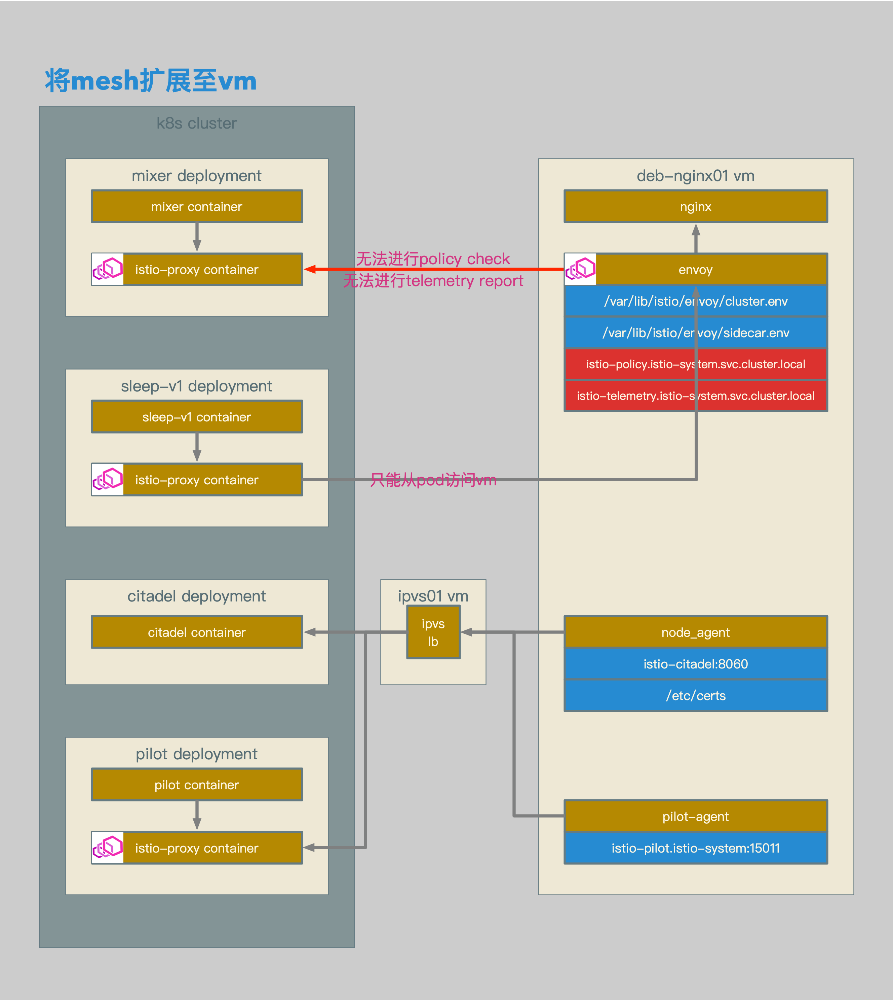

# Istio数据面配置解析20：在网络路由不可达的Bare Metal环境中使用Mesh Expansion


[TOC]


## 概述

本文介绍了在路由不可达的Overlay网络中使用Mesh Expansion：

1. K8s使用基于Flannel的Overlay网络。
2. 在VM上部署Istio Sidecar。
3. VM上的Sidecar作为Mesh的一部分，接受Pilot的管理。
4. Pod可以直接访问VM，也就意味着，Pilot可以直接访问Sidecar。
5. VM无法直接访问Pod，也就意味着，Sidecar无法直接访问Mixer。


## 相关拓扑



- vm上的mesh expansion包含以下几个主要组件：
- node_agent进程，主要用于和istio citadel通信，更新证书和密钥。
- pilot-agent进程，主要用于和istio pilot通信，更新xds相关信息。
- envoy进程，istio proxy主进程，应用xds策略。
- 如果是基于overlay网络的，从pod到vm的访问是单向的，也就是说，只能从pod访问vm，vm无法访问到pod。
- 同理，因为istio proxy在进行policy check和telemetry report的时候，是直接访问mixer pod，所以，这连个类型的访问也无法到达。


## 配置概述

1. 准备并应用用于对外暴露istio服务的mesh-expansion.yaml文件。
2. 准备并应用用于对外暴露istio服务的ipvs配置文件。
3. 准备用于vm istio proxy的证书和密钥，包括root-cert，cert-chain和key。
4. 准备用于vm istio proxy的域名解析文件kubedns。
5. 准备用于vm istio proxy的envoy配置文件cluster.env。
6. 将证书和密钥文件，域名解析文件和envoy配置文件上传至vm。
7. 在vm上安装并配置dnsmasq。
8. 在vm上安装并配置istio-sidecar.deb。


## 配置过程

```yaml
apiVersion: v1
kind: Service
metadata:
  name: istio-pilot-lb
  namespace: istio-system
  labels:
    istio: pilot
spec:
  type: ClusterIP
  externalIPs:
  - 192.168.0.62
  ports:
  - port: 15005
    name: https-pilot
    protocol: TCP
  - port: 8080
    name: http-pilot
    protocol: TCP
  - port: 15010
    name: grpc-pilot
    protocol: TCP
  - port: 15011
    name: tls-grpc-pilot
    protocol: TCP
  selector:
    istio: pilot
---
apiVersion: v1
kind: Service
metadata:
  name: kube-dns-lb
  namespace: kube-system
  labels:
    k8s-app: kube-dns
spec:
  type: ClusterIP
  externalIPs:
  - 192.168.0.62
  ports:
  - port: 53
    protocol: UDP
  selector:
    k8s-app: kube-dns
---
apiVersion: v1
kind: Service
metadata:
  name: istio-mixer-lb
  namespace: istio-system
  labels:
    istio: mixer
spec:
  type: ClusterIP
  externalIPs:
  - 192.168.0.62
  ports:
  - port: 15004
    name: grpc-mixer-mtls
    protocol: TCP
  - port: 9091
    name: grpc-mixer
    protocol: TCP
  selector:
    istio: mixer
    istio-mixer-type: telemetry
---
apiVersion: v1
kind: Service
metadata:
  name: istio-citadel-lb
  namespace: istio-system
  labels:
    istio: citadel
spec:
  type: ClusterIP
  externalIPs:
  - 192.168.0.62
  ports:
  - port: 8060
    protocol: TCP
  selector:
    istio: citadel
```

- 暴露pilot的用于xds tls的15011端口至ipvs。
- 暴露kube-dns的用于域名解析和服务发现的53端口至ipvs。
- 暴露mixer用于policy check和telemetry report的9091端口至ipvs。
- 暴露citadel用于证书更新的8060端口至ipvs。


```bash
ipvsadm -A -u 192.168.0.62:53 -s wrr -p 300
ipvsadm -a -u 192.168.0.62:53 -r 192.168.0.71:53 -g
ipvsadm -a -u 192.168.0.62:53 -r 192.168.0.72:53 -g
ipvsadm -a -u 192.168.0.62:53 -r 192.168.0.73:53 -g

ipvsadm -A -t 192.168.0.62:8080 -s wrr -p 300
ipvsadm -a -t 192.168.0.62:8080 -r 192.168.0.72:8080 -g
ipvsadm -a -t 192.168.0.62:8080 -r 192.168.0.73:8080 -g

ipvsadm -A -t 192.168.0.62:15005 -s wrr -p 300
ipvsadm -a -t 192.168.0.62:15005 -r 192.168.0.72:15005 -g
ipvsadm -a -t 192.168.0.62:15005 -r 192.168.0.73:15005 -g

ipvsadm -A -t 192.168.0.62:15010 -s wrr -p 300
ipvsadm -a -t 192.168.0.62:15010 -r 192.168.0.72:15010 -g
ipvsadm -a -t 192.168.0.62:15010 -r 192.168.0.73:15010 -g

ipvsadm -A -t 192.168.0.62:15011 -s wrr -p 300
ipvsadm -a -t 192.168.0.62:15011 -r 192.168.0.72:15011 -g
ipvsadm -a -t 192.168.0.62:15011 -r 192.168.0.73:15011 -g

ipvsadm -A -t 192.168.0.62:15004 -s wrr -p 300
ipvsadm -a -t 192.168.0.62:15004 -r 192.168.0.72:15004 -g
ipvsadm -a -t 192.168.0.62:15004 -r 192.168.0.73:15004 -g

ipvsadm -A -t 192.168.0.62:8060 -s wrr -p 300
ipvsadm -a -t 192.168.0.62:8060 -r 192.168.0.72:8060 -g
ipvsadm -a -t 192.168.0.62:8060 -r 192.168.0.73:8060 -g

ipvsadm -A -t 192.168.0.62:9091 -s wrr -p 300
ipvsadm -a -t 192.168.0.62:9091 -r 192.168.0.72:9091 -g
ipvsadm -a -t 192.168.0.62:9091 -r 192.168.0.73:9091 -g
```

- 为每个暴露的服务端口配置相应的ipvs规则。


```bash
kubectl get secret istio.default -o jsonpath='{.data.root-cert\.pem}' | base64 --decode   > root-cert.pem
kubectl get secret istio.default -o jsonpath='{.data.cert-chain\.pem}' | base64 --decode   > cert-chain.pem
kubectl get secret istio.default -o jsonpath='{.data.key\.pem}' | base64 --decode   > key.pem
```

- 使用default namespace下的istio.default中的root-cert.pem，cert-chain.pem和key.pem作为vm使用的证书和密钥。
- node_agent进程会自动联系citadel并rotate这个证书和密钥。


```bash
server=/svc.cluster.local/192.168.0.62
address=/istio-mixer/192.168.0.62
address=/istio-policy/192.168.0.62
address=/istio-telemetry/192.168.0.62
address=/istio-pilot/192.168.0.62
address=/istio-citadel/192.168.0.62
address=/istio-ca/192.168.0.62
address=/istio-mixer.istio-system/192.168.0.62
address=/istio-policy.istio-system/192.168.0.62
address=/istio-telemetry.istio-system/192.168.0.62
address=/istio-pilot.istio-system/192.168.0.62
address=/istio-citadel.istio-system/192.168.0.62
address=/istio-ca.istio-system/192.168.0.62
```

- 配置dnsmasq配置文件。
- 配置vm对svc.cluster.local域名解析时使用kube-dns对外暴露的服务端口。
- 配置vm对istio-pilot和istio-pilot.istio-system这2个域名解析到pilot对外暴露的服务端口。
- 配置vm对istio-citadel和istio-citadel.istio-system这2个域名解析到citadel对外暴露的服务端口。


```bash
ISTIO_SERVICE_CIDR=10.233.0.0/16
ISTIO_SYSTEM_NAMESPACE=istio-system
ISTIO_CP_AUTH=MUTUAL_TLS
```

- 配置cluster.env文件。
- 确认cluster的service cidr。
- 确认istio的namespace名称。
- 为vm istio proxy和pilot之间启用mtls。


```bash
root@deb-nginx01:~/istio# apt-get --no-install-recommends -y install dnsmasq
root@deb-nginx01:~/istio# cp kubedns /etc/dnsmasq.d

root@deb-nginx01:~/istio# cat /etc/resolv.conf
nameserver 127.0.0.1
nameserver 114.114.114.114

root@deb-nginx01:~/istio# cat /etc/hosts
127.0.0.1	localhost
192.168.0.81	deb-nginx01

root@deb-nginx01:~/istio# systemctl enable dnsmasq
root@deb-nginx01:~/istio# systemctl start dnsmasq
```

- 安装dnsmasq。
- 将kubedns配置文件拷贝至/etc/dnsmasq.d目录。
- 编辑/etc/resolv.conf，首选dnsmasq作为nameserver，然后配置另外一个用于其他域名解析的nameserver。
- **编辑/etc/hosts，将ip和主机名相对应。**
- 启动dnsmasq服务。


```bash
root@deb-nginx01:~/istio# host istio-pilot
istio-pilot has address 192.168.0.62
root@deb-nginx01:~/istio# host istio-pilot.istio-system
istio-pilot.istio-system has address 192.168.0.62
root@deb-nginx01:~/istio# host istio-citadel
istio-citadel has address 192.168.0.62
root@deb-nginx01:~/istio# host istio-citadel.istio-system
istio-citadel.istio-system has address 192.168.0.62

root@deb-nginx01:~/istio# host istio-pilot.istio-system.svc.cluster.local
istio-pilot.istio-system.svc.cluster.local has address 10.233.35.219
root@deb-nginx01:~/istio# host istio-citadel.istio-system.svc.cluster.local
istio-citadel.istio-system.svc.cluster.local has address 10.233.235.232
```

- 确认istio-pilot，istio-pilot.istio-system，以及istio-pilot.istio-system.svc.cluster.local都可以被正确的解析。


```bash
root@deb-nginx01:~/istio# dpkg -i istio-sidecar.deb

root@deb-nginx01:~/istio# mkdir -p /etc/certs
root@deb-nginx01:~/istio# cp *.pem /etc/certs/
root@deb-nginx01:~/istio# cp cluster.env /var/lib/istio/envoy/
root@deb-nginx01:~/istio# chown -R istio-proxy /var/lib/istio/
root@deb-nginx01:~/istio# chown -R istio-proxy /var/lib/istio/envoy
root@deb-nginx01:~/istio# chown -R istio-proxy /etc/certs

root@deb-nginx01:~/istio# systemctl enable istio-auth-node-agent
root@deb-nginx01:~/istio# systemctl enable istio
root@deb-nginx01:~/istio# systemctl start istio-auth-node-agent
root@deb-nginx01:~/istio# systemctl start istio
```

- 安装istio-sidecar.deb。
- 将之前生成的证书和密钥文件拷贝至/etc/certs/目录并修改相应权限。
- 将之前生成的cluster.env文件拷贝至/var/lib/istio/envoy并修改相应权限。
- 启动istio-auth-node-agent服务。
- 启动istio服务。


```bash
root@deb-nginx01:~/istio# systemctl status istio-auth-node-agent
● istio-auth-node-agent.service - istio-auth-node-agent: The Istio auth node agent
   Loaded: loaded (/lib/systemd/system/istio-auth-node-agent.service; enabled; vendor preset: enabled)
   Active: active (running) since Mon 2018-12-17 11:13:17 CST; 2h 13min ago
     Docs: https://istio.io/
 Main PID: 413 (istio-node-agen)
    Tasks: 1 (limit: 19660)
   CGroup: /system.slice/istio-auth-node-agent.service
           └─413 /bin/bash /usr/local/bin/istio-node-agent-start.sh

Dec 17 11:13:19 deb-nginx01 istio-node-agent-start.sh[413]: 2018-12-17T03:13:19.157851Z        info        parsed scheme: ""
Dec 17 11:13:19 deb-nginx01 istio-node-agent-start.sh[413]: 2018-12-17T03:13:19.158248Z        info        scheme "" not registered, fallback to default scheme
Dec 17 11:13:19 deb-nginx01 istio-node-agent-start.sh[413]: 2018-12-17T03:13:19.158414Z        info        Starting Node Agent
Dec 17 11:13:19 deb-nginx01 istio-node-agent-start.sh[413]: 2018-12-17T03:13:19.159055Z        info        Node Agent starts successfully.
Dec 17 11:13:19 deb-nginx01 istio-node-agent-start.sh[413]: 2018-12-17T03:13:19.185425Z        info        ccResolverWrapper: sending new addresses to cc: [{istio-citadel:8060 0
Dec 17 11:13:19 deb-nginx01 istio-node-agent-start.sh[413]: 2018-12-17T03:13:19.185827Z        info        ClientConn switching balancer to "pick_first"
Dec 17 11:13:19 deb-nginx01 istio-node-agent-start.sh[413]: 2018-12-17T03:13:19.186828Z        info        pickfirstBalancer: HandleSubConnStateChange: 0xc420222db0, CONNECTING
Dec 17 11:13:19 deb-nginx01 istio-node-agent-start.sh[413]: 2018-12-17T03:13:19.718989Z        info        Sending CSR (retrial #0) ...
Dec 17 11:13:19 deb-nginx01 istio-node-agent-start.sh[413]: 2018-12-17T03:13:19.863334Z        info        pickfirstBalancer: HandleSubConnStateChange: 0xc420222db0, READY
Dec 17 11:13:19 deb-nginx01 istio-node-agent-start.sh[413]: 2018-12-17T03:13:19.866485Z        info        CSR is approved successfully. Will renew cert in 1079h59m51.133597246s
```

- istio-auth-node-agent服务启动，并更新证书和密钥。


```bash
root@deb-nginx01:~/istio# systemctl status istio
● istio.service - istio-sidecar: The Istio sidecar
   Loaded: loaded (/lib/systemd/system/istio.service; enabled; vendor preset: enabled)
   Active: active (running) since Mon 2018-12-17 11:13:17 CST; 2h 14min ago
     Docs: http://istio.io/
 Main PID: 415 (su)
    Tasks: 0 (limit: 19660)
   CGroup: /system.slice/istio.service
           ‣ 415 su -s /bin/bash -c INSTANCE_IP=192.168.0.81 POD_NAME=deb-nginx01 POD_NAMESPACE=default exec /usr/local/bin/pilot-agent proxy      --serviceCluster rawvm     --dis

Dec 17 11:13:19 deb-nginx01 istio-start.sh[415]: -A ISTIO_OUTPUT -m owner --uid-owner 108 -j RETURN
Dec 17 11:13:19 deb-nginx01 istio-start.sh[415]: -A ISTIO_OUTPUT -m owner --uid-owner 0 -j RETURN
Dec 17 11:13:19 deb-nginx01 istio-start.sh[415]: -A ISTIO_OUTPUT -m owner --gid-owner 108 -j RETURN
Dec 17 11:13:19 deb-nginx01 istio-start.sh[415]: -A ISTIO_OUTPUT -m owner --gid-owner 0 -j RETURN
Dec 17 11:13:19 deb-nginx01 istio-start.sh[415]: -A ISTIO_OUTPUT -d 127.0.0.1/32 -j RETURN
Dec 17 11:13:19 deb-nginx01 istio-start.sh[415]: -A ISTIO_OUTPUT -d 10.233.0.0/16 -j ISTIO_REDIRECT
Dec 17 11:13:19 deb-nginx01 istio-start.sh[415]: -A ISTIO_OUTPUT -j RETURN
Dec 17 11:13:19 deb-nginx01 istio-start.sh[415]: -A ISTIO_REDIRECT -p tcp -j REDIRECT --to-ports 15001
Dec 17 11:13:19 deb-nginx01 istio-start.sh[415]: COMMIT
Dec 17 11:13:19 deb-nginx01 istio-start.sh[415]: # Completed on Mon Dec 17 11:13:19 2018
```

- istio服务启动，并更新vm的iptables规则。


```bash
root@deb-nginx01:~/istio# ps -ef|grep proxy | more
root        415      1  0 11:13 ?        00:00:00 su -s /bin/bash -c INSTANCE_IP=192.168.0.81 POD_NAME=deb-nginx01 POD_NAMESPACE=default exec /usr/local/bin/pilot-agent proxy
 --serviceCluster rawvm     --discoveryAddress istio-pilot.istio-system:15011     --controlPlaneAuthPolicy MUTUAL_TLS     2> /var/log/istio/istio.err.log > /var/log/istio/istio.lo
g istio-proxy
root        425    413  0 11:13 ?        00:00:00 su -s /bin/sh -c exec /usr/local/bin/node_agent --ca-address istio-citadel:8060 --cert-chain /etc/certs/cert-chain.pem --key /etc
/certs/key.pem --root-cert /etc/certs/root-cert.pem --env onprem istio-proxy
istio-p+    578    415  0 11:13 ?        00:00:00 /usr/local/bin/pilot-agent proxy --serviceCluster rawvm --discoveryAddress istio-pilot.istio-system:15011 --controlPlaneAuthPolic
y MUTUAL_TLS
istio-p+    773    578  0 11:13 ?        00:00:11 /usr/local/bin/envoy -c /etc/istio/proxy/envoy-rev1.json --restart-epoch 1 --drain-time-s 2 --parent-shutdown-time-s 3 --service-
cluster rawvm --service-node sidecar~192.168.0.81~deb-nginx01.default~default.svc.cluster.local --max-obj-name-len 189 --allow-unknown-fields -l warn --v2-config-only
```

- istio相关服务共包含4个主要进程：
- su -s /bin/sh -c exec /usr/local/bin/node_agent --ca-address istio-citadel:8060 --cert-chain /etc/certs/cert-chain.pem --key /etc
  /certs/key.pem --root-cert /etc/certs/root-cert.pem --env onprem istio-proxy
- su -s /bin/bash -c INSTANCE_IP=192.168.0.81 POD_NAME=deb-nginx01 POD_NAMESPACE=default exec /usr/local/bin/pilot-agent proxy
   --serviceCluster rawvm     --discoveryAddress istio-pilot.istio-system:15011     --controlPlaneAuthPolicy MUTUAL_TLS     2> /var/log/istio/istio.err.log > /var/log/istio/istio.lo
    g istio-proxy
- /usr/local/bin/pilot-agent proxy --serviceCluster rawvm --discoveryAddress istio-pilot.istio-system:15011 --controlPlaneAuthPolic
  y MUTUAL_TLS
- /usr/local/bin/envoy -c /etc/istio/proxy/envoy-rev1.json --restart-epoch 1 --drain-time-s 2 --parent-shutdown-time-s 3 --service-
  cluster rawvm --service-node sidecar~192.168.0.81~deb-nginx01.default~default.svc.cluster.local --max-obj-name-len 189 --allow-unknown-fields -l warn --v2-config-only


## 验证过程

```bash
root@deb-nginx01:/var/lib/istio/envoy# cat sidecar.env
...
# Comma separated list of local ports that will use Istio sidecar for inbound services.
# If set, iptables rules will be configured to intercept inbound traffic and redirect to sidecar.
# If not set, no rules will be enabled
ISTIO_INBOUND_PORTS=9080
...
```

- 将vm中的nginx服务的9080端口注册到istio proxy中。


```bash
shenxg13@is5:~/K8s/istio/istio-1.0.5/samples/expansion|⇒  istioctl register deb-nginx01 192.168.0.81 http:9080

shenxg13@is5:~/K8s/istio/istio-1.0.5/samples/expansion|⇒  kubectl get svc
NAME          TYPE        CLUSTER-IP      EXTERNAL-IP   PORT(S)    AGE
deb-nginx01   ClusterIP   10.233.75.121   <none>        9080/TCP   26s

shenxg13@is5:~/K8s/istio/istio-1.0.5/samples/expansion|⇒  kubectl get ep
NAME          ENDPOINTS           AGE
deb-nginx01   192.168.0.81:9080   29s
```

- 使用istioctl register将192.168.0.81这个端点注册到k8s中，服务名为deb-nginx-1.default.svc.cluster.local，端口为9080，端口名称为http。


```bash
root@deb-nginx01:/var/log/istio# cat istio.log
...
[2018-12-17 15:50:26.472][773][info][upstream] external/envoy/source/common/upstream/cluster_manager_impl.cc:500] add/update cluster outbound|9080||deb-nginx01.default.svc.cluster.local starting warming
[2018-12-17 15:50:26.473][773][info][upstream] external/envoy/source/common/upstream/cluster_manager_impl.cc:500] add/update cluster inbound|9080||deb-nginx01.default.svc.cluster.local starting warming
[2018-12-17 15:50:26.473][773][info][upstream] external/envoy/source/common/upstream/cluster_manager_impl.cc:512] warming cluster inbound|9080||deb-nginx01.default.svc.cluster.local complete
[2018-12-17 15:50:26.474][773][info][upstream] external/envoy/source/common/upstream/cluster_manager_impl.cc:512] warming cluster outbound|9080||deb-nginx01.default.svc.cluster.local complete
[2018-12-17 15:50:26.561][773][info][upstream] external/envoy/source/server/lds_api.cc:80] lds: add/update listener '192.168.0.81_9080'
[2018-12-17 15:50:26.563][773][info][upstream] external/envoy/source/server/lds_api.cc:80] lds: add/update listener '0.0.0.0_9080'
...
```

- 在加入k8s服务后，vm上的istio proxy会接到pilot发送的cluster以及listener的更新。
- 更新用于inbound的cluter inbound|9080||deb-nginx01.default.svc.cluster.local。
- 更新用于inbound的listener 192.168.0.81_9080。
- 因为vm上的istio proxy尚不支持使用istioctl pc查看envoy的配置信息，所以只能通过127.0.0.0:15000/config_dump查看相应的配置信息。


```bash
/ # curl http://deb-nginx01:9080
UNAVAILABLE:upstream connect error or disconnect/reset before headers/ #

root@deb-nginx01:/var/log/istio# cat istio.log
...
[libprotobuf ERROR src/istio/mixerclient/report_batch.cc:83] Mixer Report failed with: UNAVAILABLE:upstream connect error or disconnect/reset before headers
...
```

- 如果一切正常，此时从pod中应该可以正常访问deb-nginx01的9080端口的服务。
- 但在实际访问时，却会发生UNAVAILABLE:upstream connect error or disconnect/reset before headers的错误。
- 在查看vm istio proxy的日志时，也会发现Mixer Report failed with的错误。


```bash
...
  # disablePolicyChecks disables mixer policy checks.
  # Will set the value with same name in istio config map - pilot needs to be restarted to take effect.
  disablePolicyChecks: false

  # policyCheckFailOpen allows traffic in cases when the mixer policy service cannot be reached.
  # Default is false which means the traffic is denied when the client is unable to connect to Mixer.
  policyCheckFailOpen: false

  # EnableTracing sets the value with same name in istio config map, requires pilot restart to take effect.
  enableTracing: true
...
```

- **这是因为istio在默认安装的时候，默认启用了policy check和telemetry report，并且在policy check失败的时候强制断开连接。**


```json
{
             "name": "mixer",
             "config": {
              "transport": {
               "network_fail_policy": {
                "policy": "FAIL_CLOSE"
               },
               "report_cluster": "outbound|9091||istio-telemetry.istio-system.svc.cluster.local",
               "check_cluster": "outbound|9091||istio-policy.istio-system.svc.cluster.local"
              },
```

- 在vm istio proxy的配置中，可以看到需要向outbound|9091||istio-telemetry.istio-system.svc.cluster.local上报telemetry数据。
- 需要向outbound|9091||istio-policy.istio-system.svc.cluster.local上报policy数据。
- **并且network_fail_policy为FAIL_CLOSE。**
- **因为目前环境的overlay网络为单向可路由，即pod可以访问vm，但vm无法访问pod，所以因为outbound|9091||istio-policy.istio-system.svc.cluster.local不可达，所以连接会被强制关闭。**


```bash
...
  # disablePolicyChecks disables mixer policy checks.
  # Will set the value with same name in istio config map - pilot needs to be restarted to take effect.
  disablePolicyChecks: true

  # policyCheckFailOpen allows traffic in cases when the mixer policy service cannot be reached.
  # Default is false which means the traffic is denied when the client is unable to connect to Mixer.
  policyCheckFailOpen: true

  # EnableTracing sets the value with same name in istio config map, requires pilot restart to take effect.
  enableTracing: false
...
```

- 修改istio的默认参数，禁用policy check，禁用telemetry report，并且将policy check fail open开关打开。


```json
{
             "name": "mixer",
             "config": {
              "transport": {
               "network_fail_policy": {},
               "report_cluster": "outbound|9091||istio-telemetry.istio-system.svc.cluster.local",
               "check_cluster": "outbound|9091||istio-policy.istio-system.svc.cluster.local"
              },
```

- 在修改istio的默认参数后，vm istio proxy的配置中，无network_fail_policy配置。


```bash
/ # curl http://deb-nginx01:9080
<!DOCTYPE html>
<html>
<head>
<title>Welcome to nginx!</title>
<style>
    body {
        width: 35em;
        margin: 0 auto;
        font-family: Tahoma, Verdana, Arial, sans-serif;
    }
</style>
</head>
<body>
<h1>Welcome to nginx!</h1>
<p>If you see this page, the nginx web server is successfully installed and
working. Further configuration is required.</p>

<p>For online documentation and support please refer to
<a href="http://nginx.org/">nginx.org</a>.<br/>
Commercial support is available at
<a href="http://nginx.com/">nginx.com</a>.</p>

<p><em>Thank you for using nginx.</em></p>
</body>
</html>
/ #
```

- 此时从pod中可以正常访问deb-nginx01的9080端口的服务。

