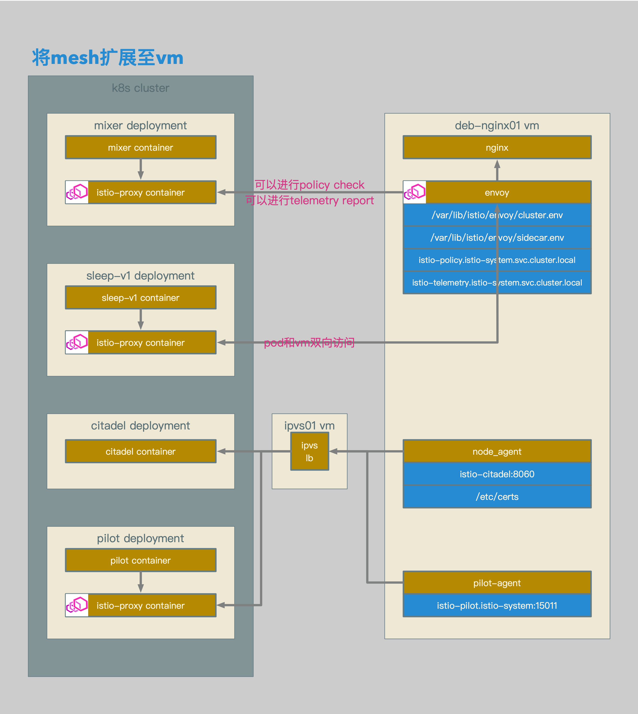
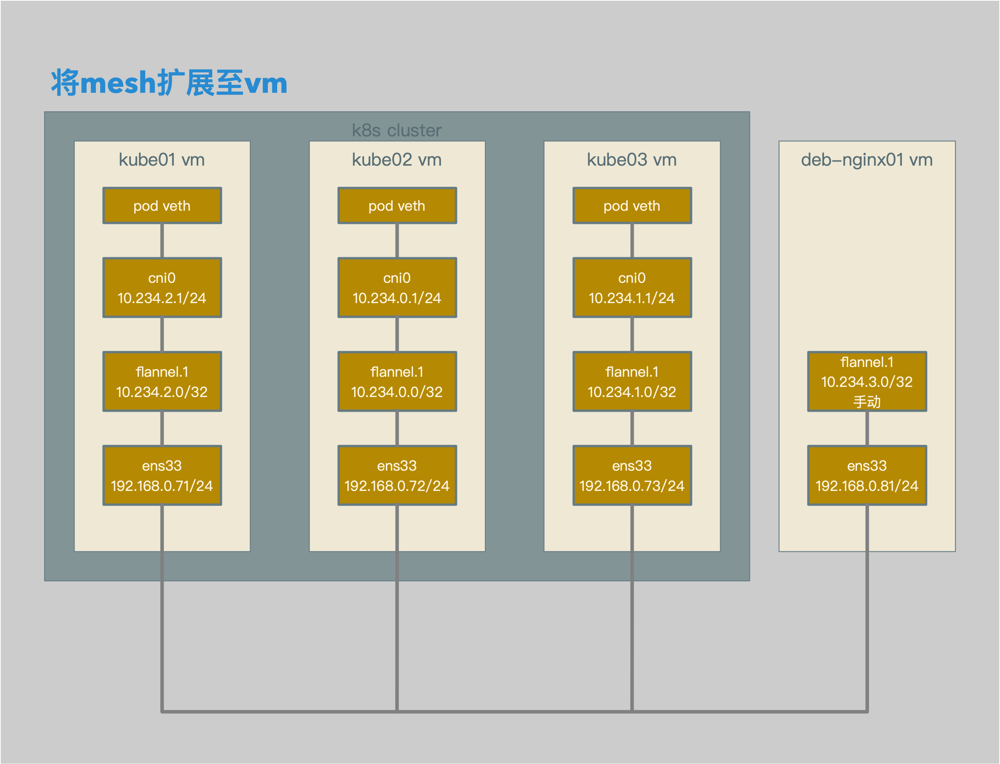

# Istio数据面配置解析21：在网络路由可达的Bare Metal环境中使用Mesh Expansion


[TOC]


## 概述

本文介绍了在路由可达的Overlay网络中使用Mesh Expansion：

1. K8s使用基于Flannel的Overlay网络。
2. **手工增加从VM到Pod的VXLAN的路由配置。**
3. 在VM上部署Istio Sidecar。
4. VM上的Sidecar作为Mesh的一部分，接受Pilot的管理。
5. Pod可以直接访问VM。
6. VM可以直接访问Pod。


## 相关拓扑



- vm上的mesh expansion包含以下几个主要组件：
- node_agent进程，主要用于和istio citadel通信，更新证书和密钥。
- pilot-agent进程，主要用于和istio pilot通信，更新xds相关信息。
- envoy进程，istio proxy主进程，应用xds策略。
- 在配置好vm到pod的路由后，pod和vm之间的访问是双向的。
- 同理，vm istio proxy可以进行policy check和telemetry report。




- 为deb-nginx01 vm增加vxlan虚拟子网卡flannel.1
- 配置deb-nginx01 vm到k8s cluster中其他节点vm的flannel.1网络的路由。


## 配置概述

1. **手工增加从vm到pod的vxlan的路由配置。**
2. 准备并应用用于对外暴露istio服务的mesh-expansion.yaml文件。
3. 准备并应用用于对外暴露istio服务的ipvs配置文件。
4. 准备用于vm istio proxy的证书和密钥，包括root-cert，cert-chain和key。
5. 准备用于vm istio proxy的域名解析文件kubedns。
6. 准备用于vm istio proxy的envoy配置文件cluster.env。
7. 将证书和密钥文件，域名解析文件和envoy配置文件上传至vm。
8. 在vm上安装并配置dnsmasq。
9. 在vm上安装并配置istio-sidecar.deb。


## 配置过程

```bash
root@deb-nginx01:~# ip link add flannel.1 type vxlan id 1 local 192.168.0.81 dev ens33 srcport 0 0 dstport 8472 nolearning ageing 300 noudpcsum noudp6zerocsumtx noudp6zerocsumrx
root@deb-nginx01:~# ip address add 10.234.3.0/32 dev flannel.1
root@deb-nginx01:~# ip link set flannel.1 up

root@deb-nginx01:~# ip route add unicast 10.234.0.0/24 via 10.234.0.0 dev flannel.1 proto boot scope global onlink
root@deb-nginx01:~# ip neigh add 10.234.0.0 dev flannel.1 lladdr 5a:09:44:c7:a3:fb
root@deb-nginx01:~# bridge fdb add 5a:09:44:c7:a3:fb dev flannel.1 dst 192.168.0.72

root@deb-nginx01:~# ip route add unicast 10.234.1.0/24 via 10.234.1.0 dev flannel.1 proto boot scope global onlink
root@deb-nginx01:~# ip neigh add 10.234.1.0 dev flannel.1 lladdr 7a:b4:48:5f:69:56
root@deb-nginx01:~# bridge fdb add 7a:b4:48:5f:69:56 dev flannel.1 dst 192.168.0.73

root@deb-nginx01:~# ip route add unicast 10.234.2.0/24 via 10.234.2.0 dev flannel.1 proto boot scope global onlink
root@deb-nginx01:~# ip neigh add 10.234.2.0 dev flannel.1 lladdr f6:cb:f7:55:bc:cd
root@deb-nginx01:~# bridge fdb add f6:cb:f7:55:bc:cd dev flannel.1 dst 192.168.0.71
```

- 在deb-nginx01 vm上增加一块vxlan类型的子网卡。
- 设置该子网卡的网络地址，注意该网络地址不能和flannel中已经分配过的网络地址冲突。
- 配置从deb-nginx01 vm到k8s cluster中其他节点vm的路由。
- 配置从deb-nginx01 vm到k8s cluster中其他节点vm的arp neighbor。
- 配置从deb-nginx01 vm到k8s cluster中其他节点vm的bridge fdb。


```bash
[root@kube01 ~]# ip route add unicast 10.234.3.0/24 via 10.234.3.0 dev flannel.1 proto boot scope global onlink
[root@kube01 ~]# ip neigh add 10.234.3.0 dev flannel.1 lladdr fe:e0:e4:83:b0:09
[root@kube01 ~]# bridge fdb add fe:e0:e4:83:b0:09 dev flannel.1 dst 192.168.0.81

[root@kube02 ~]# ip route add unicast 10.234.3.0/24 via 10.234.3.0 dev flannel.1 proto boot scope global onlink
[root@kube02 ~]# ip neigh add 10.234.3.0 dev flannel.1 lladdr fe:e0:e4:83:b0:09
[root@kube02 ~]# bridge fdb add fe:e0:e4:83:b0:09 dev flannel.1 dst 192.168.0.81

[root@kube03 ~]# ip route add unicast 10.234.3.0/24 via 10.234.3.0 dev flannel.1 proto boot scope global onlink
[root@kube03 ~]# ip neigh add 10.234.3.0 dev flannel.1 lladdr fe:e0:e4:83:b0:09
[root@kube03 ~]# bridge fdb add fe:e0:e4:83:b0:09 dev flannel.1 dst 192.168.0.81
```

- 配置从k8s cluster节点vm到deb-nginx01 vm的路由。
- 配置从k8s cluster节点vm到deb-nginx01 vm的arp neighbor。
- 配置从k8s cluster节点vm到deb-nginx01 vm的bridge fdb。


```bash
root@deb-nginx01:~# ping 10.234.0.62
PING 10.234.0.62 (10.234.0.62) 56(84) bytes of data.
64 bytes from 10.234.0.62: icmp_seq=1 ttl=63 time=0.511 ms

root@deb-nginx01:~# ping 10.234.1.30
PING 10.234.1.30 (10.234.1.30) 56(84) bytes of data.
64 bytes from 10.234.1.30: icmp_seq=1 ttl=63 time=0.511 ms

root@deb-nginx01:~# ping 10.234.2.6
PING 10.234.2.6 (10.234.2.6) 56(84) bytes of data.
64 bytes from 10.234.2.6: icmp_seq=1 ttl=63 time=0.836 ms
```

- deb-nginx01 vm到k8s cluster中pod的路由均可达。


[mesh expansion的其他配置过程见：Istio数据面配置解析20：在网络路由不可达的Bare Metal环境中使用Mesh Expansion](https://github.com/shenxg13/istio-no-best-practice/blob/master/20-mesh-expansion-in-unrouteable-network-bare-metal.md)


## 验证过程

```json
{
             "name": "mixer",
             "config": {
              "service_configs": {
               "default": {}
              },
              "transport": {
               "check_cluster": "outbound|9091||istio-policy.istio-system.svc.cluster.local",
               "network_fail_policy": {
                "policy": "FAIL_CLOSE"
               },
               "report_cluster": "outbound|9091||istio-telemetry.istio-system.svc.cluster.local"
              },
```

- 在vm istio proxy的配置中，可以看到需要向outbound|9091||istio-telemetry.istio-system.svc.cluster.local上报telemetry数据。
- 需要向outbound|9091||istio-policy.istio-system.svc.cluster.local上报policy数据。
- **并且network_fail_policy为FAIL_CLOSE。**
- **因为目前环境的overlay网络为双向可路由，即pod和vm可以互相访问，所以因为outbound|9091||istio-policy.istio-system.svc.cluster.local可达，连接正常。**


```bash
/ # curl http://deb-nginx01:9080
<!DOCTYPE html>
<html>
<head>
<title>Welcome to nginx!</title>
<style>
    body {
        width: 35em;
        margin: 0 auto;
        font-family: Tahoma, Verdana, Arial, sans-serif;
    }
</style>
</head>
<body>
<h1>Welcome to nginx!</h1>
<p>If you see this page, the nginx web server is successfully installed and
working. Further configuration is required.</p>

<p>For online documentation and support please refer to
<a href="http://nginx.org/">nginx.org</a>.<br/>
Commercial support is available at
<a href="http://nginx.com/">nginx.com</a>.</p>

<p><em>Thank you for using nginx.</em></p>
</body>
</html>
/ #
```

- 此时从pod中可以正常访问deb-nginx01的9080端口的服务。


```yaml
apiVersion: authentication.istio.io/v1alpha1
kind: Policy
metadata:
  name: policy-out
  namespace: default
spec:
  targets:
  - name: deb-nginx01
    ports:
    - number: 9080
  peers:
  - mtls:
      mode: STRICT
---
apiVersion: networking.istio.io/v1alpha3
kind: DestinationRule
metadata:
  name: dr-out
spec:
  host: deb-nginx01.default.svc.cluster.local
  trafficPolicy:
    portLevelSettings:
    - port: 
        number: 9080
      tls:
        mode: ISTIO_MUTUAL
```

- 启用从sleep-v1 pod到deb-nginx01 vm的istio mtls。


```json
{
        "name": "outbound|9080||deb-nginx01.default.svc.cluster.local",
        "type": "EDS",
        "edsClusterConfig": {
            "edsConfig": {
                "ads": {}
            },
            "serviceName": "outbound|9080||deb-nginx01.default.svc.cluster.local"
        },
        "connectTimeout": "1.000s",
        "circuitBreakers": {
            "thresholds": [
                {}
            ]
        },
        "tlsContext": {
            "commonTlsContext": {
                "tlsCertificates": [
                    {
                        "certificateChain": {
                            "filename": "/etc/certs/cert-chain.pem"
                        },
                        "privateKey": {
                            "filename": "/etc/certs/key.pem"
                        }
                    }
                ],
                "validationContext": {
                    "trustedCa": {
                        "filename": "/etc/certs/root-cert.pem"
                    },
                    "verifySubjectAltName": [
                        "spiffe://cluster.local/ns/default/sa/default"
                    ]
                },
                "alpnProtocols": [
                    "istio"
                ]
            },
            "sni": "outbound|9080||deb-nginx01.default.svc.cluster.local"
        }
    }

"listener": {
      "name": "192.168.0.81_9080",
      "address": {
       "socket_address": {
        "address": "192.168.0.81",
        "port_value": 9080
       }
      },
      "filter_chains": [
       {
        "tls_context": {
         "common_tls_context": {
          "tls_certificates": [
           {
            "certificate_chain": {
             "filename": "/etc/certs/cert-chain.pem"
            },
            "private_key": {
             "filename": "/etc/certs/key.pem"
            }
           }
          ],
          "validation_context": {
           "trusted_ca": {
            "filename": "/etc/certs/root-cert.pem"
           }
          },
          "alpn_protocols": [
           "h2",
           "http/1.1"
          ]
         },
         "require_client_certificate": true
        },
```

- 在client端的cluster outbound|9080||deb-nginx01.default.svc.cluster.local上已经启用istio mtls配置。
- 在server端的listener 192.168.0.81_9080上已经启用istio mtls配置。


```bash
/ # curl http://deb-nginx01:9080
<!DOCTYPE html>
<html>
<head>
<title>Welcome to nginx!</title>
<style>
    body {
        width: 35em;
        margin: 0 auto;
        font-family: Tahoma, Verdana, Arial, sans-serif;
    }
</style>
</head>
<body>
<h1>Welcome to nginx!</h1>
<p>If you see this page, the nginx web server is successfully installed and
working. Further configuration is required.</p>

<p>For online documentation and support please refer to
<a href="http://nginx.org/">nginx.org</a>.<br/>
Commercial support is available at
<a href="http://nginx.com/">nginx.com</a>.</p>

<p><em>Thank you for using nginx.</em></p>
</body>
</html>
/ #
```

- 从client端可以正常访问server端。


```yaml
apiVersion: authentication.istio.io/v1alpha1
kind: Policy
metadata:
  name: policy-in
  namespace: default
spec:
  targets:
  - name: nginx-v1
    ports:
    - number: 80
  peers:
  - mtls:
      mode: STRICT
---
apiVersion: networking.istio.io/v1alpha3
kind: DestinationRule
metadata:
  name: dr-in
spec:
  host: nginx-v1.default.svc.cluster.local
  trafficPolicy:
    portLevelSettings:
    - port: 
        number: 80
      tls:
        mode: ISTIO_MUTUAL
```

- 启用从deb-nginx01 vm到nginx-v1 pod的istio mtls。


```json
"cluster": {
      "name": "outbound|80||nginx-v1.default.svc.cluster.local",
      "type": "EDS",
      "eds_cluster_config": {
       "eds_config": {
        "ads": {}
       },
       "service_name": "outbound|80||nginx-v1.default.svc.cluster.local"
      },
      "connect_timeout": "1s",
      "circuit_breakers": {
       "thresholds": [
        {}
       ]
      },
      "tls_context": {
       "common_tls_context": {
        "tls_certificates": [
         {
          "certificate_chain": {
           "filename": "/etc/certs/cert-chain.pem"
          },
          "private_key": {
           "filename": "/etc/certs/key.pem"
          }
         }
        ],
        "validation_context": {
         "trusted_ca": {
          "filename": "/etc/certs/root-cert.pem"
         },
         "verify_subject_alt_name": [
          "spiffe://cluster.local/ns/default/sa/nginx-v1"
         ]
        },
        "alpn_protocols": [
         "istio"
        ]
       },
       "sni": "outbound|80||nginx-v1.default.svc.cluster.local"
      }
     },

{
        "name": "10.234.0.48_80",
        "address": {
            "socketAddress": {
                "address": "10.234.0.48",
                "portValue": 80
            }
        },
        "filterChains": [
            {
                "tlsContext": {
                    "commonTlsContext": {
                        "tlsCertificates": [
                            {
                                "certificateChain": {
                                    "filename": "/etc/certs/cert-chain.pem"
                                },
                                "privateKey": {
                                    "filename": "/etc/certs/key.pem"
                                }
                            }
                        ],
                        "validationContext": {
                            "trustedCa": {
                                "filename": "/etc/certs/root-cert.pem"
                            }
                        },
                        "alpnProtocols": [
                            "h2",
                            "http/1.1"
                        ]
                    },
                    "requireClientCertificate": true
                },
```

- 在client端的cluster outbound|80||nginx-v1.default.svc.cluster.local上已经启用istio mtls配置。
- 在server端的listener 10.234.0.48_80上已经启用istio mtls配置。


```bash
root@deb-nginx01:~# curl http://nginx-v1.default.svc.cluster.local --connect-timeout 1
curl: (28) Connection timed out after 1001 milliseconds
```

- deb-nginx01 vm无法正常访问pod中的服务。


```bash
root@deb-nginx01:~# iptables -t nat -L
Chain PREROUTING (policy ACCEPT)
target     prot opt source               destination
ISTIO_INBOUND  tcp  --  anywhere             anywhere

Chain INPUT (policy ACCEPT)
target     prot opt source               destination

Chain OUTPUT (policy ACCEPT)
target     prot opt source               destination
ISTIO_OUTPUT  tcp  --  anywhere             anywhere

Chain POSTROUTING (policy ACCEPT)
target     prot opt source               destination

Chain ISTIO_INBOUND (1 references)
target     prot opt source               destination
ISTIO_IN_REDIRECT  tcp  --  anywhere             anywhere             tcp dpt:9080

Chain ISTIO_IN_REDIRECT (1 references)
target     prot opt source               destination
REDIRECT   tcp  --  anywhere             anywhere             redir ports 15001

Chain ISTIO_OUTPUT (1 references)
target     prot opt source               destination
ISTIO_REDIRECT  all  --  anywhere            !localhost
RETURN     all  --  anywhere             anywhere             owner UID match istio-proxy
RETURN     all  --  anywhere             anywhere             owner UID match root
RETURN     all  --  anywhere             anywhere             owner GID match netdev
RETURN     all  --  anywhere             anywhere             owner GID match root
RETURN     all  --  anywhere             localhost
ISTIO_REDIRECT  all  --  anywhere             10.233.0.0/16
RETURN     all  --  anywhere             anywhere

Chain ISTIO_REDIRECT (2 references)
target     prot opt source               destination
REDIRECT   tcp  --  anywhere             anywhere             redir ports 15001
```

- 因为vm中istio proxy的iptables策略默认不对root用户的请求做拦截。
- **RETURN     all  --  anywhere             anywhere             owner UID match root**


```bash
shenxg13@deb-nginx01:/$ curl http://nginx-v1.default.svc.cluster.local
<!DOCTYPE html>
<html>
<head>
<title>Welcome to nginx!</title>
<style>
  body {
    width: 35em;
    margin: 0 auto;
    font-family: Tahoma, Verdana, Arial, sans-serif;
  }
</style>
</head>
<body>
<h1>Welcome to nginx!</h1>
<h1>v1!</h1>
<p>If you see this page, the nginx web server is successfully installed and working. Further configuration is required.</p>
<p>For online documentation and support please refer to
<a href="http://nginx.org/">nginx.org</a>.<br/>
Commercial support is available at
<a href="http://nginx.com/">nginx.com</a>.</p>
<p><em>Thank you for using nginx.</em></p>
</body>
</html>
```

- 使用其他用户，可以正常访问pod中的服务。

