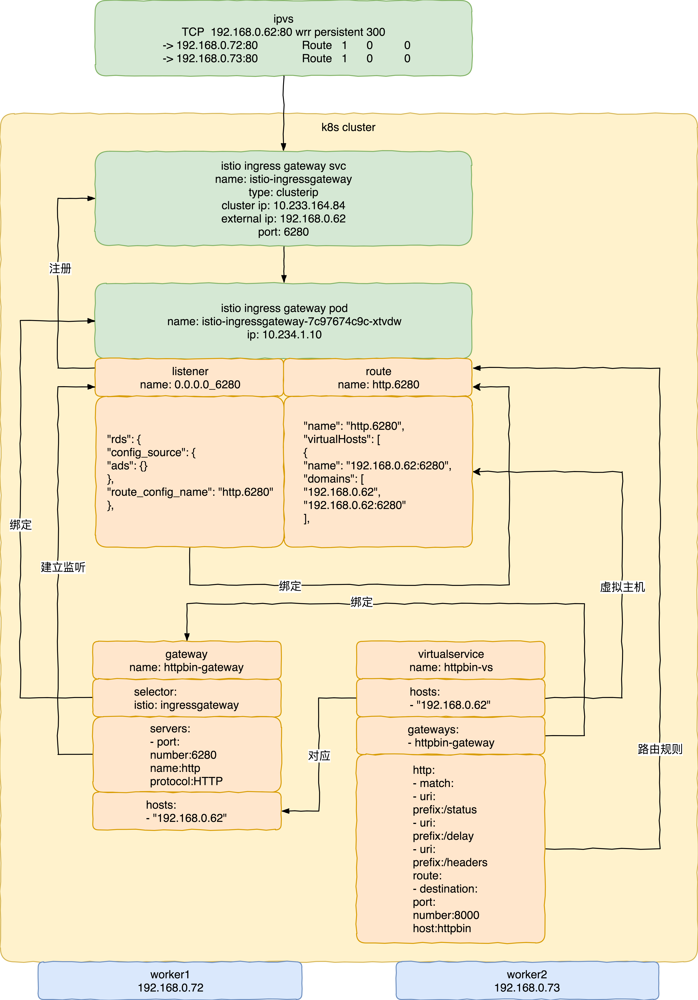

在Istio中控制Ingress流量

***

#### 相关拓扑



- 在集群外配置ipvs作为ingress gateway的负载均衡器。
- ipvs lb的地址为192.168.0.62，这个ip地址会作为用户访问的ip地址，也就是virtualservice中虚拟主机的地址。
- 将istio ingress gateway service的external ip设置为192.168.0.62。
- 增加gateway定义。
- gateway定义中的selector会将该设置与相应的gateway pod绑定。
- gateway定义中的servers会在相应的pod中生成listener实例，该拓扑中的监听端口为6280。
- 需要将6280端口注册到该gateway pod对应的服务中。
- gateway定义中的hosts表示listener会向哪些特定的虚拟主机转发流量。
- 增加virtualservice定义。
- virtualservice定义中的hosts与gateway中的hosts相对应表示该服务可以注册到gateway的监听中，这个host写会更新到gateway pod路由表的虚拟主机条目中。
- virtualservice定义中的gateways将virtualservice与gateway关联起来。
- virtualservice定义中的http定义了路由规则，路由规则会写入到相应gateway pod的路由表中。
- gateway pod的监听和路由会通过端口号绑定在一起。

 <br/>


#### 相关配置

```
ipvsadm -A -t 192.168.0.62:6280 -s wrr -p 300
ipvsadm -a -t 192.168.0.62:6280 -r 192.168.0.72:6280 -g
ipvsadm -a -t 192.168.0.62:6280 -r 192.168.0.73:6280 -g
```

- ipvs相关配置。

<br/>

```
apiVersion: networking.istio.io/v1alpha3
kind: Gateway
metadata:
  name: httpbin-gateway
spec:
  selector:
    istio: ingressgateway # use Istio default gateway implementation
  servers:
  - port:
      number: 6280
      name: http
      protocol: HTTP
    hosts:
    - "192.168.0.62"
```

- gateway相关配置。

  <br/>

```
apiVersion: networking.istio.io/v1alpha3
kind: VirtualService
metadata:
  name: httpbin-vs
spec:
  hosts:
  - "192.168.0.62"
  gateways:
  - httpbin-gateway
  http:
  - match:
    - uri:
        prefix: /status
    - uri:
        prefix: /delay
    - uri:
        prefix: /headers
    route:
    - destination:
        port:
          number: 8000
        host: httpbin
```

- virtualservice相关配置。

