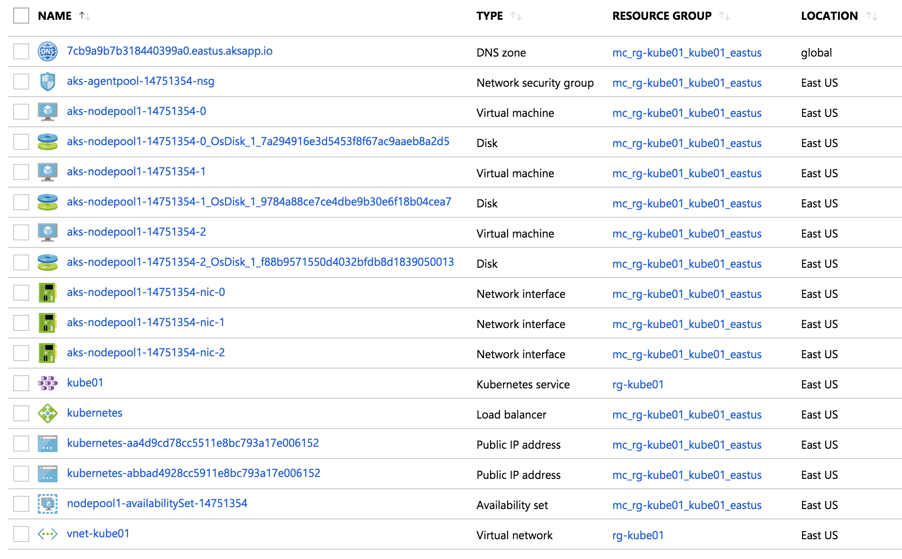
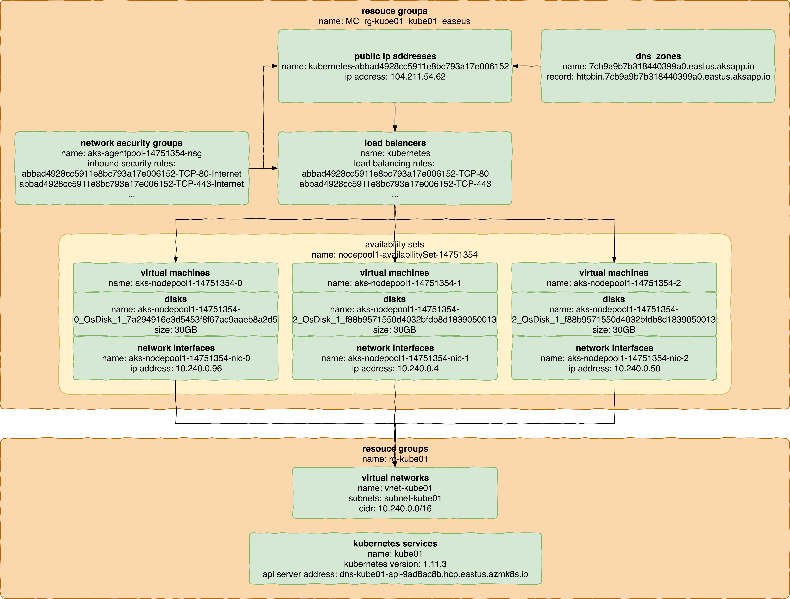

使用Azure AKS

***

#### AKS组件介绍



<br/>



- 在azure中新建resource group，名称为rg-kube01。
- 在rg-kube01中新建virtual network，名称为vnet-kube01，并且在vnet-kube01中新建subnet，名称为subnet-kube01，cidr为10.240.0.0/16。
- 在rg-kube01中新建kubernetes service，名称为kube01。
- 在新建kube01过程中，将vnet-kube01和subnet-kube01与kube01关联。
- 在新建kube01过程中，为kube01指定agent节点的数量与规模。
- kube01创建过程中会新建如下对象：
- virtual machine，包括network interface和disk，作为kube01的agent。
- load balancer，为kube01的ingress服务提供负载均衡策略。
- public ip address，为kube01的ingress服务提供公网ip。
- dns zone，为kube01的ingress服务提供域名解析。
- network security group，为kube01集群提供安全访问策略。

<br/>

#### AKS配置过程

```
az aks create --name kube01 \
--resource-group rg-kube01 \
--dns-name-prefix dns-kube01-api \
--dns-service-ip 10.241.0.10 \
--docker-bridge-address 172.17.0.1/16 \
--generate-ssh-keys \
--kubernetes-version 1.11.3 \
--network-plugin azure \
--node-count 3 \
--node-vm-size Standard_DS1_v2 \
--service-cidr 10.241.0.0/16 \
--max-pods 45 \
--enable-addons http_application_routing \
--vnet-subnet-id /subscriptions/691f1359-fffc-42e0-83d4-20e0d523c39b/resourceGroups/rg-kube01/providers/Microsoft.Network/virtualNetworks/vnet-kube01/subnets/subnet-kube01 \
--aad-client-app-id add7f78a-7d3c-45c2-bafe-2c62d8422218 \
--aad-server-app-id 0e8fff47-55ee-4e1b-822c-91acc83b39ac \
--aad-server-app-secret zDXXrYKzT9BaG6i9MxC4kLwYEWGdYJYnvsVJR2U0GIU= \
--aad-tenant-id 7813d2ef-62d8-44b7-872a-3f47c3895298
```

- —name指定k8s集群名称。
- --resource-group指定k8s集群属于哪个resource group。
- --dns-name-prefix指定api server的dns名称前缀。
- --dns-service-ip指定kube-dns的service ip。
- --docker-bridge-address指定docker bridge ip。
- --generate-ssh-keys生成相关证书和密钥。
- --kubernetes-version指定k8s集群的版本为1.11.3。（目前aks支持的最高版本）
- --network-plugin指定使用azure network plugin。
- --node-count指定agent节点数量。
- --node-vm-size指定agent节点规模。
- --service-cidr指定k8s集群的service network为10.241.0.0/16。
- --max-pods设定每个节点最大pod数量为45。
- --enable-addons启用http_application_routing，打开public ip address，load balancer和dns zone。
- --vnet-subnet-id指定vitual network中特定的subnet。
- --aad-client-app-id用于azure active directory用户授权访问k8s api server。
- --aad-server-app-id用于azure active directory用户授权访问k8s api server。
- --aad-server-app-secret用于azure active directory用户授权访问k8s api server。
- --aad-tenant-id用于azure active directory用户授权访问k8s api server。

<br/>

```
[~/.kube]$ az login
Note, we have launched a browser for you to login. For old experience with device code, use "az login --use-device-code"
You have logged in. Now let us find all the subscriptions to which you have access...
[
  {
    "cloudName": "AzureCloud",
    "id": "691f1359-fffc-42e0-83d4-20e0d523c39b",
    "isDefault": true,
    "name": "\u514d\u8d39\u8bd5\u7528",
    "state": "Enabled",
    "tenantId": "7813d2ef-62d8-44b7-872a-3f47c3895298",
    "user": {
      "name": "shenxg13@outlook.com",
      "type": "user"
    }
  }
]
[~/.kube]$
```

- 使用管理员用户登录azure。

<br/>

```
[~/.kube]$ az aks get-credentials -n kube01 -g rg-kube01 -a
Merged "kube01-admin" as current context in /Users/shenxg13/.kube/config
[~/.kube]$
```

- 下载kubeconfig文件。

<br/>

```
[~/.kube]$ kubectl get pods
NAME                      READY   STATUS    RESTARTS   AGE
httpbin-f455f64c4-5cfb8   1/1     Running   0          8h
[~/.kube]$
```

- 管理员有权限下载admin kubeconfig文件，可以正常访问集群。

<br/>

#### AKS的一些特性

- 支持azure cloud provider，支持sc，pvc和pv。
- pod network通过bridge连接到azure vnet。
- 支持load balancer类型的service。
- aks通过service principal获得访问其他azure组件的权限。
- 支持通过terraform或者ansible部署aks。
- 支持azure active directory用户授权访问aks（很好的功能，详细说明一下）。

<br/>

#### 为Azure Active Directory用户配置AKS权限

**参考文档：https://docs.microsoft.com/en-us/azure/aks/aad-integration。**

**可能出问题的地方：https://github.com/Azure/AKS/issues/478。**

```
[~/.kube]$ az ad user list --query "[].{user_name:userPrincipalName}"
[
  {
    "user_name": "gaol@shenxg13outlook.onmicrosoft.com"
  },
  {
    "user_name": "shenrs@shenxg13outlook.onmicrosoft.com"
  },
  {
    "user_name": "shenxg13_outlook.com#EXT#@shenxg13outlook.onmicrosoft.com"
  }
]
[~/.kube]$ az ad group list --query "[].{group_name:description, group_id:objectId}"
[
  {
    "group_id": "1bcbaef5-db06-4eb6-a283-3f911033823c",
    "group_name": "kube-admins"
  },
  {
    "group_id": "94168daa-b788-49f9-8cdf-d97fb98d5095",
    "group_name": "developers"
  }
]
[~/.kube]$ az ad user get-member-groups --upn-or-object-id gaol@shenxg13outlook.onmicrosoft.com
[
  {
    "displayName": "kube-admins",
    "objectId": "1bcbaef5-db06-4eb6-a283-3f911033823c"
  }
]
[~/.kube]$ az ad user get-member-groups --upn-or-object-id shenrs@shenxg13outlook.onmicrosoft.com
[
  {
    "displayName": "developers",
    "objectId": "94168daa-b788-49f9-8cdf-d97fb98d5095"
  }
]
[~/.kube]$
```

- 在azure active directory中新建用户和组。
- 将用户gaol@shenxg13outlook.onmicrosoft.com加入kube-admins组。
- 将用户shenrs@shenxg13outlook.onmicrosoft.com加入developers组。

<br/>

```
{
  "appId": "0e8fff47-55ee-4e1b-822c-91acc83b39ac",
  "appRoles": [],
  "availableToOtherTenants": false,
  "displayName": "sp-server-aad-kube01",
  "errorUrl": null,
  "groupMembershipClaims": "All",
  "optionalClaims": null,
  "acceptMappedClaims": null,
  "homepage": "http://sp-server-aad-kube01",
  "informationalUrls": {
    "privacy": null,
    "termsOfService": null
  },
  "identifierUris": [
    "https://shenxg13outlook.onmicrosoft.com/a9d63597-5d59-4f30-8257-98337425ed4b"
  ],
  "keyCredentials": [],
  "knownClientApplications": [],
  "logoutUrl": null,
  "oauth2AllowImplicitFlow": false,
  "oauth2AllowUrlPathMatching": false,
  "oauth2Permissions": [
    {
      "adminConsentDescription": "Allow the application to access sp-server-add-kube01 on behalf of the signed-in user.",
      "adminConsentDisplayName": "Access sp-server-add-kube01",
      "id": "a305c705-bfb0-4448-be68-27cfa2b315a2",
      "isEnabled": true,
      "type": "User",
      "userConsentDescription": "Allow the application to access sp-server-add-kube01 on your behalf.",
      "userConsentDisplayName": "Access sp-server-add-kube01",
      "value": "user_impersonation"
    }
  ],
  "oauth2RequirePostResponse": false,
  "objectId": "a2342e70-8572-453e-bd45-e6a22cb010c6",
  "parentalControlSettings": {
    "countriesBlockedForMinors": [],
    "legalAgeGroupRule": "Allow"
  },
  "passwordCredentials": [
    {
      "customKeyIdentifier": "YQBhAGQALQBrAHUAYgBlADAAMQA=",
      "endDate": "2020-10-10T05:20:39.819Z",
      "keyId": "1ac9a970-2bac-4f97-a853-cd91865ac739",
      "startDate": "2018-10-10T05:20:50.1010848Z",
      "value": null
    }
  ],
  "publicClient": false,
  "replyUrls": [
    "http://sp-server-aad-kube01"
  ],
  "requiredResourceAccess": [
    {
      "resourceAppId": "00000003-0000-0000-c000-000000000000",
      "resourceAccess": [
        {
          "id": "7ab1d382-f21e-4acd-a863-ba3e13f7da61",
          "type": "Role"
        },
        {
          "id": "e1fe6dd8-ba31-4d61-89e7-88639da4683d",
          "type": "Scope"
        },
        {
          "id": "06da0dbc-49e2-44d2-8312-53f166ab848a",
          "type": "Scope"
        }
      ]
    },
    {
      "resourceAppId": "00000002-0000-0000-c000-000000000000",
      "resourceAccess": [
        {
          "id": "311a71cc-e848-46a1-bdf8-97ff7156d8e6",
          "type": "Scope"
        }
      ]
    }
  ],
  "samlMetadataUrl": null
}
```

- 新建server application，名称为sp-server-aad-kube01，appid为0e8fff47-55ee-4e1b-822c-91acc83b39ac，为server application赋予访问azure active directory的权限。

<br/>

```
{
  "appId": "add7f78a-7d3c-45c2-bafe-2c62d8422218",
  "appRoles": [],
  "availableToOtherTenants": true,
  "displayName": "sp-client-aad-kube01",
  "errorUrl": null,
  "groupMembershipClaims": null,
  "optionalClaims": null,
  "acceptMappedClaims": null,
  "homepage": null,
  "informationalUrls": {
    "privacy": null,
    "termsOfService": null
  },
  "identifierUris": [],
  "keyCredentials": [],
  "knownClientApplications": [],
  "logoutUrl": null,
  "oauth2AllowImplicitFlow": false,
  "oauth2AllowUrlPathMatching": false,
  "oauth2Permissions": [],
  "oauth2RequirePostResponse": false,
  "objectId": "60b4c267-1373-4b17-a16d-08ce344d7863",
  "parentalControlSettings": {
    "countriesBlockedForMinors": [],
    "legalAgeGroupRule": "Allow"
  },
  "passwordCredentials": [],
  "publicClient": true,
  "replyUrls": [
    "http://sp-client-aad-kube01"
  ],
  "requiredResourceAccess": [
    {
      "resourceAppId": "0e8fff47-55ee-4e1b-822c-91acc83b39ac",
      "resourceAccess": [
        {
          "id": "a305c705-bfb0-4448-be68-27cfa2b315a2",
          "type": "Scope"
        }
      ]
    },
    {
      "resourceAppId": "00000002-0000-0000-c000-000000000000",
      "resourceAccess": [
        {
          "id": "311a71cc-e848-46a1-bdf8-97ff7156d8e6",
          "type": "Scope"
        }
      ]
    }
  ],
  "samlMetadataUrl": null
}
```

- 新建client application，名称为sp-client-aad-kube01，appid为add7f78a-7d3c-45c2-bafe-2c62d8422218，为client application赋予访问server application的权限。

<br/>

```
--aad-client-app-id add7f78a-7d3c-45c2-bafe-2c62d8422218 \
--aad-server-app-id 0e8fff47-55ee-4e1b-822c-91acc83b39ac \
--aad-server-app-secret zDXXrYKzT9BaG6i9MxC4kLwYEWGdYJYnvsVJR2U0GIU= \
--aad-tenant-id 7813d2ef-62d8-44b7-872a-3f47c3895298
```

- 在初始化aks时指定server app id，server secret，client app id和tenant id。

<br/>

```
[~/.kube]$ az role assignment list
[
  {
    "canDelegate": null,
    "id": "/subscriptions/691f1359-fffc-42e0-83d4-20e0d523c39b/providers/Microsoft.Authorization/roleAssignments/c42c2283-c4a4-4cc6-9b2a-50b5c8aa495b",
    "name": "c42c2283-c4a4-4cc6-9b2a-50b5c8aa495b",
    "principalId": "08c33490-c7d8-451c-9ac2-f9d12efda366",
    "principalName": "gaol@shenxg13outlook.onmicrosoft.com",
    "roleDefinitionId": "/subscriptions/691f1359-fffc-42e0-83d4-20e0d523c39b/providers/Microsoft.Authorization/roleDefinitions/4abbcc35-e782-43d8-92c5-2d3f1bd2253f",
    "roleDefinitionName": "Azure Kubernetes Service Cluster User Role",
    "scope": "/subscriptions/691f1359-fffc-42e0-83d4-20e0d523c39b",
    "type": "Microsoft.Authorization/roleAssignments"
  },
  {
    "canDelegate": null,
    "id": "/subscriptions/691f1359-fffc-42e0-83d4-20e0d523c39b/providers/Microsoft.Authorization/roleAssignments/a696cc09-f719-401a-bd5b-43d3cc8ba8a2",
    "name": "a696cc09-f719-401a-bd5b-43d3cc8ba8a2",
    "principalId": "903bf422-24d4-4135-91d7-ddbf5b9afdb6",
    "principalName": "shenrs@shenxg13outlook.onmicrosoft.com",
    "roleDefinitionId": "/subscriptions/691f1359-fffc-42e0-83d4-20e0d523c39b/providers/Microsoft.Authorization/roleDefinitions/4abbcc35-e782-43d8-92c5-2d3f1bd2253f",
    "roleDefinitionName": "Azure Kubernetes Service Cluster User Role",
    "scope": "/subscriptions/691f1359-fffc-42e0-83d4-20e0d523c39b",
    "type": "Microsoft.Authorization/roleAssignments"
  }
]
[~/.kube]$
```

- 为用户gaol@shenxg13outlook.onmicrosoft.com和shenrs@shenxg13outlook.onmicrosoft.com授予Azure Kubernetes Service Cluster User Role权限。

<br/>

```
apiVersion: rbac.authorization.k8s.io/v1
kind: ClusterRoleBinding
metadata:
 name: aad-group-cluster-admins
roleRef:
 apiGroup: rbac.authorization.k8s.io
 kind: ClusterRole
 name: cluster-admin
subjects:
- apiGroup: rbac.authorization.k8s.io
  kind: Group
  name: "1bcbaef5-db06-4eb6-a283-3f911033823c"
```

- 在aks集群中创建clusterrolebinding，将azure active directory组kube-admins授予cluster-admin权限。

<br/>

```
[~/.azure]$ az login
Note, we have launched a browser for you to login. For old experience with device code, use "az login --use-device-code"
You have logged in. Now let us find all the subscriptions to which you have access...
[
  {
    "cloudName": "AzureCloud",
    "id": "691f1359-fffc-42e0-83d4-20e0d523c39b",
    "isDefault": true,
    "name": "\u514d\u8d39\u8bd5\u7528",
    "state": "Enabled",
    "tenantId": "7813d2ef-62d8-44b7-872a-3f47c3895298",
    "user": {
      "name": "gaol@shenxg13outlook.onmicrosoft.com",
      "type": "user"
    }
  }
]

[~/.kube]$ az aks get-credentials -n kube01 -g rg-kube01
Merged "kube01" as current context in /Users/shenxg13/.kube/config

[~/.kube]$ kubectl get pods
To sign in, use a web browser to open the page https://microsoft.com/devicelogin and enter the code GDPP5D636 to authenticate.
NAME                      READY   STATUS    RESTARTS   AGE
httpbin-f455f64c4-5cfb8   1/1     Running   0          9h

[~/.kube]$ cat config
apiVersion: v1
clusters:
- cluster:
    certificate-authority-data: LS0tLS1CRUdJTiBDRVJUSUZJQ0FURS0tLS0tCk1JSUV4ekNDQXErZ0F3SUJBZ0lRZHNzSXVGd09VNTY0NURubVNNRkJ3REFOQmdrcWhraUc5dzBCQVFzRkFEQU4KTVFzd0NRWURWUVFERXdKallUQWVGdzB4T0RFd01UQXdOakU0TVRSYUZ3MHlNREV3TURrd05qRTRNVFJhTUEweApDekFKQmdOVkJBTVRBbU5oTUlJQ0lqQU5CZ2txaGtpRzl3MEJBUUVGQUFPQ0FnOEFNSUlDQ2dLQ0FnRUFwcW5TCktoYllhTXFqTWFmNGxHN2NHcE1pcnorelVGM2d2OTBPOHBncHdYaGgyVmJienhtdG1pc3hLM3duaUp6cTROWGYKeXhtNFg1emdZbWhZb3Z3Vk9qUkNTYllOY3dzR2w4K0NrUERHQXpUeHRhOEo5NW5PUVNJR29BaGJFcExWUytLQgpOejdjOWhXTzI3U1V2Yys3QkdZNkRUeGNjMmtsZGZ1TlgrYldVdFpJc0FhQTVvckhYZHk5K3MzY1R2U3dLaUtCCks3dk42ZnZ4eUxkOU14b2xRWitIS09kbzcyS055WkVpOXhQdEtZZjhSSEpURjBnbWEwMUdGY3NKcGRrZkFkLzIKVkhWa1orUWtwZXdZdzNNdnZTZG4rSjg2MUN0N2hMdC9tT1BZMlhNWGNNTFBvV2VjUTdMaml1UlBUaURzcXY1SwpZNG9sTE9PV25lYm9CQnpOd1BPUnA2bTNyS2VmS3AwOWcwQktYWlRyazlUNUFlcHJJU1UwTjNrbEtONG9iMm9uCk1wYVZuVWxkQjhTNzVkWi9kRzM0eVp5YUNiVTF3a2xwclFzamZtN0VrNTNFbzFMMUJSRVBmRXRXdGZkK2h1NlgKbW12ZGVUbk9uSDZKMFlDRmFmeDBQZm82K3FyRXk0TnlGMFNBdm00V0tDYmFsVk5MNHFidXRCcENkUHJzK3ZicgpibEkrbGgvS3NVTmQ5L0lZbFRnSXVERmMxcGp1dGNEMzVhRjgvZGd1cUdiOUl0bTduY0R5Qk93Y0FhSnhVN2cwCnppSXhyaE9jNm8yd3phREdUaGFuYWdiNTlCZDdRL1NCdGsvaGpFVHJ2YUZqbGZDYkxHSk1vWWowSnFkcU0xelgKQkl1K0ZMYmo1b0VIdGszSjhkL1VkQUgrMmRwK2F1VXBDTlFLTzFzQ0F3RUFBYU1qTUNFd0RnWURWUjBQQVFILwpCQVFEQWdLa01BOEdBMVVkRXdFQi93UUZNQU1CQWY4d0RRWUpLb1pJaHZjTkFRRUxCUUFEZ2dJQkFJNG1zR3lXCmNNM3doVTlKYXI2MHBabjk4THJ5MThPUnhsNTdSNEd1QjlRdVY5STgzL3J0SGptNGI4U29ITThMSUl1dGg5ZFcKNE9LcnBOQkV2L3Q3SCtUSHpSQzZUUUR5NWh4dDh4Z2FBczBlcUgzVEo2a2NxaWY0b3pobU4yNHdDakhqVTVrSgowTytheSt1VHc3bjZlVFRnZnJuUVB2UWJIOWZvSzZwY1ZoZmdvd2hYZ2FqUDZBY25VYkRYZm5qdWtVRW1uaEloCkRNT3h0bUhPR3E0bGxaZVRldll4OS9BQWhKeU9aWG9ZditRTGlwK0dIYzVoWmNaRXVrSStDcnNZaWlkZlJDRWYKbG5NYXQxUWpxYTU4MWsxUm1MQkxlNWRYNWE5SWxTZVpURitvU1BaNEtLUnhVMFZRSnd2d2E5UVZjYlRwRkxLLwpua1o4SEVHZTgwVnlDTWpmSVU5THBQL3QwV0NRMDlpWStnMWp5dU0vNlh4MWhlUFNwRkowa0lKbDZWeStmaGRwCnc1dXlHbTlRamVWbFE5UWpNTFFHczNQK2F4cFl2UzhRaWQ5MG9FczMyMW5qVHlCN1VnMEVCWjZhY3p5cXhhQ1EKS1dwNTNFZEFKV09qRzY2UVhxd1doTzJpRStlQjJnekN6UmppajJUbkJhZ3ExK3FuR3NsSGhBU3dRZ1NuNmU5WApEVW5Ib3hLQ01VemhGVGRuWk02bVZjZFozcDc1TE1PMGQvZHZacHdDbUtZRE1yNXhjZlJ4cEFESnozWG56d1dHCkRPck5HY25CTC9wMWlENER4a2h2RU8wYzV2aHlWOHZ6THI4aThFR0E4M011KzJ3UDlOWWJHYit6MmFYRGZIdU8Kb1Q2NTE4WWZNVVV1MUVTQ1N2UGx0WjV5NUh3TTJ1bklEZHdCCi0tLS0tRU5EIENFUlRJRklDQVRFLS0tLS0K
    server: https://dns-kube01-api-9ad8ac8b.hcp.eastus.azmk8s.io:443
  name: kube01
contexts:
- context:
    cluster: kube01
    user: clusterUser_rg-kube01_kube01
  name: kube01
current-context: kube01
kind: Config
preferences: {}
users:
- name: clusterUser_rg-kube01_kube01
  user:
    auth-provider:
      config:
        access-token: eyJ0eXAiOiJKV1QiLCJhbGciOiJSUzI1NiIsIng1dCI6Imk2bEdrM0ZaenhSY1ViMkMzbkVRN3N5SEpsWSIsImtpZCI6Imk2bEdrM0ZaenhSY1ViMkMzbkVRN3N5SEpsWSJ9.eyJhdWQiOiJzcG46MGU4ZmZmNDctNTVlZS00ZTFiLTgyMmMtOTFhY2M4M2IzOWFjIiwiaXNzIjoiaHR0cHM6Ly9zdHMud2luZG93cy5uZXQvNzgxM2QyZWYtNjJkOC00NGI3LTg3MmEtM2Y0N2MzODk1Mjk4LyIsImlhdCI6MTUzOTE4OTc5NywibmJmIjoxNTM5MTg5Nzk3LCJleHAiOjE1MzkxOTM2OTcsImFjciI6IjEiLCJhaW8iOiJBU1FBMi84SkFBQUEwZUpMMWlqWTBidmlwRzhtcDZHK2EzVVRvYzJDdGU2REtRUFZKbDBJRU9VPSIsImFtciI6WyJwd2QiXSwiYXBwaWQiOiJhZGQ3Zjc4YS03ZDNjLTQ1YzItYmFmZS0yYzYyZDg0MjIyMTgiLCJhcHBpZGFjciI6IjAiLCJncm91cHMiOlsiMWJjYmFlZjUtZGIwNi00ZWI2LWEyODMtM2Y5MTEwMzM4MjNjIl0sImlwYWRkciI6IjExNC4yNDkuNTIuMjIiLCJuYW1lIjoiZ2FvIGxpIiwib2lkIjoiMDhjMzM0OTAtYzdkOC00NTFjLTlhYzItZjlkMTJlZmRhMzY2Iiwic2NwIjoidXNlcl9pbXBlcnNvbmF0aW9uIiwic3ViIjoiMnF0Wkw1TmtRYXpYY053b0hhZjBRNG5Gc1pkdl82TFdiWmd5VExZSWJYZyIsInRpZCI6Ijc4MTNkMmVmLTYyZDgtNDRiNy04NzJhLTNmNDdjMzg5NTI5OCIsInVuaXF1ZV9uYW1lIjoiZ2FvbEBzaGVueGcxM291dGxvb2sub25taWNyb3NvZnQuY29tIiwidXBuIjoiZ2FvbEBzaGVueGcxM291dGxvb2sub25taWNyb3NvZnQuY29tIiwidXRpIjoiRllpY0k2bXF3RWVxSnlWc2c5c3JBQSIsInZlciI6IjEuMCJ9.SyTz8DZdfFzOSC88N_-E5yOi8MJbQIx-aTiOFyhhwv0kozTeAc-5ktBsMUvYb9ezvlg_PiIW44re-aeMuuQ1bbFk6vlC4Rin_OyiCOOU-Pb1ddvJ_C4X6VIpvGYCQq9nslqM9reUhTZMfJdwvjF4S-EqSlG11fytsnjeBbdMPopSFWaW7IUc2BdfNMe7_DE4lB8t6z1hqa0own3nGIhFZ5jBkDuNY_K4oBD3zfDqPn_8-2rqTw4JstR5iI19YfQsnbGA6OxDsy4Lb4BF3vkdmSpjmMKK826-0Eg1r04DN94MHaf1uJpbSfYFMjq3TTMvMpAuQzfz5nd2zRETvjOzkQ
        apiserver-id: 0e8fff47-55ee-4e1b-822c-91acc83b39ac
        client-id: add7f78a-7d3c-45c2-bafe-2c62d8422218
        expires-in: "3599"
        expires-on: "1539193697"
        refresh-token: AQABAAAAAAC5una0EUFgTIF8ElaxtWjTz1fxguSM1xp7s4uXu9bMOBEBUVnN3k5wqhIjQxELzZXGVrjOzkgvdCzKo2catUXOoy7YEz9h2T-4H7eVe8Bka8OR1CuLoY4oWxg73L7n1V3EOd3wsZ2w_tic4_vaivPq166AKashAzHYEpKAmqpqTuHEM7V1BA0M1N5FwaGdvZmSCyh3N9V00PXpaLapl7OevuTnmkoVmYi7hkIytJSOEBgrOxwErGaCkb1OC8ThnO-51u6OOLPYj3PGLs-wHBf2J7tgZZ0dKJRiK05MP0Glvae87Pr439WQcWN0ocnQTJo49zZOtbntbT6SVs6DHOCT0kznfR1Rtx3JEuIvm-OJkDd20FRRm2warJm-sXzkq4KOHGgjL-Momdamqgdt6mId7-pX31TRyGkizE61fZqZW5D2GIiuBRiJRQWTq3UDiIYk_R1WK-SCVjoM-LoqAgfmlt2SDY3bxnexIPYAdrJoOoPbb-1oZAtpO-1BPboHsXh1zdwPw_3Vf2iHMY2gza57Bk1Vj3--n1gCE1a5X7BbRSojQG9HuJ8j76gc9kEEP2-QdUBTd1JEobCz92FIPQHV5WCMSq_nxHoTtqetn6jyRtB83fS3SZBCZlJ_Cl5OA89cnR37SwZp7rMr5-7mSyY2uAwg3iKwGeRLO0JqES7mvaO2TTN6N348uiLux5zPZ8F8rVQuN5pZ8iVaK9xguTbT7rLikrxF1Y3Ea4xdUlX_HIf4yAWOEOw9FV0DrtNBtsv6t6XVs9xT6pjMnTf662PGIAA
        tenant-id: 7813d2ef-62d8-44b7-872a-3f47c3895298
      name: azure
[~/.kube]$
```

- 用户gaol@shenxg13outlook.onmicrosoft.com可以正产访问aks集群。

<br/>

```
[~/.kube]$ az login
Note, we have launched a browser for you to login. For old experience with device code, use "az login --use-device-code"
You have logged in. Now let us find all the subscriptions to which you have access...
[
  {
    "cloudName": "AzureCloud",
    "id": "691f1359-fffc-42e0-83d4-20e0d523c39b",
    "isDefault": true,
    "name": "\u514d\u8d39\u8bd5\u7528",
    "state": "Enabled",
    "tenantId": "7813d2ef-62d8-44b7-872a-3f47c3895298",
    "user": {
      "name": "shenrs@shenxg13outlook.onmicrosoft.com",
      "type": "user"
    }
  }
]

[~/.kube]$ az aks get-credentials -n kube01 -g rg-kube01
Merged "kube01" as current context in /Users/shenxg13/.kube/config

[~/.kube]$ kubectl get pods
To sign in, use a web browser to open the page https://microsoft.com/devicelogin and enter the code GU2QVPDSY to authenticate.
Error from server (Forbidden): pods is forbidden: User "shenrs@shenxg13outlook.onmicrosoft.com" cannot list pods in the namespace "default"

[~/.kube]$ cat config
apiVersion: v1
clusters:
- cluster:
    certificate-authority-data: LS0tLS1CRUdJTiBDRVJUSUZJQ0FURS0tLS0tCk1JSUV4ekNDQXErZ0F3SUJBZ0lRZHNzSXVGd09VNTY0NURubVNNRkJ3REFOQmdrcWhraUc5dzBCQVFzRkFEQU4KTVFzd0NRWURWUVFERXdKallUQWVGdzB4T0RFd01UQXdOakU0TVRSYUZ3MHlNREV3TURrd05qRTRNVFJhTUEweApDekFKQmdOVkJBTVRBbU5oTUlJQ0lqQU5CZ2txaGtpRzl3MEJBUUVGQUFPQ0FnOEFNSUlDQ2dLQ0FnRUFwcW5TCktoYllhTXFqTWFmNGxHN2NHcE1pcnorelVGM2d2OTBPOHBncHdYaGgyVmJienhtdG1pc3hLM3duaUp6cTROWGYKeXhtNFg1emdZbWhZb3Z3Vk9qUkNTYllOY3dzR2w4K0NrUERHQXpUeHRhOEo5NW5PUVNJR29BaGJFcExWUytLQgpOejdjOWhXTzI3U1V2Yys3QkdZNkRUeGNjMmtsZGZ1TlgrYldVdFpJc0FhQTVvckhYZHk5K3MzY1R2U3dLaUtCCks3dk42ZnZ4eUxkOU14b2xRWitIS09kbzcyS055WkVpOXhQdEtZZjhSSEpURjBnbWEwMUdGY3NKcGRrZkFkLzIKVkhWa1orUWtwZXdZdzNNdnZTZG4rSjg2MUN0N2hMdC9tT1BZMlhNWGNNTFBvV2VjUTdMaml1UlBUaURzcXY1SwpZNG9sTE9PV25lYm9CQnpOd1BPUnA2bTNyS2VmS3AwOWcwQktYWlRyazlUNUFlcHJJU1UwTjNrbEtONG9iMm9uCk1wYVZuVWxkQjhTNzVkWi9kRzM0eVp5YUNiVTF3a2xwclFzamZtN0VrNTNFbzFMMUJSRVBmRXRXdGZkK2h1NlgKbW12ZGVUbk9uSDZKMFlDRmFmeDBQZm82K3FyRXk0TnlGMFNBdm00V0tDYmFsVk5MNHFidXRCcENkUHJzK3ZicgpibEkrbGgvS3NVTmQ5L0lZbFRnSXVERmMxcGp1dGNEMzVhRjgvZGd1cUdiOUl0bTduY0R5Qk93Y0FhSnhVN2cwCnppSXhyaE9jNm8yd3phREdUaGFuYWdiNTlCZDdRL1NCdGsvaGpFVHJ2YUZqbGZDYkxHSk1vWWowSnFkcU0xelgKQkl1K0ZMYmo1b0VIdGszSjhkL1VkQUgrMmRwK2F1VXBDTlFLTzFzQ0F3RUFBYU1qTUNFd0RnWURWUjBQQVFILwpCQVFEQWdLa01BOEdBMVVkRXdFQi93UUZNQU1CQWY4d0RRWUpLb1pJaHZjTkFRRUxCUUFEZ2dJQkFJNG1zR3lXCmNNM3doVTlKYXI2MHBabjk4THJ5MThPUnhsNTdSNEd1QjlRdVY5STgzL3J0SGptNGI4U29ITThMSUl1dGg5ZFcKNE9LcnBOQkV2L3Q3SCtUSHpSQzZUUUR5NWh4dDh4Z2FBczBlcUgzVEo2a2NxaWY0b3pobU4yNHdDakhqVTVrSgowTytheSt1VHc3bjZlVFRnZnJuUVB2UWJIOWZvSzZwY1ZoZmdvd2hYZ2FqUDZBY25VYkRYZm5qdWtVRW1uaEloCkRNT3h0bUhPR3E0bGxaZVRldll4OS9BQWhKeU9aWG9ZditRTGlwK0dIYzVoWmNaRXVrSStDcnNZaWlkZlJDRWYKbG5NYXQxUWpxYTU4MWsxUm1MQkxlNWRYNWE5SWxTZVpURitvU1BaNEtLUnhVMFZRSnd2d2E5UVZjYlRwRkxLLwpua1o4SEVHZTgwVnlDTWpmSVU5THBQL3QwV0NRMDlpWStnMWp5dU0vNlh4MWhlUFNwRkowa0lKbDZWeStmaGRwCnc1dXlHbTlRamVWbFE5UWpNTFFHczNQK2F4cFl2UzhRaWQ5MG9FczMyMW5qVHlCN1VnMEVCWjZhY3p5cXhhQ1EKS1dwNTNFZEFKV09qRzY2UVhxd1doTzJpRStlQjJnekN6UmppajJUbkJhZ3ExK3FuR3NsSGhBU3dRZ1NuNmU5WApEVW5Ib3hLQ01VemhGVGRuWk02bVZjZFozcDc1TE1PMGQvZHZacHdDbUtZRE1yNXhjZlJ4cEFESnozWG56d1dHCkRPck5HY25CTC9wMWlENER4a2h2RU8wYzV2aHlWOHZ6THI4aThFR0E4M011KzJ3UDlOWWJHYit6MmFYRGZIdU8Kb1Q2NTE4WWZNVVV1MUVTQ1N2UGx0WjV5NUh3TTJ1bklEZHdCCi0tLS0tRU5EIENFUlRJRklDQVRFLS0tLS0K
    server: https://dns-kube01-api-9ad8ac8b.hcp.eastus.azmk8s.io:443
  name: kube01
contexts:
- context:
    cluster: kube01
    user: clusterUser_rg-kube01_kube01
  name: kube01
current-context: kube01
kind: Config
preferences: {}
users:
- name: clusterUser_rg-kube01_kube01
  user:
    auth-provider:
      config:
        access-token: eyJ0eXAiOiJKV1QiLCJhbGciOiJSUzI1NiIsIng1dCI6Imk2bEdrM0ZaenhSY1ViMkMzbkVRN3N5SEpsWSIsImtpZCI6Imk2bEdrM0ZaenhSY1ViMkMzbkVRN3N5SEpsWSJ9.eyJhdWQiOiJzcG46MGU4ZmZmNDctNTVlZS00ZTFiLTgyMmMtOTFhY2M4M2IzOWFjIiwiaXNzIjoiaHR0cHM6Ly9zdHMud2luZG93cy5uZXQvNzgxM2QyZWYtNjJkOC00NGI3LTg3MmEtM2Y0N2MzODk1Mjk4LyIsImlhdCI6MTUzOTE5MDA5MSwibmJmIjoxNTM5MTkwMDkxLCJleHAiOjE1MzkxOTM5OTEsImFjciI6IjEiLCJhaW8iOiI0MlJnWUdBTGR0bStXeWhQYWExUnJObnoyazk3ajB6WWtNckx4SHlwNmIyNFpFcnluenNBIiwiYW1yIjpbInB3ZCJdLCJhcHBpZCI6ImFkZDdmNzhhLTdkM2MtNDVjMi1iYWZlLTJjNjJkODQyMjIxOCIsImFwcGlkYWNyIjoiMCIsImdyb3VwcyI6WyI5NDE2OGRhYS1iNzg4LTQ5ZjktOGNkZi1kOTdmYjk4ZDUwOTUiXSwiaXBhZGRyIjoiMTE0LjI0OS41Mi4yMiIsIm5hbWUiOiJzaGVuIHJ1c2VuIiwib2lkIjoiOTAzYmY0MjItMjRkNC00MTM1LTkxZDctZGRiZjViOWFmZGI2Iiwic2NwIjoidXNlcl9pbXBlcnNvbmF0aW9uIiwic3ViIjoic2RXWjYyVW5vcklKck5OSURPSU8zTEZzTkV4TVpXRkpCRGF1SFJrS3FfSSIsInRpZCI6Ijc4MTNkMmVmLTYyZDgtNDRiNy04NzJhLTNmNDdjMzg5NTI5OCIsInVuaXF1ZV9uYW1lIjoic2hlbnJzQHNoZW54ZzEzb3V0bG9vay5vbm1pY3Jvc29mdC5jb20iLCJ1cG4iOiJzaGVucnNAc2hlbnhnMTNvdXRsb29rLm9ubWljcm9zb2Z0LmNvbSIsInV0aSI6IndWWXlQODM2YTBPaFFrVld6bm90QUEiLCJ2ZXIiOiIxLjAifQ.brbKlZl_7F5veDa5moOL-_52G8hjhA5ogRZEsgskzQ9vHK9yR1tt72wjmZbis_4mRXNKSrPRo1GY0jO1oEikhePte0IOKsM1tAB6TqBGSlsIQ24VaiLk1NrQwXMeyR9lsD3T4zGL6PvGp_B5j1-TcL1-UTZbXTa7Jv3j65zqRjW-UuyOETur2o_cVH3qK0VT_tczrR2qzXJACcDD7C5MsYCYd3mx7_r-qbyCdE1fxIdZuBX9ikaEk5S8Y2ZiHKRLLhE8CGAtHS2_BwNN_Ywkc2hAVbYzhiMR1h6lEVomemKDSJJabOMcF5PTD_L3chu6jokb5uK-hsNZPaEvdnrG_g
        apiserver-id: 0e8fff47-55ee-4e1b-822c-91acc83b39ac
        client-id: add7f78a-7d3c-45c2-bafe-2c62d8422218
        expires-in: "3599"
        expires-on: "1539193991"
        refresh-token: AQABAAAAAAC5una0EUFgTIF8ElaxtWjTetGCjQg5gc8hWRytXclp4E_RIW4X5fvlefB3bQTPS2AyVzv5UB2XywBoqFMsL8f2W44Y-srcTap_h2ax1F-PuToXoZa9W_M7RRBUCjlXcAgFx3mRSRLhkTmiI5mmNIA1StOPoF0zDvTdo9S3BzysDbLBahZD2ff3kIkiZcG8HxcDFclp3yvVvQ13lOxdE8DNsN_xYHflm-OjJuHnVhaGQaPKJn8EGMBbTy7cgCsJVIGnpw5DOC-mcJqqMRbFpTOh1ZELF-ZejhL1LKT3dPYra3gjBH5wCvtKnFnIVxj_UWa2cDS1_Ycz9RU50gU-wlL3St02UoQ2C9FdiBARUGILdJHG0dncXLc-CcqnVRXRbNpiIuhiH6ePVHWx0ljQG7-ySRKhHdcaLeXLi3wqzu6S5od-viG42eA_Ni_5mjz1cPQouj800loK8Lo85MUGbBnfYXSHnLEm0Te9JTs_IK25SsAs5eW80a7_Xp0LCE2ljPCInGqmBIr3LbFeMQxI6Pg-hDUZz-yrAxW2r0jF-jeH1rTPO5kNA4CmsbPpgYcz6pmfm6LmNZKLGq5uFpUP2za-geShYDj3GtQzFWyTVN-xE6EGbEO_IehG2AhLYXlIvigOsqK28VmAYkoRD7xwsjHtu63lzfOog5-IS4lLDr-LHRRw1wwXfY9rd1F8mhEf2UGZUHtCULk3oFZDeQhYMZcy2X9WuBHtGquyCHqfk0rzk_NPQtssJOH-jXVhh4i0tg2yZIGPCyOVlNR36cTQQIIbIAA
        tenant-id: 7813d2ef-62d8-44b7-872a-3f47c3895298
      name: azure
[~/.kube]$
```

- 用户shenrs@shenxg13outlook.onmicrosoft.com可以正产访问aks集群。

