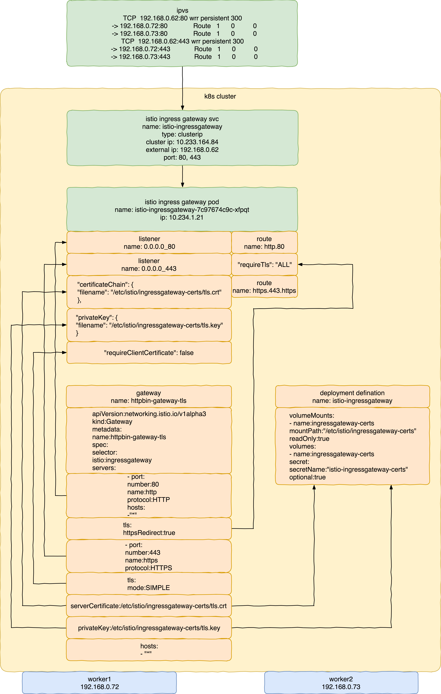
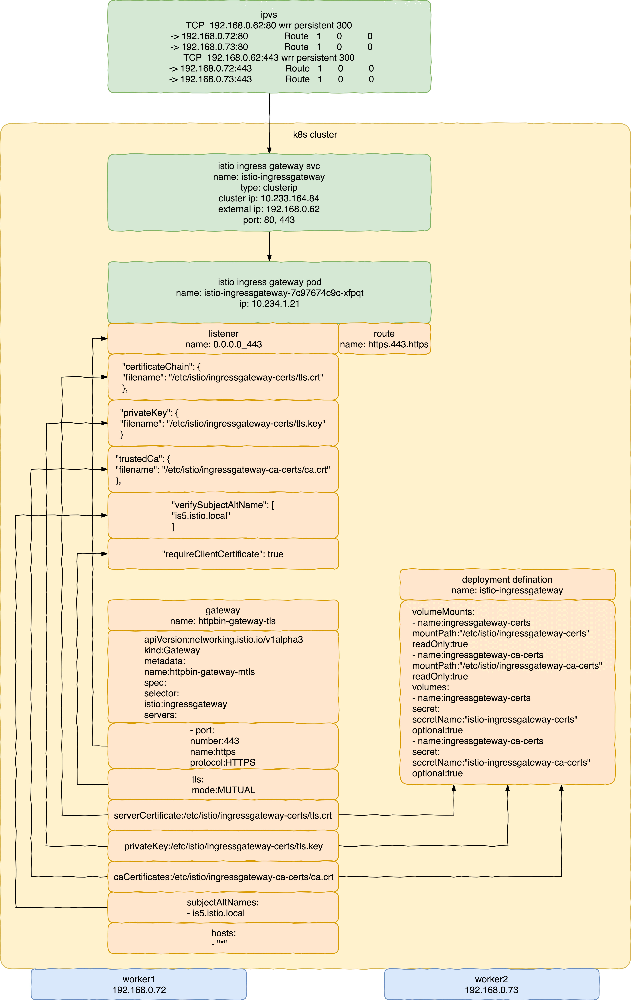

在Istio中使用安全的Gateway

***

#### 使用TLS



- 增加gateway定义。
- gateway定义中包括80和443。
- 在80中启用httpsredirect。
- 在443中启用simple tls。
- 指定443的key和cert。

<br/>

```
ipvsadm -A -t 192.168.0.62:443 -s wrr -p 300
ipvsadm -a -t 192.168.0.62:443 -r 192.168.0.72:443 -g
ipvsadm -a -t 192.168.0.62:443 -r 192.168.0.73:443 -g
ipvsadm -A -t 192.168.0.62:80 -s wrr -p 300
ipvsadm -a -t 192.168.0.62:80 -r 192.168.0.72:80 -g
ipvsadm -a -t 192.168.0.62:80 -r 192.168.0.73:80 -g
```

- ipvs相关配置。

<br/>

```
openssl req \
-newkey rsa:4096 -nodes -sha256 -keyout ca.key \
-x509 -days 3655 -out ca.crt

openssl req \
-newkey rsa:4096 -nodes -sha256 -keyout istio-httpbin.key \
-out istio-httpbin.csr

echo subjectAltName = IP:192.168.0.62, IP:192.168.0.72, IP:192.168.0.73, DNS:httpbin.istio.local, DNS:app.istio.local > extfile.cnf

openssl x509 \
-req -days 3655 -in istio-httpbin.csr -CA ca.crt -CAkey ca.key \
-CAcreateserial -extfile extfile.cnf -out istio-httpbin.crt
```

- 自签名证书相关配置。

<br/>

```
kubectl create -n istio-system secret tls istio-ingressgateway-certs --key ./istio-httpbin.key --cert ./istio-httpbin.crt
```

- k8s secret相关配置。

<br/>

```
apiVersion: networking.istio.io/v1alpha3
kind: Gateway
metadata:
  name: httpbin-gateway-tls
spec:
  selector:
    istio: ingressgateway # use istio default ingress gateway
  servers:
  - port:
      number: 80
      name: http
      protocol: HTTP
    hosts:
    - "*"
    tls:
      httpsRedirect: true
  - port:
      number: 443
      name: https
      protocol: HTTPS
    tls:
      mode: SIMPLE
      serverCertificate: /etc/istio/ingressgateway-certs/tls.crt
      privateKey: /etc/istio/ingressgateway-certs/tls.key
    hosts:
    - "*"
```

- gateway相关配置。

<br/>

```
kind: VirtualService
metadata:
  name: httpbin-vs
spec:
  hosts:
  - "192.168.0.62"
  gateways:
  - httpbin-gateway-tls
  http:
  - match:
    - uri:
        prefix: /status
    - uri:
        prefix: /delay
    - uri:
        prefix: /headers
    route:
    - destination:
        port:
          number: 8000
        host: httpbin
```

- virtualservice相关配置。

<br/>

```
[~/K8s/istio/istio-1.0.2/samples/httpbin]$ istioctl pc listener istio-ingressgateway-7c97674c9c-xfpqt -n istio-system -o json
[
    {
        "name": "0.0.0.0_443",
        "address": {
            "socketAddress": {
                "address": "0.0.0.0",
                "portValue": 443
            }
        },
        "filterChains": [
            {
                "tlsContext": {
                    "commonTlsContext": {
                        "tlsCertificates": [
                            {
                                "certificateChain": {
                                    "filename": "/etc/istio/ingressgateway-certs/tls.crt"
                                },
                                "privateKey": {
                                    "filename": "/etc/istio/ingressgateway-certs/tls.key"
                                }
                            }
                        ],
                        "alpnProtocols": [
                            "h2",
                            "http/1.1"
                        ]
                    },
                    "requireClientCertificate": false
                },
                "filters": [
                    {
                        "name": "envoy.http_connection_manager",
                        "config": {
                            "access_log": [
                                {
                                    "config": {
                                        "path": "/dev/stdout"
                                    },
                                    "name": "envoy.file_access_log"
                                }
                            ],
                            "generate_request_id": true,
                            "http_filters": [
                                {
                                    "config": {
                                        "default_destination_service": "default",
                                        "forward_attributes": {
                                            "attributes": {
                                                "source.uid": {
                                                    "string_value": "kubernetes://istio-ingressgateway-7c97674c9c-xfpqt.istio-system"
                                                }
                                            }
                                        },
                                        "mixer_attributes": {
                                            "attributes": {
                                                "context.reporter.kind": {
                                                    "string_value": "outbound"
                                                },
                                                "context.reporter.uid": {
                                                    "string_value": "kubernetes://istio-ingressgateway-7c97674c9c-xfpqt.istio-system"
                                                },
                                                "source.namespace": {
                                                    "string_value": "istio-system"
                                                },
                                                "source.uid": {
                                                    "string_value": "kubernetes://istio-ingressgateway-7c97674c9c-xfpqt.istio-system"
                                                }
                                            }
                                        },
                                        "service_configs": {
                                            "default": {}
                                        },
                                        "transport": {
                                            "attributes_for_mixer_proxy": {
                                                "attributes": {
                                                    "source.uid": {
                                                        "string_value": "kubernetes://istio-ingressgateway-7c97674c9c-xfpqt.istio-system"
                                                    }
                                                }
                                            },
                                            "check_cluster": "outbound|9091||istio-policy.istio-system.svc.cluster.local",
                                            "network_fail_policy": {
                                                "policy": "FAIL_CLOSE"
                                            },
                                            "report_cluster": "outbound|9091||istio-telemetry.istio-system.svc.cluster.local"
                                        }
                                    },
                                    "name": "mixer"
                                },
                                {
                                    "name": "envoy.cors"
                                },
                                {
                                    "name": "envoy.fault"
                                },
                                {
                                    "name": "envoy.router"
                                }
                            ],
                            "rds": {
                                "config_source": {
                                    "ads": {}
                                },
                                "route_config_name": "https.443.https"
                            },
                            "stat_prefix": "0.0.0.0_443",
                            "stream_idle_timeout": "0.000s",
                            "tracing": {
                                "client_sampling": {
                                    "value": 100
                                },
                                "operation_name": "EGRESS",
                                "overall_sampling": {
                                    "value": 100
                                },
                                "random_sampling": {
                                    "value": 100
                                }
                            },
                            "upgrade_configs": [
                                {
                                    "upgrade_type": "websocket"
                                }
                            ],
                            "use_remote_address": true
                        }
                    }
                ]
            }
        ]
    },
    {
        "name": "0.0.0.0_80",
        "address": {
            "socketAddress": {
                "address": "0.0.0.0",
                "portValue": 80
            }
        },
        "filterChains": [
            {
                "filters": [
                    {
                        "name": "envoy.http_connection_manager",
                        "config": {
                            "access_log": [
                                {
                                    "config": {
                                        "path": "/dev/stdout"
                                    },
                                    "name": "envoy.file_access_log"
                                }
                            ],
                            "generate_request_id": true,
                            "http_filters": [
                                {
                                    "config": {
                                        "default_destination_service": "default",
                                        "forward_attributes": {
                                            "attributes": {
                                                "source.uid": {
                                                    "string_value": "kubernetes://istio-ingressgateway-7c97674c9c-xfpqt.istio-system"
                                                }
                                            }
                                        },
                                        "mixer_attributes": {
                                            "attributes": {
                                                "context.reporter.kind": {
                                                    "string_value": "outbound"
                                                },
                                                "context.reporter.uid": {
                                                    "string_value": "kubernetes://istio-ingressgateway-7c97674c9c-xfpqt.istio-system"
                                                },
                                                "source.namespace": {
                                                    "string_value": "istio-system"
                                                },
                                                "source.uid": {
                                                    "string_value": "kubernetes://istio-ingressgateway-7c97674c9c-xfpqt.istio-system"
                                                }
                                            }
                                        },
                                        "service_configs": {
                                            "default": {}
                                        },
                                        "transport": {
                                            "attributes_for_mixer_proxy": {
                                                "attributes": {
                                                    "source.uid": {
                                                        "string_value": "kubernetes://istio-ingressgateway-7c97674c9c-xfpqt.istio-system"
                                                    }
                                                }
                                            },
                                            "check_cluster": "outbound|9091||istio-policy.istio-system.svc.cluster.local",
                                            "network_fail_policy": {
                                                "policy": "FAIL_CLOSE"
                                            },
                                            "report_cluster": "outbound|9091||istio-telemetry.istio-system.svc.cluster.local"
                                        }
                                    },
                                    "name": "mixer"
                                },
                                {
                                    "name": "envoy.cors"
                                },
                                {
                                    "name": "envoy.fault"
                                },
                                {
                                    "name": "envoy.router"
                                }
                            ],
                            "rds": {
                                "config_source": {
                                    "ads": {}
                                },
                                "route_config_name": "http.80"
                            },
                            "stat_prefix": "0.0.0.0_80",
                            "stream_idle_timeout": "0.000s",
                            "tracing": {
                                "client_sampling": {
                                    "value": 100
                                },
                                "operation_name": "EGRESS",
                                "overall_sampling": {
                                    "value": 100
                                },
                                "random_sampling": {
                                    "value": 100
                                }
                            },
                            "upgrade_configs": [
                                {
                                    "upgrade_type": "websocket"
                                }
                            ],
                            "use_remote_address": true
                        }
                    }
                ]
            }
        ]
    }
]
[~/K8s/istio/istio-1.0.2/samples/httpbin]$
```

- gateway envoy listener相关配置。

<br/>

```
[~/K8s/istio/istio-1.0.2/samples/httpbin]$ istioctl pc route istio-ingressgateway-7c97674c9c-xfpqt -n istio-system -o json
[
    {
        "name": "https.443.https",
        "virtualHosts": [
            {
                "name": "192.168.0.62:443",
                "domains": [
                    "192.168.0.62",
                    "192.168.0.62:443"
                ],
                "routes": [
                    {
                        "match": {
                            "prefix": "/status"
                        },
                        "route": {
                            "cluster": "outbound|8000||httpbin.default.svc.cluster.local",
                            "timeout": "0.000s",
                            "maxGrpcTimeout": "0.000s"
                        },
                        "decorator": {
                            "operation": "httpbin.default.svc.cluster.local:8000/status*"
                        },
                        "perFilterConfig": {
                            "mixer": {
                                "forward_attributes": {
                                    "attributes": {
                                        "destination.service": {
                                            "string_value": "httpbin.default.svc.cluster.local"
                                        },
                                        "destination.service.host": {
                                            "string_value": "httpbin.default.svc.cluster.local"
                                        },
                                        "destination.service.name": {
                                            "string_value": "httpbin"
                                        },
                                        "destination.service.namespace": {
                                            "string_value": "default"
                                        },
                                        "destination.service.uid": {
                                            "string_value": "istio://default/services/httpbin"
                                        }
                                    }
                                },
                                "mixer_attributes": {
                                    "attributes": {
                                        "destination.service": {
                                            "string_value": "httpbin.default.svc.cluster.local"
                                        },
                                        "destination.service.host": {
                                            "string_value": "httpbin.default.svc.cluster.local"
                                        },
                                        "destination.service.name": {
                                            "string_value": "httpbin"
                                        },
                                        "destination.service.namespace": {
                                            "string_value": "default"
                                        },
                                        "destination.service.uid": {
                                            "string_value": "istio://default/services/httpbin"
                                        }
                                    }
                                }
                            }
                        }
                    },
                    {
                        "match": {
                            "prefix": "/delay"
                        },
                        "route": {
                            "cluster": "outbound|8000||httpbin.default.svc.cluster.local",
                            "timeout": "0.000s",
                            "maxGrpcTimeout": "0.000s"
                        },
                        "decorator": {
                            "operation": "httpbin.default.svc.cluster.local:8000/delay*"
                        },
                        "perFilterConfig": {
                            "mixer": {
                                "forward_attributes": {
                                    "attributes": {
                                        "destination.service": {
                                            "string_value": "httpbin.default.svc.cluster.local"
                                        },
                                        "destination.service.host": {
                                            "string_value": "httpbin.default.svc.cluster.local"
                                        },
                                        "destination.service.name": {
                                            "string_value": "httpbin"
                                        },
                                        "destination.service.namespace": {
                                            "string_value": "default"
                                        },
                                        "destination.service.uid": {
                                            "string_value": "istio://default/services/httpbin"
                                        }
                                    }
                                },
                                "mixer_attributes": {
                                    "attributes": {
                                        "destination.service": {
                                            "string_value": "httpbin.default.svc.cluster.local"
                                        },
                                        "destination.service.host": {
                                            "string_value": "httpbin.default.svc.cluster.local"
                                        },
                                        "destination.service.name": {
                                            "string_value": "httpbin"
                                        },
                                        "destination.service.namespace": {
                                            "string_value": "default"
                                        },
                                        "destination.service.uid": {
                                            "string_value": "istio://default/services/httpbin"
                                        }
                                    }
                                }
                            }
                        }
                    },
                    {
                        "match": {
                            "prefix": "/headers"
                        },
                        "route": {
                            "cluster": "outbound|8000||httpbin.default.svc.cluster.local",
                            "timeout": "0.000s",
                            "maxGrpcTimeout": "0.000s"
                        },
                        "decorator": {
                            "operation": "httpbin.default.svc.cluster.local:8000/headers*"
                        },
                        "perFilterConfig": {
                            "mixer": {
                                "forward_attributes": {
                                    "attributes": {
                                        "destination.service": {
                                            "string_value": "httpbin.default.svc.cluster.local"
                                        },
                                        "destination.service.host": {
                                            "string_value": "httpbin.default.svc.cluster.local"
                                        },
                                        "destination.service.name": {
                                            "string_value": "httpbin"
                                        },
                                        "destination.service.namespace": {
                                            "string_value": "default"
                                        },
                                        "destination.service.uid": {
                                            "string_value": "istio://default/services/httpbin"
                                        }
                                    }
                                },
                                "mixer_attributes": {
                                    "attributes": {
                                        "destination.service": {
                                            "string_value": "httpbin.default.svc.cluster.local"
                                        },
                                        "destination.service.host": {
                                            "string_value": "httpbin.default.svc.cluster.local"
                                        },
                                        "destination.service.name": {
                                            "string_value": "httpbin"
                                        },
                                        "destination.service.namespace": {
                                            "string_value": "default"
                                        },
                                        "destination.service.uid": {
                                            "string_value": "istio://default/services/httpbin"
                                        }
                                    }
                                }
                            }
                        }
                    }
                ]
            }
        ],
        "validateClusters": false
    },
    {
        "name": "http.80",
        "virtualHosts": [
            {
                "name": "192.168.0.62:80",
                "domains": [
                    "192.168.0.62",
                    "192.168.0.62:80"
                ],
                "routes": [
                    {
                        "match": {
                            "prefix": "/status"
                        },
                        "route": {
                            "cluster": "outbound|8000||httpbin.default.svc.cluster.local",
                            "timeout": "0.000s",
                            "maxGrpcTimeout": "0.000s"
                        },
                        "decorator": {
                            "operation": "httpbin.default.svc.cluster.local:8000/status*"
                        },
                        "perFilterConfig": {
                            "mixer": {
                                "forward_attributes": {
                                    "attributes": {
                                        "destination.service": {
                                            "string_value": "httpbin.default.svc.cluster.local"
                                        },
                                        "destination.service.host": {
                                            "string_value": "httpbin.default.svc.cluster.local"
                                        },
                                        "destination.service.name": {
                                            "string_value": "httpbin"
                                        },
                                        "destination.service.namespace": {
                                            "string_value": "default"
                                        },
                                        "destination.service.uid": {
                                            "string_value": "istio://default/services/httpbin"
                                        }
                                    }
                                },
                                "mixer_attributes": {
                                    "attributes": {
                                        "destination.service": {
                                            "string_value": "httpbin.default.svc.cluster.local"
                                        },
                                        "destination.service.host": {
                                            "string_value": "httpbin.default.svc.cluster.local"
                                        },
                                        "destination.service.name": {
                                            "string_value": "httpbin"
                                        },
                                        "destination.service.namespace": {
                                            "string_value": "default"
                                        },
                                        "destination.service.uid": {
                                            "string_value": "istio://default/services/httpbin"
                                        }
                                    }
                                }
                            }
                        }
                    },
                    {
                        "match": {
                            "prefix": "/delay"
                        },
                        "route": {
                            "cluster": "outbound|8000||httpbin.default.svc.cluster.local",
                            "timeout": "0.000s",
                            "maxGrpcTimeout": "0.000s"
                        },
                        "decorator": {
                            "operation": "httpbin.default.svc.cluster.local:8000/delay*"
                        },
                        "perFilterConfig": {
                            "mixer": {
                                "forward_attributes": {
                                    "attributes": {
                                        "destination.service": {
                                            "string_value": "httpbin.default.svc.cluster.local"
                                        },
                                        "destination.service.host": {
                                            "string_value": "httpbin.default.svc.cluster.local"
                                        },
                                        "destination.service.name": {
                                            "string_value": "httpbin"
                                        },
                                        "destination.service.namespace": {
                                            "string_value": "default"
                                        },
                                        "destination.service.uid": {
                                            "string_value": "istio://default/services/httpbin"
                                        }
                                    }
                                },
                                "mixer_attributes": {
                                    "attributes": {
                                        "destination.service": {
                                            "string_value": "httpbin.default.svc.cluster.local"
                                        },
                                        "destination.service.host": {
                                            "string_value": "httpbin.default.svc.cluster.local"
                                        },
                                        "destination.service.name": {
                                            "string_value": "httpbin"
                                        },
                                        "destination.service.namespace": {
                                            "string_value": "default"
                                        },
                                        "destination.service.uid": {
                                            "string_value": "istio://default/services/httpbin"
                                        }
                                    }
                                }
                            }
                        }
                    },
                    {
                        "match": {
                            "prefix": "/headers"
                        },
                        "route": {
                            "cluster": "outbound|8000||httpbin.default.svc.cluster.local",
                            "timeout": "0.000s",
                            "maxGrpcTimeout": "0.000s"
                        },
                        "decorator": {
                            "operation": "httpbin.default.svc.cluster.local:8000/headers*"
                        },
                        "perFilterConfig": {
                            "mixer": {
                                "forward_attributes": {
                                    "attributes": {
                                        "destination.service": {
                                            "string_value": "httpbin.default.svc.cluster.local"
                                        },
                                        "destination.service.host": {
                                            "string_value": "httpbin.default.svc.cluster.local"
                                        },
                                        "destination.service.name": {
                                            "string_value": "httpbin"
                                        },
                                        "destination.service.namespace": {
                                            "string_value": "default"
                                        },
                                        "destination.service.uid": {
                                            "string_value": "istio://default/services/httpbin"
                                        }
                                    }
                                },
                                "mixer_attributes": {
                                    "attributes": {
                                        "destination.service": {
                                            "string_value": "httpbin.default.svc.cluster.local"
                                        },
                                        "destination.service.host": {
                                            "string_value": "httpbin.default.svc.cluster.local"
                                        },
                                        "destination.service.name": {
                                            "string_value": "httpbin"
                                        },
                                        "destination.service.namespace": {
                                            "string_value": "default"
                                        },
                                        "destination.service.uid": {
                                            "string_value": "istio://default/services/httpbin"
                                        }
                                    }
                                }
                            }
                        }
                    }
                ],
                "requireTls": "ALL"
            }
        ],
        "validateClusters": false
    }
]
[~/K8s/istio/istio-1.0.2/samples/httpbin]$
```

- gateway envoy route相关配置。

<br/>

```
[~/K8s/istio/istio-1.0.2/samples/certs]$ http http://192.168.0.62/status/418 --verify no --follow -v
GET /status/418 HTTP/1.1
Accept: */*
Accept-Encoding: gzip, deflate
Connection: keep-alive
Host: 192.168.0.62
User-Agent: HTTPie/0.9.9

HTTP/1.1 301 Moved Permanently
content-length: 0
date: Sun, 30 Sep 2018 09:04:21 GMT
location: https://192.168.0.62/status/418
server: envoy

GET /status/418 HTTP/1.1
Accept: */*
Accept-Encoding: gzip, deflate
Connection: keep-alive
Host: 192.168.0.62
User-Agent: HTTPie/0.9.9

HTTP/1.1 418 Unknown
access-control-allow-credentials: true
access-control-allow-origin: *
content-length: 135
date: Sun, 30 Sep 2018 09:04:21 GMT
server: envoy
x-envoy-upstream-service-time: 2
x-more-info: http://tools.ietf.org/html/rfc2324

    -=[ teapot ]=-

       _...._
     .'  _ _ `.
    | ."` ^ `". _,
    \_;`"---"`|//
      |       ;/
      \_     _/
        `"""`

[~/K8s/istio/istio-1.0.2/samples/certs]$
```

- httpredirect测试结果。

<br/>

```
[~/K8s/istio/istio-1.0.2/samples/certs]$ http https://192.168.0.62/status/418 --verify no -v
GET /status/418 HTTP/1.1
Accept: */*
Accept-Encoding: gzip, deflate
Connection: keep-alive
Host: 192.168.0.62
User-Agent: HTTPie/0.9.9

HTTP/1.1 418 Unknown
access-control-allow-credentials: true
access-control-allow-origin: *
content-length: 135
date: Sun, 30 Sep 2018 09:06:07 GMT
server: envoy
x-envoy-upstream-service-time: 7
x-more-info: http://tools.ietf.org/html/rfc2324

    -=[ teapot ]=-

       _...._
     .'  _ _ `.
    | ."` ^ `". _,
    \_;`"---"`|//
      |       ;/
      \_     _/
        `"""`

[~/K8s/istio/istio-1.0.2/samples/certs]$
```

- https测试结果。

<br/>

#### 使用mTLS



- 增加gateway定义。
- gateway定义中包括443。
- 在443中启用mutual tls。
- 指定443的key和cert。
- 指定443的ca cert。
- 指定允许连接443的san。

<br/>

```
openssl req \
-newkey rsa:4096 -nodes -sha256 -keyout istio-is5.key \
-out istio-is5.csr

echo subjectAltName = DNS:is5.istio.local > is5-extfile.cnf

openssl x509 \
-req -days 3655 -in istio-is5.csr -CA ca.crt -CAkey ca.key \
-CAcreateserial -extfile is5-extfile.cnf -out istio-is5.crt

openssl x509  -noout -text -in istio-is5.crt
```

- client自签名证书相关配置。

<br/>

```
kubectl create -n istio-system secret generic istio-ingressgateway-ca-certs --from-file ./ca.crt
```

- k8s secret相关配置。

<br/>

```
apiVersion: networking.istio.io/v1alpha3
kind: Gateway
metadata:
  name: httpbin-gateway-mtls
spec:
  selector:
    istio: ingressgateway # use istio default ingress gateway
  servers:
  - port:
      number: 443
      name: https
      protocol: HTTPS
    tls:
      mode: MUTUAL
      serverCertificate: /etc/istio/ingressgateway-certs/tls.crt
      privateKey: /etc/istio/ingressgateway-certs/tls.key
      caCertificates: /etc/istio/ingressgateway-ca-certs/ca.crt
      subjectAltNames:
      - is5.istio.local
    hosts:
    - "*"
```

- gateway相关配置。

<br/>

```
kind: VirtualService
metadata:
  name: httpbin-vs
spec:
  hosts:
  - "192.168.0.62"
  gateways:
  - httpbin-gateway-mtls
  http:
  - match:
    - uri:
        prefix: /status
    - uri:
        prefix: /delay
    - uri:
        prefix: /headers
    route:
    - destination:
        port:
          number: 8000
        host: httpbin
```

- virtualservice相关配置。

<br/>

```
[~/K8s/istio/istio-1.0.2/samples/httpbin]$ istioctl pc listener istio-ingressgateway-7c97674c9c-xfpqt -n istio-system -o json
[
    {
        "name": "0.0.0.0_443",
        "address": {
            "socketAddress": {
                "address": "0.0.0.0",
                "portValue": 443
            }
        },
        "filterChains": [
            {
                "tlsContext": {
                    "commonTlsContext": {
                        "tlsCertificates": [
                            {
                                "certificateChain": {
                                    "filename": "/etc/istio/ingressgateway-certs/tls.crt"
                                },
                                "privateKey": {
                                    "filename": "/etc/istio/ingressgateway-certs/tls.key"
                                }
                            }
                        ],
                        "validationContext": {
                            "trustedCa": {
                                "filename": "/etc/istio/ingressgateway-ca-certs/ca.crt"
                            },
                            "verifySubjectAltName": [
                                "is5.istio.local"
                            ]
                        },
                        "alpnProtocols": [
                            "h2",
                            "http/1.1"
                        ]
                    },
                    "requireClientCertificate": true
                },
                "filters": [
                    {
                        "name": "envoy.http_connection_manager",
                        "config": {
                            "access_log": [
                                {
                                    "config": {
                                        "path": "/dev/stdout"
                                    },
                                    "name": "envoy.file_access_log"
                                }
                            ],
                            "generate_request_id": true,
                            "http_filters": [
                                {
                                    "config": {
                                        "default_destination_service": "default",
                                        "forward_attributes": {
                                            "attributes": {
                                                "source.uid": {
                                                    "string_value": "kubernetes://istio-ingressgateway-7c97674c9c-xfpqt.istio-system"
                                                }
                                            }
                                        },
                                        "mixer_attributes": {
                                            "attributes": {
                                                "context.reporter.kind": {
                                                    "string_value": "outbound"
                                                },
                                                "context.reporter.uid": {
                                                    "string_value": "kubernetes://istio-ingressgateway-7c97674c9c-xfpqt.istio-system"
                                                },
                                                "source.namespace": {
                                                    "string_value": "istio-system"
                                                },
                                                "source.uid": {
                                                    "string_value": "kubernetes://istio-ingressgateway-7c97674c9c-xfpqt.istio-system"
                                                }
                                            }
                                        },
                                        "service_configs": {
                                            "default": {}
                                        },
                                        "transport": {
                                            "attributes_for_mixer_proxy": {
                                                "attributes": {
                                                    "source.uid": {
                                                        "string_value": "kubernetes://istio-ingressgateway-7c97674c9c-xfpqt.istio-system"
                                                    }
                                                }
                                            },
                                            "check_cluster": "outbound|9091||istio-policy.istio-system.svc.cluster.local",
                                            "network_fail_policy": {
                                                "policy": "FAIL_CLOSE"
                                            },
                                            "report_cluster": "outbound|9091||istio-telemetry.istio-system.svc.cluster.local"
                                        }
                                    },
                                    "name": "mixer"
                                },
                                {
                                    "name": "envoy.cors"
                                },
                                {
                                    "name": "envoy.fault"
                                },
                                {
                                    "name": "envoy.router"
                                }
                            ],
                            "rds": {
                                "config_source": {
                                    "ads": {}
                                },
                                "route_config_name": "https.443.https"
                            },
                            "stat_prefix": "0.0.0.0_443",
                            "stream_idle_timeout": "0.000s",
                            "tracing": {
                                "client_sampling": {
                                    "value": 100
                                },
                                "operation_name": "EGRESS",
                                "overall_sampling": {
                                    "value": 100
                                },
                                "random_sampling": {
                                    "value": 100
                                }
                            },
                            "upgrade_configs": [
                                {
                                    "upgrade_type": "websocket"
                                }
                            ],
                            "use_remote_address": true
                        }
                    }
                ]
            }
        ]
    }
]
[~/K8s/istio/istio-1.0.2/samples/httpbin]$
```

- gateway envoy listener相关配置。

<br/>

```
[~/K8s/istio/istio-1.0.2/samples/httpbin]$ istioctl pc route istio-ingressgateway-7c97674c9c-xfpqt -n istio-system -o json
[
    {
        "name": "https.443.https",
        "virtualHosts": [
            {
                "name": "192.168.0.62:443",
                "domains": [
                    "192.168.0.62",
                    "192.168.0.62:443"
                ],
                "routes": [
                    {
                        "match": {
                            "prefix": "/status"
                        },
                        "route": {
                            "cluster": "outbound|8000||httpbin.default.svc.cluster.local",
                            "timeout": "0.000s",
                            "maxGrpcTimeout": "0.000s"
                        },
                        "decorator": {
                            "operation": "httpbin.default.svc.cluster.local:8000/status*"
                        },
                        "perFilterConfig": {
                            "mixer": {
                                "forward_attributes": {
                                    "attributes": {
                                        "destination.service": {
                                            "string_value": "httpbin.default.svc.cluster.local"
                                        },
                                        "destination.service.host": {
                                            "string_value": "httpbin.default.svc.cluster.local"
                                        },
                                        "destination.service.name": {
                                            "string_value": "httpbin"
                                        },
                                        "destination.service.namespace": {
                                            "string_value": "default"
                                        },
                                        "destination.service.uid": {
                                            "string_value": "istio://default/services/httpbin"
                                        }
                                    }
                                },
                                "mixer_attributes": {
                                    "attributes": {
                                        "destination.service": {
                                            "string_value": "httpbin.default.svc.cluster.local"
                                        },
                                        "destination.service.host": {
                                            "string_value": "httpbin.default.svc.cluster.local"
                                        },
                                        "destination.service.name": {
                                            "string_value": "httpbin"
                                        },
                                        "destination.service.namespace": {
                                            "string_value": "default"
                                        },
                                        "destination.service.uid": {
                                            "string_value": "istio://default/services/httpbin"
                                        }
                                    }
                                }
                            }
                        }
                    },
                    {
                        "match": {
                            "prefix": "/delay"
                        },
                        "route": {
                            "cluster": "outbound|8000||httpbin.default.svc.cluster.local",
                            "timeout": "0.000s",
                            "maxGrpcTimeout": "0.000s"
                        },
                        "decorator": {
                            "operation": "httpbin.default.svc.cluster.local:8000/delay*"
                        },
                        "perFilterConfig": {
                            "mixer": {
                                "forward_attributes": {
                                    "attributes": {
                                        "destination.service": {
                                            "string_value": "httpbin.default.svc.cluster.local"
                                        },
                                        "destination.service.host": {
                                            "string_value": "httpbin.default.svc.cluster.local"
                                        },
                                        "destination.service.name": {
                                            "string_value": "httpbin"
                                        },
                                        "destination.service.namespace": {
                                            "string_value": "default"
                                        },
                                        "destination.service.uid": {
                                            "string_value": "istio://default/services/httpbin"
                                        }
                                    }
                                },
                                "mixer_attributes": {
                                    "attributes": {
                                        "destination.service": {
                                            "string_value": "httpbin.default.svc.cluster.local"
                                        },
                                        "destination.service.host": {
                                            "string_value": "httpbin.default.svc.cluster.local"
                                        },
                                        "destination.service.name": {
                                            "string_value": "httpbin"
                                        },
                                        "destination.service.namespace": {
                                            "string_value": "default"
                                        },
                                        "destination.service.uid": {
                                            "string_value": "istio://default/services/httpbin"
                                        }
                                    }
                                }
                            }
                        }
                    },
                    {
                        "match": {
                            "prefix": "/headers"
                        },
                        "route": {
                            "cluster": "outbound|8000||httpbin.default.svc.cluster.local",
                            "timeout": "0.000s",
                            "maxGrpcTimeout": "0.000s"
                        },
                        "decorator": {
                            "operation": "httpbin.default.svc.cluster.local:8000/headers*"
                        },
                        "perFilterConfig": {
                            "mixer": {
                                "forward_attributes": {
                                    "attributes": {
                                        "destination.service": {
                                            "string_value": "httpbin.default.svc.cluster.local"
                                        },
                                        "destination.service.host": {
                                            "string_value": "httpbin.default.svc.cluster.local"
                                        },
                                        "destination.service.name": {
                                            "string_value": "httpbin"
                                        },
                                        "destination.service.namespace": {
                                            "string_value": "default"
                                        },
                                        "destination.service.uid": {
                                            "string_value": "istio://default/services/httpbin"
                                        }
                                    }
                                },
                                "mixer_attributes": {
                                    "attributes": {
                                        "destination.service": {
                                            "string_value": "httpbin.default.svc.cluster.local"
                                        },
                                        "destination.service.host": {
                                            "string_value": "httpbin.default.svc.cluster.local"
                                        },
                                        "destination.service.name": {
                                            "string_value": "httpbin"
                                        },
                                        "destination.service.namespace": {
                                            "string_value": "default"
                                        },
                                        "destination.service.uid": {
                                            "string_value": "istio://default/services/httpbin"
                                        }
                                    }
                                }
                            }
                        }
                    }
                ]
            }
        ],
        "validateClusters": false
    }
]
[~/K8s/istio/istio-1.0.2/samples/httpbin]$
```

- gateway envoy route相关配置。

<br/>

```
[~/K8s/istio/istio-1.0.2/samples/certs]$ http https://192.168.0.62/status/418 --verify no --cert ./istio-is5.crt --cert-key ./istio-is5.key -v
GET /status/418 HTTP/1.1
Accept: */*
Accept-Encoding: gzip, deflate
Connection: keep-alive
Host: 192.168.0.62
User-Agent: HTTPie/0.9.9

HTTP/1.1 418 Unknown
access-control-allow-credentials: true
access-control-allow-origin: *
content-length: 135
date: Sun, 30 Sep 2018 09:34:54 GMT
server: envoy
x-envoy-upstream-service-time: 6
x-more-info: http://tools.ietf.org/html/rfc2324

    -=[ teapot ]=-

       _...._
     .'  _ _ `.
    | ."` ^ `". _,
    \_;`"---"`|//
      |       ;/
      \_     _/
        `"""`

[~/K8s/istio/istio-1.0.2/samples/certs]$
```

- 测试结果。

