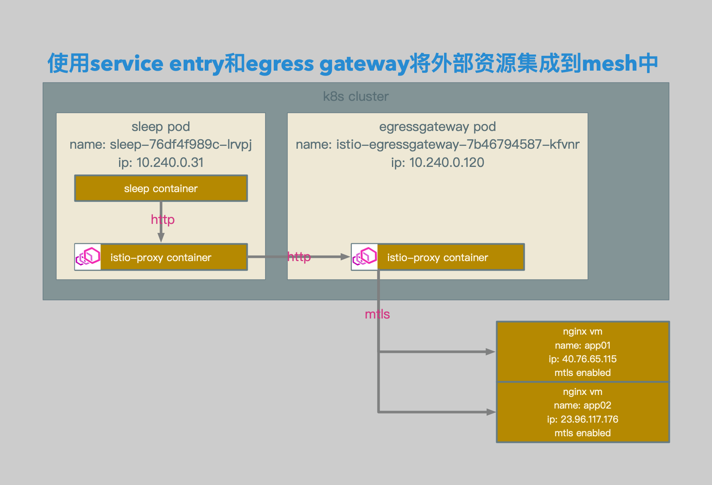

# Istio Egress中的Envoy相关配置解析

## 请求由product pod直接发送至外部服务


## 请求由egress gateway转发至外部服务

### 相关拓扑



- sleep pod中的sleep container发送相关请求。
- 请求被sleep pod中的istio-proxy container截获，并根据路由规则转发至egressgateway pod。
- egressgateway中的istio-proxy container根据目标规则中的相关设置加载tls配置，并根据路由规则将请求转发至相关外部服务。


- 使用istio gateway定义egress gateway的envoy listener，使envoy listener监听80端口。

- 在定义监听后，mesh中会生成egressgateway的80端口相关endpoint和cluster。

- 使用istio virtualservice定义从从pod发出的访问相关uri的的envoy route。

- 所有相关uri的请求全部会被路由到egress gateway。

- 使用k8s service定义外部服务到envoy cluster的映射名称。

- 使用istio serviceentry定义外部服务到envoy cluster和endpoint中的节点，以及每个节点的label。

- 使用istio destinationrule定义外部服务在envoy cluster和endpoint中的subset，以及mtls使用的相关证书。

- 使用istio virtualservice定义从egress gateway到外部服务的路由。


### 相关配置

```bash
openssl req \
-newkey rsa:4096 -nodes -sha256 -keyout nginx-ext.key \
-out nginx-ext.csr

echo subjectAltName = IP:40.76.65.115, IP:23.96.117.176, DNS:nginx.external.svc.cluster.local, DNS:app01.eastus.cloudapp.azure.com, DNS:app02.eastus.cloudapp.azure.com > nginx-ext.cnf

openssl x509 \
-req -days 3655 -in nginx-ext.csr -CA ca.crt -CAkey ca.key \
-CAcreateserial -extfile nginx-ext.cnf -out nginx-ext.crt

openssl req \
-newkey rsa:4096 -nodes -sha256 -keyout client.key \
-out client.csr

openssl x509 \
-req -days 3655 -in client.csr -CA ca.crt -CAkey ca.key \
-CAcreateserial -out client.crt

kubectl create -n istio-system secret tls istio-egressgateway-certs --key ./client.key --cert ./client.crt
kubectl create -n istio-system secret generic istio-egressgateway-ca-certs --from-file ./ca.crt

helm template install/kubernetes/helm/istio/ --name istio-egressgateway --namespace istio-system -x charts/gateways/templates/deployment.yaml --set gateways.istio-ingressgateway.enabled=false \
> ./helm-egressgateway.yaml
```

- 证书，k8s secret和egressgateway yaml相关配置。


```yaml
apiVersion: networking.istio.io/v1alpha3
kind: Gateway
metadata:
  name: eg-nginx-ext
spec:
  selector:
    istio: egressgateway
  servers:
  - port:
      number: 80
      name: http
      protocol: HTTP
    hosts:
    - nginx.external.svc.cluster.local
```

- egress gateway相关配置。


```yaml
apiVersion: networking.istio.io/v1alpha3
kind: VirtualService
metadata:
  name: vs-nginx-ext-mesh
spec:
  hosts:
  - nginx.external.svc.cluster.local
  http:
  - match:
    - port: 80
    route:
    - destination:
        host: istio-egressgateway.istio-system.svc.cluster.local
        port:
          number: 80
```

- mesh层面的virtualservice相关配置。


```yaml
apiVersion: v1
kind: Service
metadata:
  name: nginx
  namespace: external
  labels:
    app: nginx
spec:
  ports:
  - port: 443
    name: http-tls
  selector:
    app: nginx
```

- service相关配置。


```yaml
apiVersion: networking.istio.io/v1alpha3
kind: ServiceEntry
metadata:
  name: se-nginx-ext
spec:
  hosts:
  - nginx.external.svc.cluster.local
  ports:
  - number: 443
    name: http-tls
    protocol: HTTP
  location: MESH_INTERNAL
  resolution: STATIC
  endpoints:
  - address: 40.76.65.115
    ports:
      http-tls: 443
    labels:
      version: v1
  - address: 23.96.117.176
    ports:
      http-tls: 443
    labels:
      version: v2
```

- serviceentry相关配置。


```yaml
apiVersion: networking.istio.io/v1alpha3
kind: DestinationRule
metadata:
  name: dr-nginx-ext
spec:
  host: nginx.external.svc.cluster.local
  trafficPolicy:
    portLevelSettings:
    - port: 
        number: 443
      tls:
        mode: MUTUAL
        clientCertificate: /etc/istio/egressgateway-certs/tls.crt
        privateKey: /etc/istio/egressgateway-certs/tls.key
        caCertificates: /etc/istio/egressgateway-ca-certs/ca.crt
  subsets:
  - name: v1
    labels:
      version: v1
  - name: v2
    labels:
      version: v2
```

- destinationrule相关配置。


```yaml
apiVersion: networking.istio.io/v1alpha3
kind: VirtualService
metadata:
  name: vs-nginx-ext-egress
spec:
  hosts:
    - nginx.external.svc.cluster.local
  gateways:
  - eg-nginx-ext
  http:
  - match:
    - port: 80
      headers:
        want:
          exact: v1
    route:
    - destination:
        host: nginx.external.svc.cluster.local
        port: 
          number: 443
        subset: v1
  - match:
    - port: 80
      headers:
        want:
          exact: v2
    route:
    - destination:
        host: nginx.external.svc.cluster.local
        port: 
          number: 443
        subset: v2
```

- egress gateway层面的virtualservice相关配置。


```bash
root@sleep-76df4f989c-lrvpj:/# curl http://nginx.external.svc.cluster.local -Hwant:v1
<!DOCTYPE html>
<html>
<head>
<title>Welcome to nginx!</title>
<style>
    body {
        width: 35em;
        margin: 0 auto;
        font-family: Tahoma, Verdana, Arial, sans-serif;
    }
</style>
</head>
<body>
<h1>Welcome to nginx!</h1>
<h1>app01</h1>
<p>If you see this page, the nginx web server is successfully installed and
working. Further configuration is required.</p>

<p>For online documentation and support please refer to
<a href="http://nginx.org/">nginx.org</a>.<br/>
Commercial support is available at
<a href="http://nginx.com/">nginx.com</a>.</p>

<p><em>Thank you for using nginx.</em></p>
</body>
</html>
root@sleep-76df4f989c-lrvpj:/#

root@sleep-76df4f989c-lrvpj:/# curl http://nginx.external.svc.cluster.local -Hwant:v2
<!DOCTYPE html>
<html>
<head>
<title>Welcome to nginx!</title>
<style>
    body {
        width: 35em;
        margin: 0 auto;
        font-family: Tahoma, Verdana, Arial, sans-serif;
    }
</style>
</head>
<body>
<h1>Welcome to nginx!</h1>
<h1>app02</h1>
<p>If you see this page, the nginx web server is successfully installed and
working. Further configuration is required.</p>

<p>For online documentation and support please refer to
<a href="http://nginx.org/">nginx.org</a>.<br/>
Commercial support is available at
<a href="http://nginx.com/">nginx.com</a>.</p>

<p><em>Thank you for using nginx.</em></p>
</body>
</html>
root@sleep-76df4f989c-lrvpj:/#
```

- 测试结果。